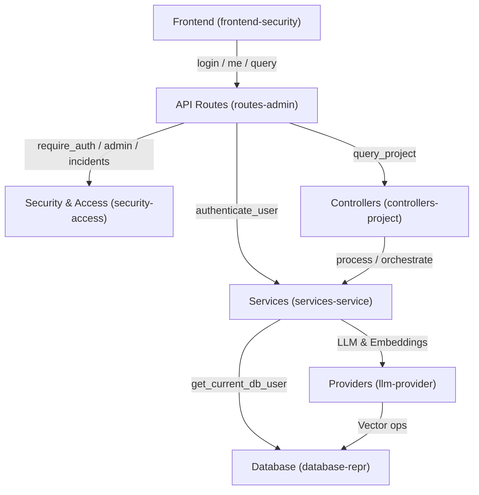

# AGENTS.md

## Purpose

This file is the working map for agents in this repository. Read it before deep exploration, keep it short, and update it whenever the code structure or critical behavior changes.

Primary goal: reduce token waste by searching first, reading only the needed files, and keeping a living code graph here instead of rediscovering the same structure every turn.

## Mandatory Workflow

1. Start with targeted search, not broad file dumps.
2. Read this file before opening many files.
3. Prefer `rg`, `rg --files`, and narrow reads around matched lines.
4. Trace requests by layer: `route -> controller -> service -> provider/db/task`.
5. When a structural change lands, update this file in the same task.
6. When adding a class, endpoint, task, provider, or major function, add it here immediately.
7. When removing or renaming behavior, remove stale entries here immediately.
8. Do not trust `README.md` as the source of truth; verify against code.
9. Keep summaries compact. Do not paste large code blocks into this file.
10. If this file is out of sync with the code, fix it first or explicitly note the drift.

## Token-Saving Search Playbook

- Entry points:
  - `backend/main.py`
  - `backend/routes/*.py`
  - `telegram_bot/bot.py`
  - `frontend/app.js`
  - `frontend-next/src/app/*`
- Find classes/functions:
  - `rg -n "^(class|def|async def) " backend telegram_bot`
- Find ownership/auth flow:
  - `rg -n "get_current_db_user|owner_id|require_security_center_access" backend`
- Find retrieval pipeline:
  - `rg -n "search_similar_chunks|generate_answer|add_vectors|create_provider" backend`
- Find Celery flow:
  - `rg -n "process_document_task|index_project_task|process_and_index_workflow" backend`
- Find config toggles:
  - `rg -n "get_runtime_value|settings\\.|ENVIRONMENT|CONTEXT_TOKEN_BUDGET|SECURITY_SIMULATION_DESTRUCTIVE_ENABLED|TELEGRAM_OUTBOX" backend .env.example`

## Architecture Summary

The backend is layered and mostly follows this shape:

`FastAPI routes -> controllers -> services -> providers -> DB / vector DB / external APIs`

Cross-cutting layers:

- `backend/security/*`: auth, rate limiting, sanitization, event logging
- `backend/tasks/*`: Celery background processing/indexing workflows
- `backend/monitoring/*`: isolated Prometheus request metrics and `/metrics` registration
- `backend/runtime_config.py`: runtime toggles persisted outside static env config via shared JSON under `uploads/config/`

Top-level repo organization:

- `.dockerignore`: Docker build allowlist for runtime-only context
- `.code-review-graphignore`: code-review-graph parse filter; excludes generated/runtime/local artifacts and one-off maintenance outputs from graph builds
- `.github/workflows/secret-scan.yml`: CI gitleaks secret scanning on pushes and pull requests
- `scripts/dev/`: local Windows startup helpers
  - only three entry scripts should remain here: `setup.bat`, `start.bat`, `stop.bat`
  - current user-requested exception: `newstart.bat` also exists to launch the Next.js frontend after the base stack starts
- `docker/`: Compose/build files plus local monitoring config (`docker/prometheus.yml`, Grafana provisioning, Grafana dashboards, postgres-exporter, and node-exporter)
- `tools/`: maintenance and one-off repo utilities
  - includes `tools/test_all.py` as the authenticated smoke test entrypoint
  - `tools/combine_code.py` writes repo bundles under `tmp/`; default output now prioritizes `AGENTS.md`, `README.md`, `.env.example`, Docker/runtime JSON, and `scripts/dev/*.bat`, includes `frontend-next/`, and excludes the legacy `frontend/`
- `docs/`: notes and extra documentation
  - includes `docs/project-graph.md` as the current runtime/API/service/data/frontend graph
  - includes `docs/database.md` as the current storage/database map and sync verdict
- `frontend-next/`: Next.js App Router migration frontend
  - route entrypoints live under `frontend-next/src/app/`
  - API modules live under `frontend-next/src/lib/api/`
  - auth remains Bearer-token compatible in this round
  - do not use legacy `/bot/config` or `active_project_id` here
- `assets/`: static project assets
- `uploads/config/`: shared runtime config for backend, worker, and telegram bot (`app_config.json`, `bot_config.json`)
- `uploads/logs/`: runtime logs, probes, and local command output
- `tmp/`: generated local artifacts
- root keeps only repo-critical/runtime-root files such as `.env*`, `README.md`, `LICENSE`, `AGENTS.md`, `app_config.json`, and `bot_config.json`; the two root config JSON files now act as legacy/bootstrap copies and live config should be read from `uploads/config/`; Alembic runtime files now live under `backend/alembic/` (`backend/alembic/alembic.ini`, `backend/alembic/init-db.sql`)

Main persistence model:

- PostgreSQL via async SQLAlchemy for users/projects/assets/chunks/task executions
- Vector storage via pluggable provider:
  - `pgvector`
  - `qdrant`

## Code Graph (Architecture Map)

This architecture map was generated by the `code-review-graph` tool. It shows the primary communities (modules) and critical execution flows.

### Communities
- **services-service (222 nodes)**: Directory-based community: `backend/services`
- **frontend-security (219 nodes)**: Directory-based community: `frontend`
- **routes-admin (179 nodes)**: Directory-based community: `backend/routes`
- **llm-provider (109 nodes)**: Directory-based community: `backend/providers`
- **tests-tests (102 nodes)**: Directory-based community: `backend/tests`
- **security-access (78 nodes)**: Directory-based community: `backend/security`
- **database-repr (35 nodes)**: Directory-based community: `backend/database`
- **controllers-project (33 nodes)**: Directory-based community: `backend/controllers`
- **utils-task (23 nodes)**: Directory-based community: `backend/utils`
- **tools-squad (22 nodes)**: Directory-based community: `tools`

### Critical Execution Flows
- `get_current_user` (criticality: 0.87)
- `get_current_db_user` (criticality: 0.87)
- `login` (criticality: 0.87)
- `require_mutation_auth_if_enabled` (criticality: 0.85)
- `me` (criticality: 0.78)
- `require_security_center_access` (criticality: 0.76)
- `require_incident_access` (criticality: 0.76)
- `require_admin_access` (criticality: 0.75)
- `authenticate_user` (criticality: 0.75)
- `query_project` (criticality: 0.75)

## Runtime Flows

### Upload + Process

1. `POST /projects/{project_id}/documents` in `backend/routes/documents.py`
2. `DocumentController.upload_document()`
3. `FileService.save_upload_file()`
4. Celery `process_document_task()`
5. `DocumentLoaderService.load_document()`
6. `ChunkingService.chunk_document()`
7. `EmbeddingService.generate_embeddings()`
8. `VectorDBProvider.add_vectors()`

Note: `backend/controllers/document_controller.py` keeps `DocumentController.process_document()` as a deprecated guard (raises `RuntimeError`). The legacy implementation exists as `_deprecated_process_document_impl()` and should not be invoked by routes; processing must go through Celery tasks.

### Query

1. Frontend `handleChatSubmit()` calls `POST /projects/{project_id}/query` directly
2. `POST /projects/{project_id}/query` in `backend/routes/query.py`
3. `QueryController.answer_query()`
4. `QueryService.search_similar_chunks()`
5. `EmbeddingService.generate_single_embedding()`
6. `VectorDBProvider.search()`
7. `AnswerService.generate_answer()`

### Production Telegram Customer Query

1. Telegram sends update to `POST /telegram/webhook/{integration_id}/{webhook_secret}`
2. `TelegramWebhookService` resolves exactly one `BotIntegration`
3. `ConversationService` creates/updates `TelegramCustomer`, `Conversation`, and customer `ConversationMessage`
4. `CustomerBotQueryService` calls `QueryController.answer_query()` with the integration `owner_id` and `project_id`
5. Sources/retrieval metadata are stored internally on `ConversationMessage`
6. Customer reply hides sources unless `show_sources_to_customer` is enabled
7. Webhook saves bot reply/fallback durably as `delivery_status="pending"` on `ConversationMessage`
8. Celery `backend.tasks.telegram_outbox.deliver_pending_messages` delivers pending messages through `TelegramAPIService`

### Project Reindex

1. `POST /projects/{project_id}/index`
2. Celery `index_project_task()`
3. Re-embed all `Chunk` rows for project
4. Re-push vectors to configured vector DB

## Ownership and Security Rules

- Ownership is derived from JWT-backed `current_user`, not request payloads.
- Product role is DB-backed on `users.role`; default is `company_admin`.
- `PLATFORM_OWNER_USERNAME` promotes the matching DB user to `platform_owner` after login.
- `/admin/*` product console routes must use `require_platform_owner_access()`.
- Retrieval depends on `owner_id` scoping.
- Vector search providers expect owner-aware filtering.
- Any change to retrieval/indexing must preserve `owner_id` in vector metadata.
- Any route calling `ProjectController.get_project()` or `DocumentController.get_document()` must pass `owner_id`.
- Company SaaS routes must filter by `owner_id == current_user.id`.
- Telegram webhook retrieval must use only the `owner_id` and `project_id` on the receiving `BotIntegration`; no project fallback is allowed.
- Telegram bot tokens must be encrypted, hashed for dedupe, never logged, and never returned to clients.
- Conversation sources/retrieval metadata are internal by default; customer-visible sources require `show_sources_to_customer`.
- `POST /config/providers` now always requires an authenticated JWT user (no anonymous mutation fallback).
- `GET /config/providers` requires an authenticated JWT user.
- `GET /stats/` now requires an authenticated JWT user.
- `POST /bot/config` now requires a real JWT-backed DB user and only accepts `active_project_id` values owned by that user.
- `/bot/config` remains legacy/demo configuration and now returns a deprecation warning; do not build production behavior on it.
- Configured `BOT_API_*` / `AUTH_ADMIN_*` service-account usernames are reserved from normal signup/password rotation, and successful service-account login keeps a matching DB user row available for `get_current_db_user()`.
- Document processing must go through Celery tasks only (routes dispatch `process_document_task` / `process_and_index_workflow`; direct `DocumentController.process_document()` is disabled).
- Security simulation is non-destructive by default; destructive simulation requires `SECURITY_SIMULATION_DESTRUCTIVE_ENABLED=true` and platform-owner role.

## Review Findings

No currently open high-severity findings are tracked in this file after the latest fixes.

Recently fixed:

1. `backend/routes/projects.py`
   `index_project()` now passes JWT-derived `owner_id` before queueing reindexing.
2. `backend/routes/documents.py`
   `process_and_index_document()` now enforces owned-document access before queueing workflow.
3. `backend/tasks/data_indexing.py`
   Reindexing now persists `owner_id` in vector metadata so retrieval scoping remains valid.
4. `backend/main.py`
   CORS now uses `settings.cors_origins` instead of wildcard origins with credentials.
5. `backend/database/connection.py` and `backend/alembic/versions/20260416_01_add_users_and_project_owner.py`
   Schema bootstrapping now runs through Alembic, and the base migration was aligned with the current `users/projects/assets/chunks/celery_task_executions` schema instead of the stale `user_id/email/password_hash` layout.
6. `backend/database/models.py`, `backend/providers/vectordb/pgvector_provider.py`, and `backend/alembic/versions/20260420_01_convert_chunk_embedding_to_pgvector.py`
   `chunks.embedding` now stores native `pgvector` values, a migration converts old JSON embeddings to `vector`, and `PGVectorProvider` executes similarity search inside PostgreSQL only.
7. `backend/providers/vectordb/pgvector_provider.py` and `backend/alembic/versions/20260420_02_add_pgvector_hnsw_indexes.py`
  ANN indexing is now dimension-aware: HNSW expression indexes are created per embedding dimension, and pgvector queries match them via `vector_dims(...)` plus a cast to `vector(query_dim)` or `halfvec(query_dim)`.
8. `backend/config.py` and `backend/flowerconfig.py`
   Runtime startup no longer fails when `CELERY_FLOWER_PASSWORD` is unset; the setting now defaults safely and Flower config reads it defensively.
9. `backend/providers/vectordb/pgvector_provider.py` and `backend/alembic/versions/20260420_02_add_pgvector_hnsw_indexes.py`
  HNSW indexes now use `vector` for dimensions `<= 2000` and `halfvec` for dimensions `<= 4000`; dimensions above that still use exact native pgvector search without ANN indexing.
10. `.dockerignore` and `docker/backend.Dockerfile`
  Docker builds now use a runtime-only context and copy only `backend/`, `telegram_bot/`, and required root config files; do not reintroduce `COPY . .` unless you also revisit build performance.
11. `docker/docker-compose.yml`
   Compose now builds the app image once as `ragmind-app:local`; `worker` and `telegram_bot` reuse that image instead of repeating the same build definition.
12. `scripts/dev/setup.bat`, `scripts/dev/start.bat`, and `scripts/dev/stop.bat`
   These are the only supported local entry scripts; when consolidating script behavior, remove stale helpers instead of keeping multiple overlapping launch paths. `start.bat` should default to a fast `docker compose up -d` path and reserve `--build` for explicit rebuilds only.
13. `uploads/logs/`
  `setup.bat` writes `uploads/logs/setup.log`; `start.bat` writes `uploads/logs/start.log`, follows container output into `uploads/logs/docker_stack.log`, snapshots `docker compose ps` into `uploads/logs/docker_ps.log`, and redirects the local static frontend server to `uploads/logs/frontend.log`; `stop.bat` writes `uploads/logs/stop.log` and appends pre/post-stop stack state to `uploads/logs/docker_ps.log`.
14. `frontend/app.js`, `frontend/login.html`, and `frontend/signup.html`
   Frontend API autodiscovery now defaults to `http://localhost:8000` and probes port `8000` before legacy ports like `8101`; keep query-string and `localStorage` overrides intact for non-local environments.
15. `backend/utils/task_tracking.py`, `backend/utils/idempotency_manager.py`, `backend/routes/projects.py`, `backend/routes/documents.py`, `backend/tasks/data_indexing.py`, `backend/tasks/file_processing.py`, `backend/tasks/process_workflow.py`, and `backend/celery_app.py`
  Task ownership is now persisted by `celery_task_id` instead of relying on in-memory-only `_TASK_OWNER_MAP`, manual project reindex uses the default worker queue plus durable owner tracking, worker tasks reuse the pre-created execution row instead of duplicating it, duplicate historical rows are merged away by `celery_task_id`, and `process-and-index` parent workflows now finalize from child-task reconciliation instead of needing `/tasks/{id}` polling to reach a terminal state.
16. `backend/providers/llm/factory.py` and `backend/routes/app_config.py`
  Provider availability is registry-backed. Embeddings are currently `gemini` and `cohere`; broken `voyage`/`bge-m3` options were removed from production selection.
17. `backend/providers/llm/factory.py`
  `gemini-2.5-lite-flash` now resolves through a dedicated lite builder, ensuring explicit lite provider selection uses `settings.gemini_lite_model` instead of falling back to the standard Gemini model.
18. `backend/providers/llm/gemini_provider.py`
  Gemini embedding dimension is no longer hardcoded to `768`; it now infers by embedding model (`gemini-embedding-001` -> `3072`, `text-embedding-004` -> `768`) and updates dynamically from real embedding responses.
19. `backend/routes/documents.py`, `backend/routes/projects.py`, `backend/routes/query.py`, `backend/routes/stats.py`, and `backend/routes/bot_config.py`
  Route-level unexpected exceptions are now logged server-side and return sanitized client messages (for example `Internal server error`) instead of leaking raw `detail=str(e)` internals.
20. `backend/security/middleware.py` and `backend/config.py`
  Rate limiting now keys authenticated traffic by JWT subject (`user:`) with IP fallback to reduce shared-IP bottlenecks, and default throughput caps were raised (`chat` and `upload` request/in-flight limits) while retaining endpoint-specific throttling.
21. `backend/config.py`, `.env`, and `.env.example`
  OpenRouter Gemma 4 26B A4B and optional local Gemma 4 E4B are supported as separate LLM providers; Google Gemini still uses the Gemini API models.
22. `backend/shared_config_paths.py`, `backend/runtime_config.py`, `backend/routes/bot_config.py`, `telegram_bot/config.py`, `telegram_bot/handlers.py`, and `docker/docker-compose.yml`
  Runtime app/bot config now resolves through shared files under `uploads/config/`, Compose passes `RAGMIND_SHARED_CONFIG_DIR` to backend/worker/bot and mounts `uploads/` into the bot, the hardcoded `BOT_ACTIVE_PROJECT_ID` compose override was removed, `/bot/config` now requires an authenticated DB user plus owned-project validation, and the bot idles instead of crash-looping when `TELEGRAM_BOT_TOKEN` is blank.
23. `backend/security/auth.py` and `backend/services/auth_service.py`
  `BOT_API_*` and `AUTH_ADMIN_*` credentials now act as managed service accounts during `/auth/login`: successful login provisions or syncs a DB-backed user row so JWT subjects continue to resolve through `get_current_db_user()`, and those reserved usernames are blocked from normal signup/password rotation.
24. `docker/docker-compose.yml` and `backend/tasks/maintenance.py`
  Compose now runs a dedicated Celery beat scheduler service (`ragmind-scheduler`) so periodic cleanup tasks like `clean_celery_executions_table()` are actually scheduled in the default local stack.
25. `backend/providers/vectordb/interface.py`, `backend/providers/vectordb/pgvector_provider.py`, `backend/providers/vectordb/qdrant_provider.py`, and `backend/tasks/file_processing.py`
  Targeted stale-vector cleanup is now available across vector providers: `delete_vectors(...)` deletes by metadata filter, and document-processing retries/failures now clear old vectors for the current asset before rebuilding chunks/embeddings.
26. `backend/routes/health.py` and `scripts/dev/start.bat`
  Startup readiness now reflects the actual stack: `/health` returns `healthy` only when database, broker, result backend, Celery worker, shared config, and vector store are reachable, and `start.bat` waits for that JSON-ready state instead of any HTTP 200.
27. `frontend/app.js`
  Security Center simulation reset is intentionally scoped to transient event streams only (feed clear), while incidents and security overview metrics remain intact for investigation continuity.
28. `frontend/app.js` and `backend/security/middleware.py`
  Chat submit now calls the supported non-streaming `POST /projects/{project_id}/query` endpoint directly, and chat rate limiting no longer includes the nonexistent `/query/stream` route.
29. `.env.example`, `.github/workflows/secret-scan.yml`, `backend/main.py`, `backend/routes/app_config.py`, `backend/config.py`, `backend/routes/documents.py`, `backend/providers/vectordb/pgvector_provider.py`, `backend/controllers/query_controller.py`, `backend/routes/query.py`, `backend/init_database.py`, `backend/routes/stats.py`, and `frontend/app.js`
  Security and reliability hardening pass: leaked example credentials were replaced with placeholders and CI secret scanning was added; CORS now reads `settings.cors_origins`; provider mutation and global stats endpoints require JWT auth by default; upload reads are capped to `max_size + 1` before rejection; pgvector vector deletion now rejects empty/unknown/null-only filters; query infrastructure failures now surface as sanitized `503` errors instead of `200` fallback answers; database bootstrap SQL now uses parameterization and `sql.Identifier`; duplicate frontend helper definitions were removed to avoid silent overrides.
30. `backend/database/models.py`, `backend/alembic/versions/20260427_01_add_b2b_telegram_saas.py`, `backend/routes/bot_integrations.py`, `backend/routes/conversations.py`, `backend/routes/telegram_webhook.py`, `backend/routes/admin_console.py`, `backend/services/*telegram*`, `backend/services/bot_integration_service.py`, `backend/services/conversation_service.py`, `backend/security/auth.py`, `frontend/index.html`, and `frontend/app.js`
  B2B Telegram SaaS implementation added DB-backed bot integrations, encrypted token storage, durable Telegram customers/conversations/messages, customer-safe RAG replies, per-integration webhook throttling/idempotency, company-scoped dashboard routes, platform-owner-only `/admin/*` product routes, and frontend views for bot integrations, conversations, and the Admin Console.
31. `backend/routes/admin_users.py` and `backend/tests/test_admin_service.py`
  `/admin/users/*` status-mutation routes now require `require_platform_owner_access` (not legacy `require_admin_access`) and regression tests assert platform-owner-only enforcement.
32. `backend/services/telegram_api_service.py`, `backend/services/bot_integration_service.py`, and `backend/tests/test_bot_integrations.py`
  Bot integration readiness now validates decrypted token health, live Telegram token validation, real Telegram webhook alignment, and provider-stack readiness (LLM + embedding + vector backend) before reporting `ready=true`.
33. `backend/routes/app_config.py`, `backend/main.py`, and `backend/tests/test_app_config.py`
  Runtime provider selections are now normalized/migrated when invalid legacy values are found (for example removed providers), both at startup and via `GET /config/providers`, preventing stale config from breaking query/indexing.
34. `docker/docker-compose.yml`, `docker/prometheus.yml`, `docker/grafana/provisioning/*`, `docker/grafana/dashboards/ragmind-overview.json`, `backend/monitoring/metrics.py`, `backend/main.py`, and `backend/config.py`
  Prometheus/Grafana monitoring was reapplied as isolated infrastructure: compose adds Prometheus, Grafana, and postgres-exporter; backend exposes minimal Prometheus metrics without touching existing API routers, auth, Celery, Telegram, retrieval, or provider behavior.
35. `backend/database/connection.py`
  Local startup now recovers from dev databases stamped with unknown discarded-branch Alembic revisions by stamping to the current head and retrying migrations, preserving the restored codebase while avoiding a startup crash on polluted local volumes.
36. `docker/docker-compose.yml`
  The legacy single Telegram polling bot now idles by default and only starts when `ENABLE_LEGACY_TELEGRAM_BOT=1`, preventing local logs from filling with Telegram `409` conflicts when a production webhook is registered for the same token.
37. `frontend-next/src/app/*`, `frontend-next/src/lib/api/*`, `frontend-next/src/store/auth-store.ts`, and `.env.example`
  New Next.js App Router frontend migration now lives in `frontend-next/`, runs on `http://localhost:3001`, uses `NEXT_PUBLIC_API_BASE_URL` for backend calls, keeps Bearer-token compatibility for this round, surfaces company/admin product routes without using legacy `/bot/config` or `active_project_id`, and adds build/typecheck/lint validation through the new frontend workspace.
38. `scripts/dev/newstart.bat`, `README.md`, and `AGENTS.md`
  `newstart.bat` is a user-requested helper that first calls `scripts/dev/start.bat`, then launches `frontend-next` with `pnpm dev` or `npm run dev`, waits for `http://localhost:3001/login`, and opens the Next.js frontend. This is an explicit exception to the normal three-script guidance in `scripts/dev/`.
39. `frontend-next/src/lib/auth/session.ts`, `frontend-next/src/app/(auth)/login/page.tsx`, `frontend-next/src/components/layout/RoleGuard.tsx`, `docker/docker-compose.yml`, and `.env`
  Next.js auth hydration now runs once via `useAuthStore.getState()` and auth consumers read store fields with separate selectors to avoid React 19 external-store infinite-update loops; local backend CORS now explicitly includes `http://localhost:3001` so the Next.js frontend can call `/health` and auth endpoints from the dev port.

## Known Drift Between Docs and Code

- `README.md` is aligned with the current SaaS/product entry points at a high level, but code remains source of truth for endpoint details.
- Celery/background-task paths are central in code and should be trusted over README summaries.
- Runtime-config-driven retrieval behavior exists in code and is not fully captured in README.
- Alembic migrations must stay in sync with `backend/database/models.py`; do not assume old revisions reflect current field names.

## Update Rules For This File

Update `AGENTS.md` immediately when any of the following changes:

- new route/controller/service/provider/task is added
- method signatures change
- ownership/auth flow changes
- vector metadata shape changes
- runtime flags change retrieval/indexing behavior
- new known bug is discovered or fixed
- frontend entrypoint/API flow changes materially

When updating:

1. Keep this file concise.
2. Prefer bullets and short path-based references.
3. Remove stale entries, do not only append.
4. Add the critical path first, details second.
5. If a section becomes too large, summarize and point to the code paths.

## Practical Guidance For Future Agents

- Use GitHub MCP for repo, PR, issue, and review context.
- Use Context7 before answering framework or library version questions.
- Use OpenAI Developer Docs MCP for OpenAI, Codex, and API questions.
- Use Playwright MCP for UI, browser, and frontend verification.
- Use filesystem MCP only within this repository root.
- Do not add Postgres MCP unless a safe read-only `DATABASE_URL` or `POSTGRES_*` environment value already exists.
- For Jira-backed feature work or structured planning, use the Squad workflow prompt in `.github/prompts/squad-workflow.prompt.md` before coding; the repo and user-level copies both follow `squad init` -> `squad new-story` -> `squad new-plan`.
- The Squad MCP wrapper lives in `tools/squad_mcp_server.py` and exposes the same `init`, `new-story`, and `new-plan` workflow to MCP clients.

- Before editing retrieval or indexing, inspect:
  - `backend/services/query_service.py`
  - `backend/tasks/data_indexing.py`
  - `backend/tasks/file_processing.py`
  - `backend/providers/vectordb/*`
- Before editing auth/security, inspect:
  - `backend/security/auth.py`
  - `backend/routes/auth.py`
  - `backend/security/middleware.py`
  - `backend/services/login_security_service.py`
- Before editing uploads/documents, inspect:
  - `backend/routes/documents.py`
  - `backend/controllers/document_controller.py`
  - `backend/services/file_service.py`
  - `backend/services/document_loader.py`
  - `backend/services/chunking_service.py`

## MCP Usage Rules

- Use GitHub MCP for repo, PR, issue, and review context.
- Use Context7 before answering framework or library version questions.
- Use OpenAI Developer Docs MCP for OpenAI, Codex, and API questions.
- Use Playwright MCP for UI, browser, and frontend verification.
- Use filesystem MCP only within this repository root.
- Do not add Postgres MCP unless a safe read-only `DATABASE_URL` or `POSTGRES_*` environment value already exists.

## MCP and AI Review Tooling

- Use Serena MCP for semantic code navigation, symbols, references, and targeted edits.
- Use Repomix MCP when the agent needs a compact AI-friendly package of the repo.
- Use Sentry MCP only for debugging real Sentry issues/errors/traces after OAuth.
- Use DeepWiki MCP for public GitHub repo documentation/context.
- Use Sourcegraph MCP only if `SOURCEGRAPH_MCP_URL` is configured.
- Use CodeRabbit for local VS Code review before opening PRs.
- Use Graphite AI Reviews for PR review automation after GitHub App setup.
- Use Continue AI Checks for repo-specific security/backend/frontend review gates.
- Never hardcode secrets in MCP configs.
- Never expose local infrastructure ports publicly unless intentionally deployed behind auth.

## Bottom Line

Yes, maintaining a repo-aware `AGENTS.md` with a concise code graph and update rules is a modern and useful workflow, especially for agent-assisted development. The important part is that it must stay short, code-grounded, and updated with every structural change, otherwise it becomes another stale doc that increases token cost instead of reducing it.

<!-- SPECKIT START -->
For additional context about technologies to be used, project structure,
shell commands, and other important information, read the current plan
<!-- SPECKIT END -->
