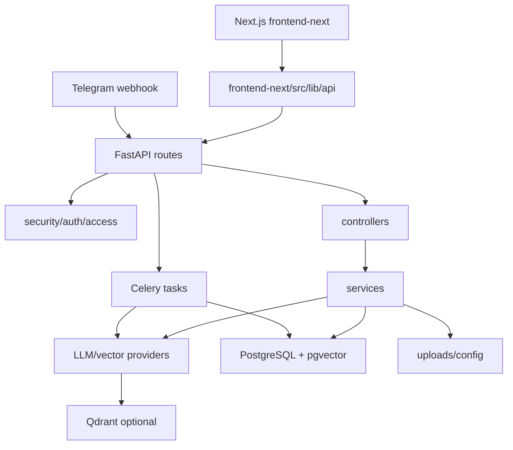

# AGENTS.md

## Purpose

This is the working map for agents in this repository. Read it before broad exploration, keep it short, and update it whenever code structure, runtime behavior, security boundaries, or frontend entrypoints change.

Primary goal: save tokens by searching first, using the code-review graph for structure, and recording durable repo knowledge here instead of rediscovering it every turn.

Last refreshed: 2026-06-16 after Telegram production-hardening changes and `code-review-graph update --repo .`.

## Workflow

1. Start with targeted search, not broad file dumps.
2. Read this file before opening many files.
3. Prefer `rg`, `rg --files`, and narrow reads around matched lines.
4. Trace requests by layer: `route -> controller -> service -> provider/db/task`.
5. Prefer code and config over README/spec summaries when they disagree.
6. Before structural edits, refresh or query code-review-graph.
7. When adding, removing, or renaming a route, service, task, provider, major component, runtime flag, or auth rule, update this file in the same task.
8. Remove stale entries instead of only appending.

## Fast Search Playbook

- Entry points:
  - `backend/main.py`
  - `backend/routes/*.py`
  - `backend/celery_app.py`
  - `telegram_bot/bot.py`
  - `frontend-next/src/app/*`
  - `frontend-next/src/lib/api/*`
- Classes/functions:
  - `rg -n "^(class|def|async def) " backend telegram_bot`
- Backend route registration:
  - `rg -n "include_router|@router" backend/main.py backend/routes`
- Auth and ownership:
  - `rg -n "get_current_db_user|require_platform_owner_access|owner_id|UserRole|UserAccountStatus" backend`
- Retrieval/indexing:
  - `rg -n "search_similar_chunks|generate_answer|add_vectors|delete_vectors|create_provider" backend`
- Celery/outbox:
  - `rg -n "process_document_task|index_project_task|process_and_index_workflow|deliver_pending_messages|celery_task_executions" backend`
- Frontend API bindings:
  - `rg -n "apiRequest|queryKeys|useQuery|useMutation|localStorage|Authorization" frontend-next/src`
- Runtime flags/config:
  - `rg -n "get_runtime_value|settings\\.|ENVIRONMENT|CONTEXT_TOKEN_BUDGET|SECURITY_SIMULATION_DESTRUCTIVE_ENABLED|TELEGRAM_OUTBOX|TELEGRAM_WEBHOOK|TELEGRAM_RATE_LIMIT|TELEGRAM_REPLY_GENERATION|PROMETHEUS_BASE_URL|GRAFANA_" backend .env.example docker/docker-compose.yml infra/azure`

## Code Review Graph

Use code-review-graph before repo-wide reviews, architecture work, high-risk changes, or `AGENTS.md` updates.

Commands:

```powershell
code-review-graph update --repo .
code-review-graph build --repo .
code-review-graph status --repo .
```

MCP tools to use after refresh:

- `get_architecture_overview_tool(detail_level="minimal")`
- `list_communities_tool(detail_level="minimal", min_size=3, sort_by="size")`
- `get_knowledge_gaps_tool()`

Fresh graph communities from the latest 2026-06-16 update:

- `ui-admin` (263 nodes): `frontend-next` TSX app routes/components.
- `services-service` (223): backend services.
- `routes-admin` (178): FastAPI routes.
- `tests-tests` (153): backend tests.
- `llm-provider` (110): LLM, embedding, and vector providers.
- `security-access` (84): auth, access control, rate limiting, security events.
- `database-repr` (35): database connection/models.
- `controllers-project` (33): project/document/query controllers.
- `versions-upgrade` (23): Alembic migrations.
- `utils-task` (23): task tracking/idempotency helpers.
- `tools-squad` (22): repo utility tooling.
- `backend-config` (21): settings/runtime/bootstrap config.
- `tasks-process` (16): Celery processing/indexing/query-generation/outbox tasks.
- `telegram-bot-bot` (16): legacy single Telegram bot.
- `monitoring-metrics` (13): Prometheus/Celery metrics.
- `models-incident` (9): incident domain models.

Graph warnings to remember from the latest update:

- High coupling exists between `routes-admin` and `security-access`.
- High coupling exists between `security-access` and `services-service`, reduced from 39 to 27 edges after moving Telegram answer generation into a worker task.
- `backend-config` fans into routes/services/tasks/providers; config changes need broad validation.
- `ui-admin` is large; frontend changes should be block-scoped and backed by browser checks.

Current graph hotspots worth extra tests/review:

- `backend/tasks/file_processing.py::_process_document`
- `backend/tasks/telegram_query.py::_generate_bot_reply`
- `backend/tasks/telegram_outbox.py::_deliver_pending_messages`
- `backend/controllers/query_controller.py::QueryController.answer_query`
- `frontend-next/src/lib/api/client.ts::apiRequest`
- `frontend-next/src/app/(company)/knowledge-bases/[projectId]/page.tsx`
- `frontend-next/src/app/(company)/telegram-bots/[botId]/page.tsx`
- `frontend-next/src/components/bots/BotFormDrawer.tsx`

## Architecture Summary

Runtime shape:

`Browser / Telegram -> FastAPI routes -> controllers -> services -> providers/tasks -> PostgreSQL/pgvector, Qdrant, external LLM APIs`

Main units:

- `backend/`: FastAPI app, routes, controllers, services, providers, tasks, monitoring, DB models.
- `frontend-next/`: production Next.js App Router frontend on port `3001`.
- `telegram_bot/`: optional legacy single-bot flow; not the production multi-company bot path.
- `docker/`: local runtime services, monitoring, Grafana dashboards, Prometheus config.
- `infra/azure/`: Azure Container Apps production deployment Bicep and parameter template.
- `scripts/dev/`: Windows helpers. Supported scripts are `setup.bat`, `start.bat`, `newstart.bat`, and `stop.bat`.
- `scripts/deploy/`: production deployment helpers (`azure-deploy.ps1`, `sync-telegram-webhooks.ps1`).
- `uploads/config/`: shared live runtime config (`app_config.json`, `bot_config.json`).
- `uploads/logs/`: local logs and probe output.
- `tools/`: smoke tests, binding audit, bundle utilities, Squad MCP wrapper.
- `specs/`: Spec Kit feature plans. Treat active specs as plans, not code truth.
- `docs/notes/`: reports and long-form notes; often historical.



## Active Runtime Entry Points

Backend:

- `backend/main.py` includes health, projects, documents, query, stats, security, incidents, admin users, admin console, admin observability, bot integrations, conversations, Telegram webhook, bot config, app config, and auth routers.
- Health endpoints in code: `/`, `/health`, `/health/live`, `/health/full`, `/metrics`.
- Admin observability endpoints: `/admin/observability/dashboards`, `/admin/observability/summary`.

Frontend:

- Production frontend source is `frontend-next/`; do not recreate the deleted `frontend/` directory.
- Run with `scripts/dev/newstart.bat` or `cd frontend-next; pnpm dev`.
- URL: `http://localhost:3001/login`.
- API base: `NEXT_PUBLIC_API_BASE_URL=http://localhost:8000`.
- Production container image builds from `frontend-next/Dockerfile` and binds Next.js to `0.0.0.0:3001`.
- Auth is still Bearer-token compatible and stored by the current frontend store; HttpOnly cookie migration is planned/historical, not current runtime.
- `frontend-next/AGENTS.md` warns that local Next.js docs under `node_modules/next/dist/docs/` must be checked before Next.js API changes.

## Critical Flows

### Upload And Process

1. `POST /projects/{project_id}/documents` in `backend/routes/documents.py`
2. `DocumentController.upload_document()`
3. `FileService.save_upload_file()`
4. Celery `process_document_task()`
5. `DocumentLoaderService.load_document()`
6. `ChunkingService.chunk_document()`
7. `EmbeddingService.generate_embeddings()`
8. `VectorDBProvider.add_vectors()`

Rules:

- Document processing must go through Celery tasks. `DocumentController.process_document()` is a deprecated guard and should not become a route path again.
- Fresh pgvector embedding writes must use the same worker transaction/session that flushed new chunks, and row updates must be verified.
- Retries/failures must clear stale vectors for the current asset before rebuilding.

### Query

1. Frontend calls `POST /projects/{project_id}/query`.
2. `backend/routes/query.py::query_project`
3. `QueryController.answer_query()`
4. `QueryService.search_similar_chunks()`
5. `EmbeddingService.generate_single_embedding()`
6. `VectorDBProvider.search()`
7. `AnswerService.generate_answer()`

Rules:

- Preserve `owner_id` and `project_id` scoping through vector metadata/search.
- Query infra failures should surface sanitized `503` style failures, not fake successful fallback answers.
- Runtime retrieval flags live in `backend/runtime_config.py`.
- Answer generation output is capped by `ANSWER_MAX_TOKENS`; do not raise it back to provider-breaking values.

### Production Telegram Customer Query

1. Telegram sends `POST /telegram/webhook/{integration_id}/{webhook_secret}`.
2. `TelegramWebhookService` resolves exactly one `BotIntegration`.
3. `ConversationService` persists customer, conversation, and customer message.
4. Webhook commits quickly and enqueues `backend.tasks.telegram_query.generate_bot_reply`.
5. `CustomerBotQueryService` calls `QueryController.answer_query()` with integration `owner_id` and `project_id` inside the worker.
6. Sources/retrieval metadata stay internal unless `show_sources_to_customer` is enabled.
7. Query task saves bot reply/fallback as `delivery_status="pending"`.
8. Celery `backend.tasks.telegram_outbox.deliver_pending_messages` leases pending or stale `sending` messages and delivers through `TelegramAPIService`.

Rules:

- No project fallback is allowed for Telegram webhook retrieval.
- Webhook registration sends Telegram `secret_token`, and `/telegram/webhook/*` verifies `X-Telegram-Bot-Api-Secret-Token` when `TELEGRAM_WEBHOOK_REQUIRE_SECRET_HEADER=true`.
- Webhook rate limiting should use Redis in production through `TELEGRAM_RATE_LIMIT_REDIS_URL` or Redis-backed `CELERY_RESULT_BACKEND`; in-memory fallback is per replica only.
- Bot tokens are encrypted, hashed for dedupe, never logged, and never returned to clients.
- Production webhook registration is centralized in `BotIntegrationService.register_webhook()`.
- After changing `PUBLIC_WEBHOOK_BASE_URL` or binding Azure custom domains, run `python -m backend.scripts.sync_telegram_webhooks --json` or `scripts/deploy/sync-telegram-webhooks.ps1`.
- Smoke tests that expect inline Telegram sends or inline answer generation are stale; current behavior is quick webhook ack, async query task, then durable outbox.
- Manual agent replies are saved as pending messages and delivered by the same outbox worker.
- Outbox retries use `delivery_next_attempt_at` with exponential backoff configured by `TELEGRAM_OUTBOX_RETRY_BASE_SECONDS` and `TELEGRAM_OUTBOX_RETRY_MAX_SECONDS`.

### Project Reindex

1. `POST /projects/{project_id}/index`
2. Celery `index_project_task()`
3. Re-embed all project chunks.
4. Re-push vectors to the configured vector DB with owner-aware metadata.

## Ownership And Security Rules

- Ownership comes from JWT-backed `current_user`, never request payloads.
- Product role is DB-backed on `users.role`; default role is `company_admin`.
- `PLATFORM_OWNER_USERNAME` promotes a matching DB user to `platform_owner` after login.
- `/admin/*` and `/admin/observability/*` require `require_platform_owner_access()`.
- Company SaaS routes must filter by `owner_id == current_user.id`.
- Any route calling `ProjectController.get_project()` or `DocumentController.get_document()` must pass `owner_id`.
- `/stats/` is tenant-scoped in code; platform-wide stats are under `/admin/stats`.
- `GET /config/providers` and `POST /config/providers` require JWT-backed DB users.
- `/bot/config` is legacy/demo only, requires auth, validates owned `active_project_id`, and returns deprecation context.
- `BOT_API_*` and `AUTH_ADMIN_*` usernames are reserved service accounts and must not be available for normal signup/password rotation.
- Security simulation is non-destructive by default; destructive simulation requires `SECURITY_SIMULATION_DESTRUCTIVE_ENABLED=true` and platform-owner access.
- Client IP extraction honors `X-Forwarded-For` only from configured trusted proxies.
- Unknown Alembic revision auto-stamping is local/dev recovery only; production must fail closed.
- Local compose should publish backend/local tooling on `127.0.0.1` unless deliberately deployed behind auth/proxy.
- Never hardcode secrets or local infrastructure credentials into MCP configs, frontend code, docs, or examples.

## Frontend Rules

Active feature: `specs/003-frontend-ui-upgrade`.

- Production work stays in `frontend-next/`.
- Do not create a second production app under `new front`.
- `specs/new front/TASK.md` is historical migration planning. Its statement that old `frontend/` remains is now stale.
- Do not use legacy `/bot/config` or `active_project_id` in the Next frontend.
- Every upgraded route must keep real `frontend-next/src/lib/api/*` calls, TanStack Query keys, auth guards, and mutation invalidation.
- No invented operational metrics or fake dashboards. Use backend data or explicit unavailable/empty states.
- Platform-owner observability must call backend `/admin/observability/*`, not browser-side Prometheus/Grafana credentials.
- Use shadcn/ui and local shared components first. Current added components include `chart`, `checkbox`, `drawer`, `empty`, `progress`, `switch`, and `tooltip`.
- Tables that need filtering/sorting/pagination should use the shared TanStack Table layer.
- Forms with validation should use React Hook Form and Zod.
- Use Playwright/browser checks for rendered UI changes, including desktop plus at least one smaller viewport when practical.

Important frontend files:

- Routes: `frontend-next/src/app/(auth)`, `(company)`, `(admin)`.
- API clients: `frontend-next/src/lib/api/*`.
- Query keys: `frontend-next/src/lib/api/queryKeys.ts`.
- Auth store: `frontend-next/src/store/auth-store.ts`.
- Layout: `frontend-next/src/components/layout/*`.
- Shared UI: `frontend-next/src/components/shared/*`, `frontend-next/src/components/ui/*`.
- Binding audit: `tools/frontend_backend_binding_audit.py`.
- E2E setup: `frontend-next/playwright.config.ts`, `frontend-next/tests/e2e/`.

UI upgrade status from `specs/003-frontend-ui-upgrade/tasks.md`:

- Completed foundations: dependencies, query keys, API error handling, shared table helpers, shared states, form helpers, global shell tokens/layout, binding audit, Playwright setup.
- Completed slices: admin observability backend/frontend, app shell/sidebar/topbar, company dashboard real-data panels, current binding-audit evidence.
- Still pending in spec: browser/e2e checks, login/signup polish, many page-level block upgrades, responsive/accessibility pass, final smoke/binding verification.

## Data And Storage

Main SQLAlchemy models in `backend/database/models.py`:

- `User`
- `Project`
- `Asset`
- `Chunk`
- `BotIntegration`
- `TelegramCustomer`
- `Conversation`
- `ConversationMessage`
- `CeleryTaskExecution`

Storage notes:

- PostgreSQL is the primary relational store.
- `chunks.embedding` uses native pgvector.
- Qdrant remains an optional vector backend.
- `celery_task_executions` tracks durable ownership/workflow metadata by `celery_task_id`.
- Runtime config lives under `uploads/config/`; root `app_config.json` and `bot_config.json` are legacy/bootstrap copies.
- Alembic runtime files live under `backend/alembic/`.

## Provider And Monitoring Map

Providers:

- Chat/embedding provider registry is in `backend/providers/llm/factory.py`.
- Active vector DB provider is resolved in `backend/providers/vectordb/factory.py`.
- Current production embedding options documented in code are `gemini` and `cohere`.
- OpenRouter Gemma 4 26B A4B and optional local Gemma 4 E4B are separate LLM provider paths.

Monitoring:

- Backend Prometheus metrics are in `backend/monitoring/metrics.py` and mounted at `/metrics`.
- Celery worker metrics are exposed on worker port `9108`.
- Prometheus config: `docker/prometheus.yml`.
- Grafana provisioning/dashboards: `docker/grafana/provisioning/`, `docker/grafana/dashboards/`.
- Local dashboards can show expected `N/A` values for Docker Desktop/WSL noise, replication, or missing optional metrics.

## Local Runtime

- Setup: `scripts/dev/setup.bat`
- Backend stack only: `scripts/dev/start.bat`
- Backend plus Next frontend: `scripts/dev/newstart.bat`
- Stop: `scripts/dev/stop.bat`
- Backend URL: `http://localhost:8000`
- Frontend URL: `http://localhost:3001/login`
- Prometheus: `http://localhost:9090`
- Grafana: `http://localhost:3000`
- Azure production deploy: `scripts/deploy/azure-deploy.ps1 -ResourceGroup <rg> -RootDomain <domain>`

Validation commands:

```powershell
python tools/test_all.py
python tools/frontend_backend_binding_audit.py
.venv\Scripts\python.exe -m pytest -q backend/tests
cd frontend-next; pnpm lint
cd frontend-next; pnpm typecheck
cd frontend-next; pnpm build
cd frontend-next; pnpm exec playwright test
```

Known validation drift:

- `docs/notes/backend-services-test-report-2026-06-12.md` says backend runtime and tests were healthy, but `tools/test_all.py` had stale Telegram inline-send expectations.
- `frontend-next/test-results/**/error-context.md` files are transient Playwright artifacts, not product docs.

## Markdown Doc Trust Order

This refresh scanned project Markdown files with dependencies/build/runtime folders excluded. Use this trust order:

1. Code and config in `backend/`, `frontend-next/`, `docker/`, `scripts/dev/`, `.env.example`.
2. This `AGENTS.md`.
3. `README.md` for user setup and current stack.
4. `backend/ENDPOINTS.md` for endpoint inventory, but verify against code.
5. `docs/project-graph.md` for a denser architecture snapshot, but it was last marked 2026-04-21 and may miss newer routes.
6. `specs/003-frontend-ui-upgrade/*` for active frontend upgrade plan/status.
7. `specs/002-production-security-fixes/*`, `specs/new front/TASK.md`, `report.md`, and `docs/BIG_PROJECT_DOC.md` as historical/planning material unless code confirms them.

Known Markdown drift:

- `backend/ENDPOINTS.md` omits `/health/live` and `/health/full` and still describes `/stats/` as global in one place; code makes `/stats/` tenant-scoped.
- `specs/002-production-security-fixes/spec.md` and research discuss HttpOnly cookie migration, but later tasks/README say frontend Bearer-token behavior remains for now.
- `specs/new front/TASK.md` says the legacy `frontend/` should remain; current code removed it.
- `frontend-next/README.md` is mostly stock Next.js text and mentions port `3000`; actual frontend port is `3001`.
- `docs/BIG_PROJECT_DOC.md` is a combined source bundle and may include stale embedded copies.

## Before Editing

Retrieval/indexing:

- `backend/services/query_service.py`
- `backend/services/answer_service.py`
- `backend/tasks/data_indexing.py`
- `backend/tasks/file_processing.py`
- `backend/providers/vectordb/*`

Auth/security:

- `backend/security/auth.py`
- `backend/security/middleware.py`
- `backend/security/client_ip.py`
- `backend/routes/auth.py`
- `backend/services/login_security_service.py`

Uploads/documents:

- `backend/routes/documents.py`
- `backend/controllers/document_controller.py`
- `backend/services/file_service.py`
- `backend/services/document_loader.py`
- `backend/services/chunking_service.py`

Telegram SaaS:

- `backend/routes/bot_integrations.py`
- `backend/routes/telegram_webhook.py`
- `backend/routes/conversations.py`
- `backend/services/bot_integration_service.py`
- `backend/services/telegram_webhook_service.py`
- `backend/services/conversation_service.py`
- `backend/services/customer_bot_query_service.py`
- `backend/tasks/telegram_query.py`
- `backend/tasks/telegram_outbox.py`

Admin/observability:

- `backend/routes/admin_console.py`
- `backend/routes/admin_users.py`
- `backend/routes/admin_observability.py`
- `backend/services/observability_service.py`
- `frontend-next/src/app/(admin)/admin/*`
- `frontend-next/src/components/admin/*`

Frontend block work:

- `specs/003-frontend-ui-upgrade/tasks.md`
- `specs/003-frontend-ui-upgrade/api-binding-inventory.md`
- `specs/003-frontend-ui-upgrade/block-map.md`
- `specs/003-frontend-ui-upgrade/validation-evidence.md`
- `frontend-next/src/lib/api/*`
- `frontend-next/src/components/shared/*`

## Update Rules For This File

Update immediately when:

- A route, controller, service, provider, task, model, migration, or major frontend route/component is added, removed, or renamed.
- Auth, ownership, tenant scoping, platform-owner access, token handling, or trusted-proxy logic changes.
- Vector metadata shape or retrieval/indexing behavior changes.
- Runtime config flags or provider registries change.
- Frontend entrypoints, API bindings, auth flow, or validation workflow changes materially.
- A known bug is discovered or fixed.
- Code-review graph communities change meaningfully after a full build.

Keep updates compact, path-based, and code-grounded.

## MCP And Tooling

- Use code-review-graph for repo structure, hotspots, and impact context.
- Use GitHub MCP for repo, PR, issue, and review context.
- Use Context7 before answering framework/library version questions.
- Use OpenAI Developer Docs MCP for OpenAI, Codex, and API questions.
- Use Playwright MCP or local Playwright for UI/browser verification.
- Use filesystem MCP only inside this repository root.
- Use Repomix only when a compact AI-friendly package is useful.
- Do not add Postgres MCP unless a safe read-only database URL is already available.
- For Jira-backed planning, use `.github/prompts/squad-workflow.prompt.md`; the wrapper is `tools/squad_mcp_server.py`.

<!-- SPECKIT START -->
For additional context about technologies to be used, project structure,
shell commands, and other important information, read the current plan:
`specs/003-frontend-ui-upgrade/plan.md`
<!-- SPECKIT END -->
