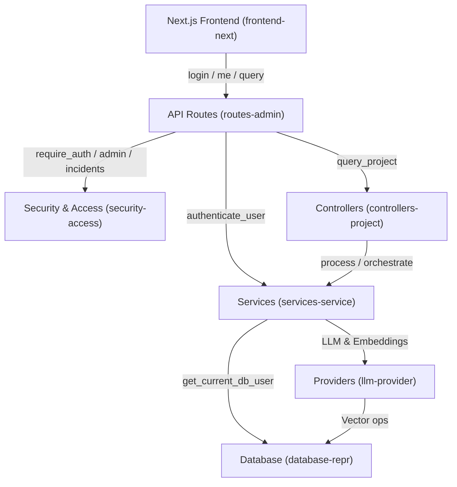

# RAGMind

RAGMind is a B2B SaaS Retrieval Augmented Generation (RAG) platform for turning uploaded company documents into searchable project knowledge bases and Telegram customer-support bots.

It combines a FastAPI backend, background processing with Celery, vector search with pgvector or Qdrant, and a Next.js App Router frontend in `frontend-next/`.

## Current Stack

- Backend: FastAPI + SQLAlchemy (async)
- Background jobs: Celery + RabbitMQ + Redis
- Databases: PostgreSQL (with pgvector) and optional Qdrant
- Frontend: Next.js App Router frontend on port 3001
- Product roles: `company_admin` and `platform_owner`
- Telegram support: database-backed bot integrations plus durable conversations
- Legacy bot: optional single-bot service kept for demo/backward compatibility
- Local runtime exposure: compose-published services and Next.js dev/start scripts bind to `127.0.0.1` by default

## Architecture At A Glance

1. Upload document to a project.
2. Celery worker extracts text, chunks content, and generates embeddings.
3. Vectors are written to the active vector provider; pgvector embedding writes share the worker transaction that created fresh chunks.
4. Query endpoint retrieves relevant chunks and sends context to the configured LLM provider.
5. Response is returned with source context for dashboard testing.
6. Production Telegram webhooks resolve a bot integration, persist the customer conversation, reuse the same RAG stack with `owner_id`/`project_id` scoping, and hide sources from customers by default.

## Code Graph (Architecture Map)

This architecture map was generated by the `code-review-graph` tool. It shows the primary communities (modules) and critical execution flows.



### Communities
- **services-service (222 nodes)**: Directory-based community: `backend/services`
- **frontend-next**: Next.js App Router frontend under `frontend-next/`
- **routes-admin (179 nodes)**: Directory-based community: `backend/routes`
- **llm-provider (109 nodes)**: Directory-based community: `backend/providers`
- **tests-tests (102 nodes)**: Directory-based community: `backend/tests`
- **security-access (78 nodes)**: Directory-based community: `backend/security`
- **database-repr (35 nodes)**: Directory-based community: `backend/database`
- **controllers-project (33 nodes)**: Directory-based community: `backend/controllers`
- **utils-task (23 nodes)**: Directory-based community: `backend/utils`
- **tools-squad (22 nodes)**: Directory-based community: `tools`

## Quick Start (Windows)

### Prerequisites

- Docker Desktop (Linux containers)
- WSL2 enabled for Docker Desktop
- Python 3.11+ for local tooling
- uv (optional but recommended for faster environment setup)

### 1. Clone

```powershell
git clone https://github.com/ZozElwakil/RAGMind---EELU-Project.git
cd RAGMind---EELU-Project
```

### 2. Setup

```powershell
scripts\dev\setup.bat
```

What setup does:

- creates or repairs venv
- installs backend dependencies from backend/requirements.txt (using `uv` when available, with `pip` fallback)
- creates .env from .env.example when missing
- creates uploads, tmp, and logs directories
- validates docker compose config when Docker is ready (`docker compose` or `docker-compose`)

### 3. Configure Environment

Edit .env and set provider credentials you plan to use.

Common required values:

- GEMINI_API_KEY (if using Gemini provider)
- OPENROUTER_API_KEY (if using OpenRouter Gemini, Free, or Gemma 4 26B A4B providers)
- GROQ_API_KEY (if using Groq Llama 3.3)
- CEREBRAS_API_KEY (if using Cerebras Llama 3.1)
- COHERE_API_KEY (if using Cohere embeddings)
- BOT_TOKEN_ENCRYPTION_KEY (required before saving production Telegram bot integrations)
- PUBLIC_WEBHOOK_BASE_URL (public HTTPS backend URL used to register Telegram webhooks)
- PLATFORM_OWNER_USERNAME (username promoted to platform_owner after login)
- TELEGRAM_BOT_TOKEN (legacy single-bot service only)

Generate a Fernet encryption key for bot tokens:

```powershell
python -c "from cryptography.fernet import Fernet; print(Fernet.generate_key().decode())"
```

### Authentication (Current Round)

This round uses the existing Bearer-token flow (frontend stores and sends `Authorization: Bearer <token>`).

Cookie-based frontend auth (HttpOnly session cookies) is not implemented yet and is planned for a later round.

### 4. Start The Local Stack

```powershell
scripts\dev\newstart.bat
```

Use rebuild mode only when Docker image inputs changed:

```powershell
scripts\dev\start.bat --build
```

Default URLs:

- Next.js frontend: [http://localhost:3001/login](http://localhost:3001/login)
- Backend API: [http://localhost:8000](http://localhost:8000)
- Health: [http://localhost:8000/health](http://localhost:8000/health)
- Metrics: [http://localhost:8000/metrics](http://localhost:8000/metrics)
- API docs: [http://localhost:8000/docs](http://localhost:8000/docs)
- Prometheus: [http://localhost:9090](http://localhost:9090)
- Grafana: [http://localhost:3000](http://localhost:3000) with `admin` / `admin123`

Local compose publishes the backend on `127.0.0.1:8000`. For a LAN or production deployment, put the backend behind an intentional reverse proxy and set `SECURITY_TRUSTED_PROXY_IPS` to the proxy IPs/CIDRs before relying on forwarded client IP headers.

## Azure Production Deployment

Production Telegram bots should use a stable Azure HTTPS URL, not ngrok.

The Azure deployment entrypoint is:

```powershell
scripts\deploy\azure-deploy.ps1 -ResourceGroup ragmind-prod-rg -RootDomain yourdomain.com
```

It provisions Azure Container Apps for:

- `ragmind-api` on port `8000`
- `ragmind-worker`
- `ragmind-scheduler`
- `ragmind-web` on port `3001`

It also provisions ACR, PostgreSQL Flexible Server with pgvector allow-listed, Azure Cache for Redis, Log Analytics, and Azure Files mounted at `/app/uploads`.

Required secret environment variables before running:

```powershell
$env:AZURE_POSTGRES_ADMIN_PASSWORD = "<strong password>"
$env:AUTH_JWT_SECRET_KEY = "<32+ char signing key>"
$env:AUTH_ADMIN_PASSWORD = "<strong admin password>"
$env:BOT_TOKEN_ENCRYPTION_KEY = "<Fernet key>"
$env:GROQ_API_KEY = "<Groq key>"
$env:COHERE_API_KEY = "<Cohere key>"
```

Custom domains are `api.<root-domain>` and `app.<root-domain>`. First run the deploy script to get default Container Apps hostnames, create DNS CNAME records from the custom hosts to those defaults, then rerun with:

```powershell
scripts\deploy\azure-deploy.ps1 -ResourceGroup ragmind-prod-rg -RootDomain yourdomain.com -BindCustomDomains
```

The script adds the Container Apps hostnames, creates or reuses managed TLS certificates, and binds them. If Azure prints an `asuid.*` TXT challenge, add that DNS record and rerun the same command.

After custom domains are bound, synchronize Telegram webhooks:

```powershell
scripts\deploy\sync-telegram-webhooks.ps1 -Mode AzureContainerApp -ResourceGroup ragmind-prod-rg -ApiAppName ragmind-api
```

This registers existing active bots to `https://api.<root-domain>/telegram/webhook/{integration_id}/{webhook_secret}` without dropping pending Telegram updates.

### 5. Stop

```powershell
scripts\dev\stop.bat
```

## Dev Scripts

All supported local scripts are under scripts/dev.

| Script | Purpose | Key behavior | Logs |
| --- | --- | --- | --- |
| scripts/dev/setup.bat | Prepare local environment | Creates venv, installs deps, initializes .env | uploads/logs/setup.log |
| scripts/dev/start.bat | Start backend stack only | Uses docker compose up -d by default; supports --build | uploads/logs/start.log |
| scripts/dev/newstart.bat | Start backend stack and open the Next.js frontend | Calls `start.bat`, launches `frontend-next` on port 3001, then opens `/login` | uploads/logs/newstart.log, uploads/logs/frontend_next.log |
| scripts/dev/stop.bat | Stop stack and close helper windows | Stops compose services and captures stack state | uploads/logs/stop.log, uploads/logs/docker_ps.log |

## Next.js Frontend

The dashboard frontend lives in `frontend-next/`.

Run it with:

```powershell
cd frontend-next
pnpm dev
```

Or use the helper script:

```powershell
scripts\dev\newstart.bat
```

Key details:

- URL: `http://localhost:3001` (`pnpm dev` and `pnpm start` bind to `127.0.0.1`)
- Env file: `frontend-next/.env.local`
- Required public env: `NEXT_PUBLIC_API_BASE_URL=http://localhost:8000`
- Auth remains Bearer-token compatible in this migration round
- Telegram bot forms expose source-visibility and human-handoff settings
- The legacy static `frontend/` was removed; do not build new behavior there.

## Docker And WSL Troubleshooting (Windows)

If Docker Desktop shows errors like:

- WSL integration with distro Ubuntu unexpectedly stopped
- Wsl/Service/CreateInstance/E_FAIL

Use this sequence:

1. Close Docker Desktop.
2. Run: wsl --shutdown
3. Run: wsl --update
4. Start Docker Desktop again and wait until Engine is ready.
5. In Docker Desktop settings, toggle Ubuntu integration off/on under Resources > WSL Integration.
6. Retry scripts/dev/start.bat.

The scripts now print WSL-specific hints when this failure mode is detected.

## Runtime Services And Ports

- backend: 8000
- postgres (host mapped): 5435
- qdrant (host mapped): 6381
- rabbitmq AMQP: 5729
- rabbitmq management: 15672
- redis: 6383
- Prometheus: 9090
- Grafana: 3000
- postgres-exporter: 9187
- node-exporter: 9100
- Celery worker metrics: 9108

The `/stats/` endpoint returns counts scoped to the authenticated company user's projects. Platform-wide counts are available through `/admin/stats` for `platform_owner` users.

## Monitoring

The local Docker stack includes Prometheus, Grafana, postgres-exporter, node-exporter, and a Celery worker metrics endpoint.

- Backend metrics are exposed at `/metrics` through `backend/monitoring/metrics.py`.
- Celery task/document metrics are exposed from the worker on `worker:9108/metrics`.
- Prometheus config lives in `docker/prometheus.yml` and scrapes `backend:8000`, `postgres-exporter:9187`, `node-exporter:9100`, `worker:9108`, and Qdrant's built-in `qdrant:6333/metrics` endpoint.
- Grafana provisioning lives in `docker/grafana/provisioning/`.
- Bundled dashboards live in `docker/grafana/dashboards/` and load automatically:
  - `RAGMind Overview`
  - `PostgreSQL Exporter` (Grafana dashboard 12485)
  - `Node Exporter Full` (Grafana dashboard 1860)
  - `FastAPI Observability` (Grafana dashboard 18739, adapted to RAGMind's `endpoint` and `status_code` labels)

Start normally with:

```powershell
scripts\dev\start.bat
```

Open Prometheus at [http://localhost:9090](http://localhost:9090). Open Grafana at [http://localhost:3000](http://localhost:3000).

## Database Migrations (Alembic)

Database initialization runs migrations via Alembic during backend startup.
Manual commands are still useful when working directly with schema changes.
Unknown Alembic revision auto-recovery is allowed only outside `ENVIRONMENT=production`; production fails closed and requires an operator migration decision.

Upgrade:

```powershell
alembic -c backend/alembic/alembic.ini upgrade head
```

Rollback one revision:

```powershell
alembic -c backend/alembic/alembic.ini downgrade -1
```

## API Reference

- Route inventory: backend/ENDPOINTS.md
- Interactive docs: /docs when backend is running

Production Telegram endpoints:

- `POST /bot-integrations/` creates a company-owned Telegram bot integration for an owned project.
- `POST /telegram/webhook/{integration_id}/{webhook_secret}` receives Telegram updates for exactly one integration.
- `GET /conversations/` and related routes power the company support inbox.
- `/admin/*` routes are platform-owner-only and return `403` for normal company users.
- Telegram outbox delivery uses a claim lease so stale `sending` messages can be retried by later worker runs.

The legacy `/bot/config` and `telegram_bot/` active-project flow remains for demo compatibility only. It must not be used for multi-company production support behavior.

## Smoke Test

Run the end-to-end smoke test against a running backend:

```powershell
python tools/test_all.py
```

Optional environment variables:

- RAGMIND_BASE_URL
- RAGMIND_REQUEST_TIMEOUT
- RAGMIND_PROCESSING_TIMEOUT
- RAGMIND_STRICT_QUERY

## Dependency Security

Backend framework/request-parsing dependencies are pinned past the audit findings in `backend/requirements.txt` (`fastapi`, `starlette`, `python-multipart`, and `python-dotenv`). The Next.js workspace uses a `pnpm` override to keep transitive `postcss` on `8.5.12`.

## Repository Layout

```text
backend/        FastAPI app, routes, services, providers, tasks
backend/templates/ Prompt templates used by answer and query services
docker/         Dockerfile and docker-compose setup
frontend-next/  Next.js App Router dashboard migration
telegram_bot/   Legacy single-bot integration
scripts/dev/    setup/start/stop scripts for local Windows workflow
backend/alembic/ Database migration revisions
docs/project-graph.md Runtime/API/service/data/frontend graph
docs/notes/     reports and long-form notes (non-runtime docs)
tools/          Utility scripts, including smoke test
uploads/        Local uploaded files and runtime logs under uploads/logs/
tmp/            Generated local artifacts
```

## Repository Hygiene

- Keep repository root for operational files only (runtime config, compose/build files, licenses, and primary docs like README).
- Move analysis reports and long-form notes under `docs/notes/` instead of adding them to root.
- Current report files live in `docs/notes/report.md` and `docs/notes/report-2.md`.

## License

MIT. See LICENSE.
