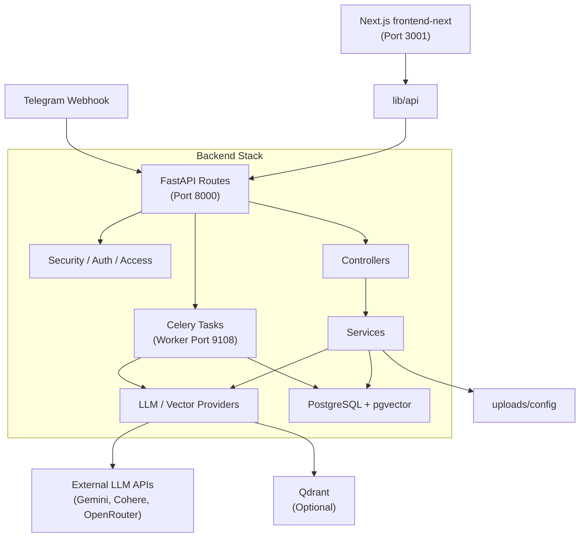
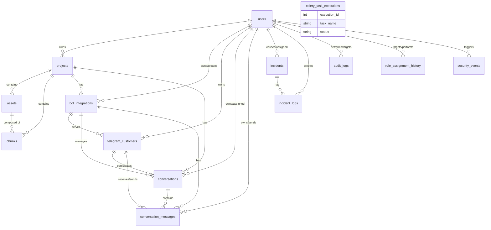
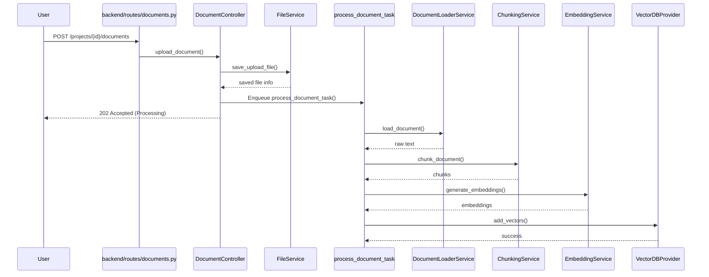
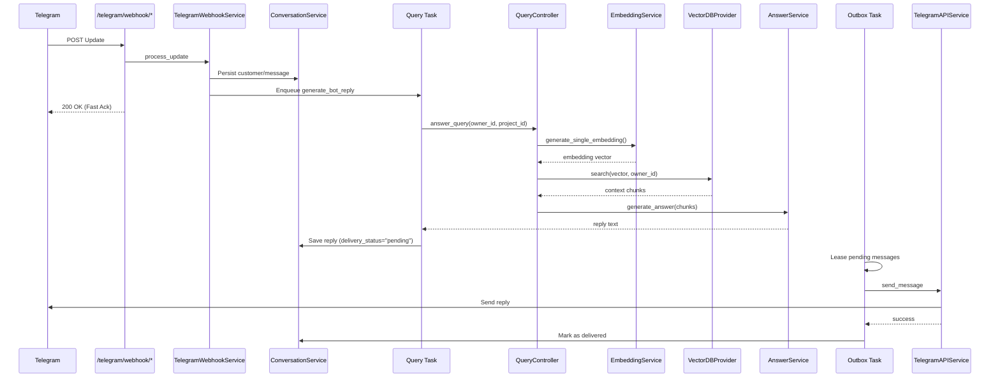

# System Architecture and Flow Diagrams

This document contains Mermaid diagrams visualizing the system architecture, database schema, and key execution flows.

## 1. System Architecture

## 2. Database Entity-Relationship (ER) Diagram

## 3. Upload and Process Document Flow

## 4. Production Telegram Customer Query Flow

