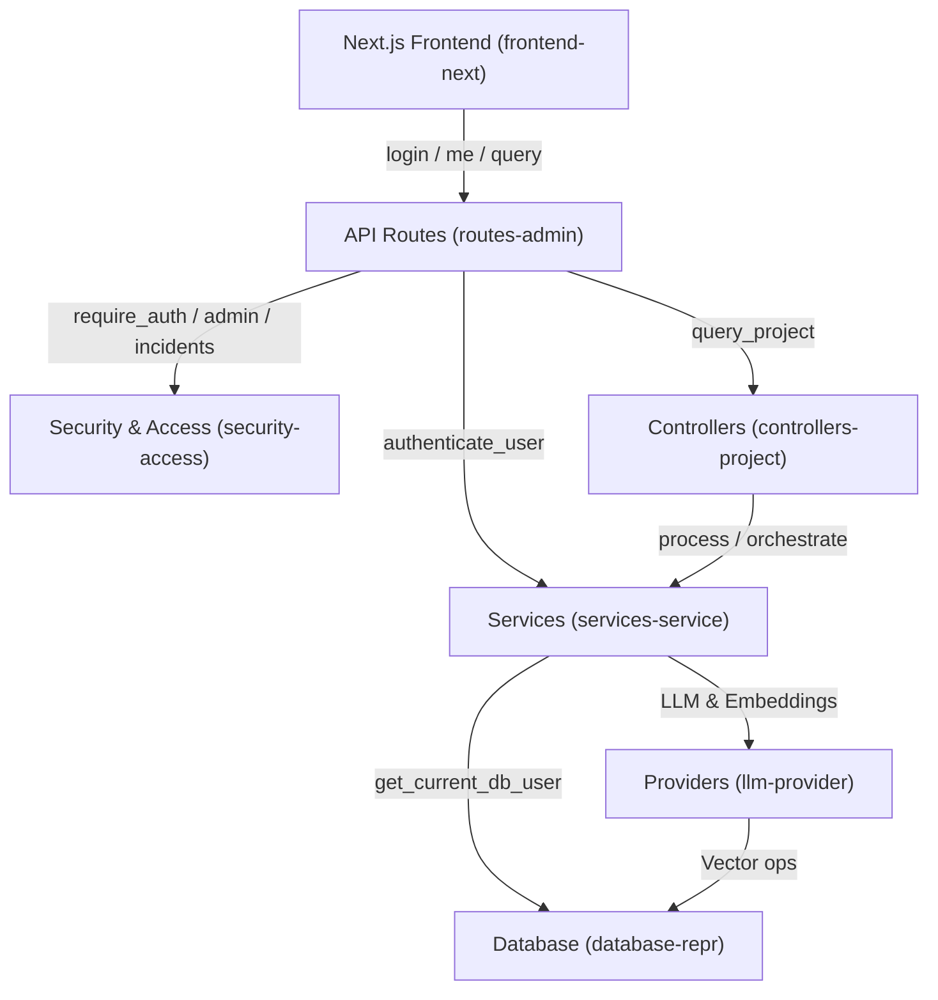
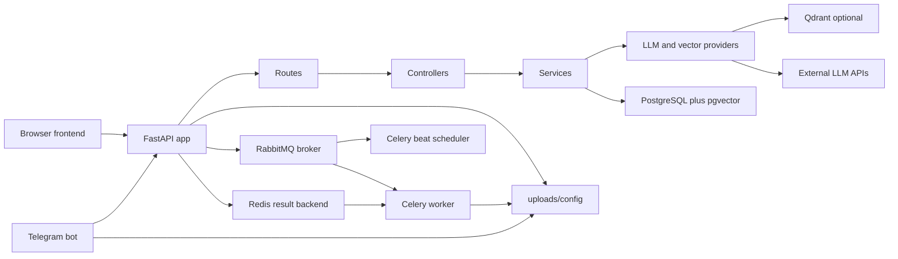
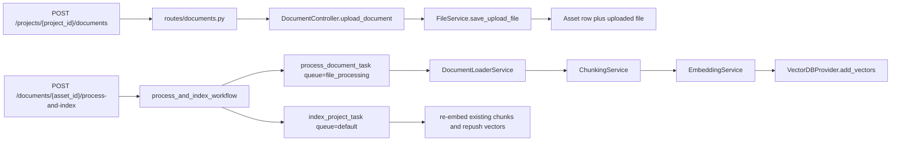
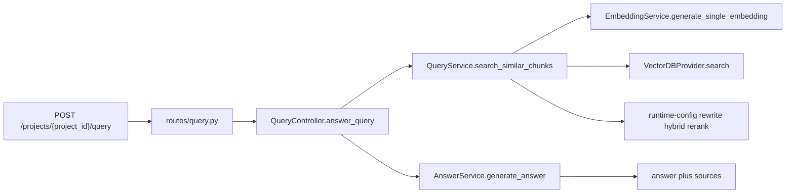
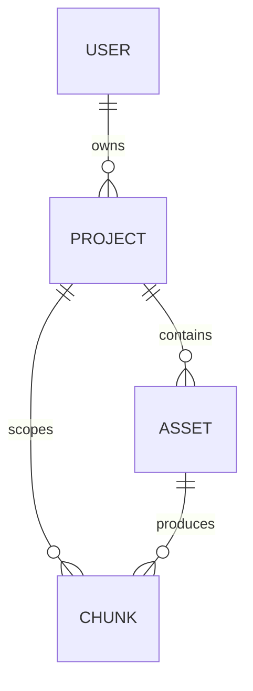
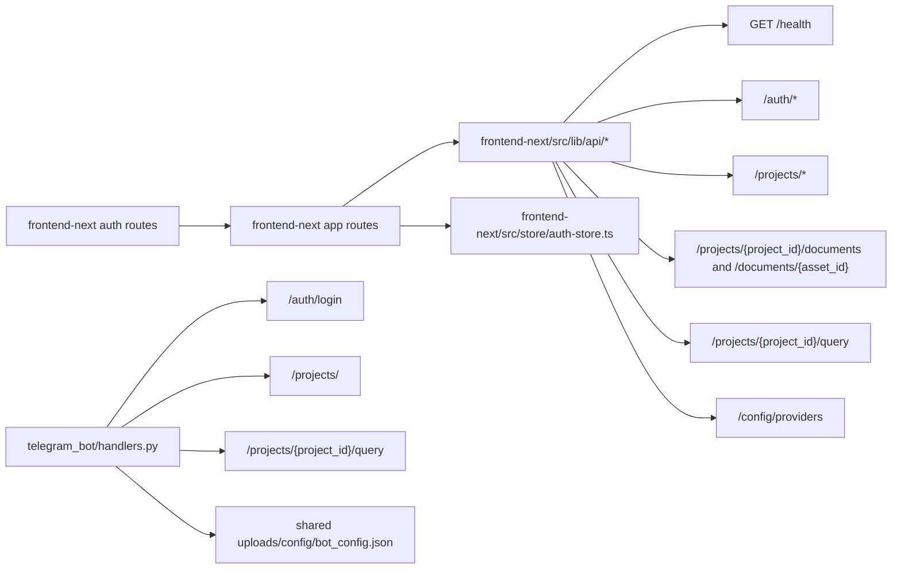

# RAGMind Big Project Documentation

This file is a direct concatenation of project documentation and AGENTS files. It intentionally excludes secrets and runtime files such as `.env`, `uploads/`, `tmp/`, virtual environments, build outputs, and dependency folders.

## Included Sources
- `AGENTS.md`
- `frontend-next/AGENTS.md`
- `README.md`
- `.continue/README.md`
- `report.md`
- `backend/ENDPOINTS.md`
- `frontend-next/README.md`
- `docs/project-graph.md`
- `docs/notes/monitoring-dashboard-notes.md`
- `docs/notes/futurework.html`
- `specs/new front/TASK.md`
- `specs/002-production-security-fixes/spec.md`
- `specs/002-production-security-fixes/plan.md`
- `specs/002-production-security-fixes/tasks.md`
- `specs/002-production-security-fixes/research.md`
- `specs/002-production-security-fixes/data-model.md`
- `specs/002-production-security-fixes/quickstart.md`
- `specs/002-production-security-fixes/contracts/api-changes.md`
- `specs/002-production-security-fixes/checklists/requirements.md`

---

# Source: `AGENTS.md`

<!-- BEGIN SOURCE: AGENTS.md -->

# AGENTS.md

## Purpose

This file is the working map for agents in this repository. Read it before deep exploration, keep it short, and update it whenever the code structure or critical behavior changes.

Primary goal: reduce token waste by searching first, reading only the needed files, and keeping a living code graph here instead of rediscovering the same structure every turn.

## Mandatory Workflow

1. Start with targeted search, not broad file dumps.
2. Read this file before opening many files.
3. Prefer `rg`, `rg --files`, and narrow reads around matched lines.
4. Trace requests by layer: `route -> controller -> service -> provider/db/task`.
5. When a structural change lands, update this file in the same task.
6. When adding a class, endpoint, task, provider, or major function, add it here immediately.
7. When removing or renaming behavior, remove stale entries here immediately.
8. Do not trust `README.md` as the source of truth; verify against code.
9. Keep summaries compact. Do not paste large code blocks into this file.
10. If this file is out of sync with the code, fix it first or explicitly note the drift.

## Token-Saving Search Playbook

- Entry points:
  - `backend/main.py`
  - `backend/routes/*.py`
  - `telegram_bot/bot.py`
  - `frontend-next/src/app/*`
  - `frontend-next/src/lib/api/*`
- Find classes/functions:
  - `rg -n "^(class|def|async def) " backend telegram_bot`
- Find ownership/auth flow:
  - `rg -n "get_current_db_user|owner_id|require_security_center_access" backend`
- Find retrieval pipeline:
  - `rg -n "search_similar_chunks|generate_answer|add_vectors|create_provider" backend`
- Find Celery flow:
  - `rg -n "process_document_task|index_project_task|process_and_index_workflow" backend`
- Find config toggles:
  - `rg -n "get_runtime_value|settings\\.|ENVIRONMENT|CONTEXT_TOKEN_BUDGET|SECURITY_SIMULATION_DESTRUCTIVE_ENABLED|TELEGRAM_OUTBOX" backend .env.example`

## Architecture Summary

The backend is layered and mostly follows this shape:

`FastAPI routes -> controllers -> services -> providers -> DB / vector DB / external APIs`

Cross-cutting layers:

- `backend/security/*`: auth, rate limiting, sanitization, event logging
- `backend/tasks/*`: Celery background processing/indexing workflows
- `backend/monitoring/*`: isolated Prometheus request metrics and `/metrics` registration
- `backend/runtime_config.py`: runtime toggles persisted outside static env config via shared JSON under `uploads/config/`

Top-level repo organization:

- `.dockerignore`: Docker build allowlist for runtime-only context
- `.code-review-graphignore`: code-review-graph parse filter; excludes generated/runtime/local artifacts and one-off maintenance outputs from graph builds
- `.github/workflows/secret-scan.yml`: CI gitleaks secret scanning on pushes and pull requests
- `scripts/dev/`: local Windows startup helpers
  - only three entry scripts should remain here: `setup.bat`, `start.bat`, `stop.bat`
  - current user-requested exception: `newstart.bat` also exists to launch the Next.js frontend after the base stack starts
- `docker/`: Compose/build files plus local monitoring config (`docker/prometheus.yml`, Grafana provisioning, Grafana dashboards, postgres-exporter, and node-exporter)
- `tools/`: maintenance and one-off repo utilities
  - includes `tools/test_all.py` as the authenticated smoke test entrypoint
  - `tools/combine_code.py` writes repo bundles under `tmp/`; default output now prioritizes `AGENTS.md`, `README.md`, `.env.example`, Docker/runtime JSON, `scripts/dev/*.bat`, and `frontend-next/`
- `docs/`: notes and extra documentation
  - includes `docs/project-graph.md` as the current runtime/API/service/data/frontend graph
  - includes `docs/database.md` as the current storage/database map and sync verdict
- `frontend-next/`: current Next.js App Router frontend
  - route entrypoints live under `frontend-next/src/app/`
  - API modules live under `frontend-next/src/lib/api/`
  - auth remains Bearer-token compatible in this round
  - do not use legacy `/bot/config` or `active_project_id` here
  - the deleted legacy static frontend lived under `frontend/`; do not recreate it
- `assets/`: static project assets
- `uploads/config/`: shared runtime config for backend, worker, and telegram bot (`app_config.json`, `bot_config.json`)
- `uploads/logs/`: runtime logs, probes, and local command output
- `tmp/`: generated local artifacts
- root keeps only repo-critical/runtime-root files such as `.env*`, `README.md`, `LICENSE`, `AGENTS.md`, `app_config.json`, and `bot_config.json`; the two root config JSON files now act as legacy/bootstrap copies and live config should be read from `uploads/config/`; Alembic runtime files now live under `backend/alembic/` (`backend/alembic/alembic.ini`, `backend/alembic/init-db.sql`)

Main persistence model:

- PostgreSQL via async SQLAlchemy for users/projects/assets/chunks/task executions
- Vector storage via pluggable provider:
  - `pgvector`
  - `qdrant`

## Code Graph (Architecture Map)

This architecture map was generated by the `code-review-graph` tool. It shows the primary communities (modules) and critical execution flows.



### Communities
- **services-service (222 nodes)**: Directory-based community: `backend/services`
- **frontend-next**: Directory-based community: `frontend-next`
- **routes-admin (179 nodes)**: Directory-based community: `backend/routes`
- **llm-provider (109 nodes)**: Directory-based community: `backend/providers`
- **tests-tests (102 nodes)**: Directory-based community: `backend/tests`
- **security-access (78 nodes)**: Directory-based community: `backend/security`
- **database-repr (35 nodes)**: Directory-based community: `backend/database`
- **controllers-project (33 nodes)**: Directory-based community: `backend/controllers`
- **utils-task (23 nodes)**: Directory-based community: `backend/utils`
- **tools-squad (22 nodes)**: Directory-based community: `tools`

### Critical Execution Flows
- `get_current_user` (criticality: 0.87)
- `get_current_db_user` (criticality: 0.87)
- `login` (criticality: 0.87)
- `require_mutation_auth_if_enabled` (criticality: 0.85)
- `me` (criticality: 0.78)
- `require_security_center_access` (criticality: 0.76)
- `require_incident_access` (criticality: 0.76)
- `require_admin_access` (criticality: 0.75)
- `authenticate_user` (criticality: 0.75)
- `query_project` (criticality: 0.75)

## Runtime Flows

### Upload + Process

1. `POST /projects/{project_id}/documents` in `backend/routes/documents.py`
2. `DocumentController.upload_document()`
3. `FileService.save_upload_file()`
4. Celery `process_document_task()`
5. `DocumentLoaderService.load_document()`
6. `ChunkingService.chunk_document()`
7. `EmbeddingService.generate_embeddings()`
8. `VectorDBProvider.add_vectors()`

Note: pgvector embedding writes for freshly-created chunks must run through the same worker `AsyncSession` that flushed the new chunk rows, and `PGVectorProvider.add_vectors()` verifies every target chunk row is updated. Do not move fresh chunk embedding writes back to a separate uncommitted transaction.

Note: `backend/controllers/document_controller.py` keeps `DocumentController.process_document()` as a deprecated guard (raises `RuntimeError`). The legacy implementation exists as `_deprecated_process_document_impl()` and should not be invoked by routes; processing must go through Celery tasks.

### Query

1. Frontend `handleChatSubmit()` calls `POST /projects/{project_id}/query` directly
2. `POST /projects/{project_id}/query` in `backend/routes/query.py`
3. `QueryController.answer_query()`
4. `QueryService.search_similar_chunks()`
5. `EmbeddingService.generate_single_embedding()`
6. `VectorDBProvider.search()`
7. `AnswerService.generate_answer()`

### Production Telegram Customer Query

1. Telegram sends update to `POST /telegram/webhook/{integration_id}/{webhook_secret}`
2. `TelegramWebhookService` resolves exactly one `BotIntegration`
3. `ConversationService` creates/updates `TelegramCustomer`, `Conversation`, and customer `ConversationMessage`
4. `CustomerBotQueryService` calls `QueryController.answer_query()` with the integration `owner_id` and `project_id`
5. Sources/retrieval metadata are stored internally on `ConversationMessage`
6. Customer reply hides sources unless `show_sources_to_customer` is enabled
7. Webhook saves bot reply/fallback durably as `delivery_status="pending"` on `ConversationMessage`
8. Celery `backend.tasks.telegram_outbox.deliver_pending_messages` claims pending or stale `sending` messages through a lease timestamp and delivers them through `TelegramAPIService`

### Project Reindex

1. `POST /projects/{project_id}/index`
2. Celery `index_project_task()`
3. Re-embed all `Chunk` rows for project
4. Re-push vectors to configured vector DB

## Ownership and Security Rules

- Ownership is derived from JWT-backed `current_user`, not request payloads.
- Product role is DB-backed on `users.role`; default is `company_admin`.
- `PLATFORM_OWNER_USERNAME` promotes the matching DB user to `platform_owner` after login.
- `/admin/*` product console routes must use `require_platform_owner_access()`.
- Retrieval depends on `owner_id` scoping.
- Vector search providers expect owner-aware filtering.
- Any change to retrieval/indexing must preserve `owner_id` in vector metadata.
- Any route calling `ProjectController.get_project()` or `DocumentController.get_document()` must pass `owner_id`.
- Company SaaS routes must filter by `owner_id == current_user.id`.
- Telegram webhook retrieval must use only the `owner_id` and `project_id` on the receiving `BotIntegration`; no project fallback is allowed.
- Telegram bot tokens must be encrypted, hashed for dedupe, never logged, and never returned to clients.
- Conversation sources/retrieval metadata are internal by default; customer-visible sources require `show_sources_to_customer`.
- `POST /config/providers` now always requires an authenticated JWT user (no anonymous mutation fallback).
- `GET /config/providers` requires an authenticated JWT user.
- `GET /stats/` returns counts scoped to the authenticated user's owned projects; platform-wide stats belong under platform-owner-only `/admin/stats`.
- Client IP extraction only honors `X-Forwarded-For` when `request.client.host` matches `SECURITY_TRUSTED_PROXY_IPS`; otherwise direct client host wins.
- Local compose should publish backend and local tooling ports on `127.0.0.1` unless deliberately deployed behind an authenticated/proxied surface.
- `POST /bot/config` now requires a real JWT-backed DB user and only accepts `active_project_id` values owned by that user.
- `/bot/config` remains legacy/demo configuration and now returns a deprecation warning; do not build production behavior on it.
- Configured `BOT_API_*` / `AUTH_ADMIN_*` service-account usernames are reserved from normal signup/password rotation, and successful service-account login keeps a matching DB user row available for `get_current_db_user()`.
- Document processing must go through Celery tasks only (routes dispatch `process_document_task` / `process_and_index_workflow`; direct `DocumentController.process_document()` is disabled).
- Security simulation is non-destructive by default; destructive simulation requires `SECURITY_SIMULATION_DESTRUCTIVE_ENABLED=true` and platform-owner role.
- Unknown Alembic revision auto-stamping is local/dev recovery only; `ENVIRONMENT=production` must fail closed.

## Review Findings

No currently open high-severity findings are tracked in this file after the latest fixes.

Recently fixed:

1. `backend/routes/projects.py`
   `index_project()` now passes JWT-derived `owner_id` before queueing reindexing.
2. `backend/routes/documents.py`
   `process_and_index_document()` now enforces owned-document access before queueing workflow.
3. `backend/tasks/data_indexing.py`
   Reindexing now persists `owner_id` in vector metadata so retrieval scoping remains valid.
4. `backend/main.py`
   CORS now uses `settings.cors_origins` instead of wildcard origins with credentials.
5. `backend/database/connection.py` and `backend/alembic/versions/20260416_01_add_users_and_project_owner.py`
   Schema bootstrapping now runs through Alembic, and the base migration was aligned with the current `users/projects/assets/chunks/celery_task_executions` schema instead of the stale `user_id/email/password_hash` layout.
6. `backend/database/models.py`, `backend/providers/vectordb/pgvector_provider.py`, and `backend/alembic/versions/20260420_01_convert_chunk_embedding_to_pgvector.py`
   `chunks.embedding` now stores native `pgvector` values, a migration converts old JSON embeddings to `vector`, and `PGVectorProvider` executes similarity search inside PostgreSQL only.
7. `backend/providers/vectordb/pgvector_provider.py` and `backend/alembic/versions/20260420_02_add_pgvector_hnsw_indexes.py`
  ANN indexing is now dimension-aware: HNSW expression indexes are created per embedding dimension, and pgvector queries match them via `vector_dims(...)` plus a cast to `vector(query_dim)` or `halfvec(query_dim)`.
8. `backend/config.py` and `backend/flowerconfig.py`
   Runtime startup no longer fails when `CELERY_FLOWER_PASSWORD` is unset; the setting now defaults safely and Flower config reads it defensively.
9. `backend/providers/vectordb/pgvector_provider.py` and `backend/alembic/versions/20260420_02_add_pgvector_hnsw_indexes.py`
  HNSW indexes now use `vector` for dimensions `<= 2000` and `halfvec` for dimensions `<= 4000`; dimensions above that still use exact native pgvector search without ANN indexing.
10. `.dockerignore` and `docker/backend.Dockerfile`
  Docker builds now use a runtime-only context and copy only `backend/`, `telegram_bot/`, and required root config files; do not reintroduce `COPY . .` unless you also revisit build performance.
11. `docker/docker-compose.yml`
   Compose now builds the app image once as `ragmind-app:local`; `worker` and `telegram_bot` reuse that image instead of repeating the same build definition.
12. `scripts/dev/setup.bat`, `scripts/dev/start.bat`, and `scripts/dev/stop.bat`
   These are the only supported local entry scripts; when consolidating script behavior, remove stale helpers instead of keeping multiple overlapping launch paths. `start.bat` should default to a fast `docker compose up -d` path and reserve `--build` for explicit rebuilds only.
13. `uploads/logs/`
  `setup.bat` writes `uploads/logs/setup.log`; `start.bat` writes `uploads/logs/start.log`; `stop.bat` writes `uploads/logs/stop.log` and appends pre/post-stop stack state to `uploads/logs/docker_ps.log`.
14. Legacy static frontend note
   The old static HTML/CSS/JS frontend previously lived under `frontend/` and used port `8080`; it has since been deleted. Do not add new code or docs for that path.
15. `backend/utils/task_tracking.py`, `backend/utils/idempotency_manager.py`, `backend/routes/projects.py`, `backend/routes/documents.py`, `backend/tasks/data_indexing.py`, `backend/tasks/file_processing.py`, `backend/tasks/process_workflow.py`, and `backend/celery_app.py`
  Task ownership is now persisted by `celery_task_id` instead of relying on in-memory-only `_TASK_OWNER_MAP`, manual project reindex uses the default worker queue plus durable owner tracking, worker tasks reuse the pre-created execution row instead of duplicating it, duplicate historical rows are merged away by `celery_task_id`, and `process-and-index` parent workflows now finalize from child-task reconciliation instead of needing `/tasks/{id}` polling to reach a terminal state.
16. `backend/providers/llm/factory.py` and `backend/routes/app_config.py`
  Provider availability is registry-backed. Embeddings are currently `gemini` and `cohere`; broken `voyage`/`bge-m3` options were removed from production selection.
17. `backend/providers/llm/factory.py`
  `gemini-2.5-lite-flash` now resolves through a dedicated lite builder, ensuring explicit lite provider selection uses `settings.gemini_lite_model` instead of falling back to the standard Gemini model.
18. `backend/providers/llm/gemini_provider.py`
  Gemini embedding dimension is no longer hardcoded to `768`; it now infers by embedding model (`gemini-embedding-001` -> `3072`, `text-embedding-004` -> `768`) and updates dynamically from real embedding responses.
19. `backend/routes/documents.py`, `backend/routes/projects.py`, `backend/routes/query.py`, `backend/routes/stats.py`, and `backend/routes/bot_config.py`
  Route-level unexpected exceptions are now logged server-side and return sanitized client messages (for example `Internal server error`) instead of leaking raw `detail=str(e)` internals.
20. `backend/security/middleware.py` and `backend/config.py`
  Rate limiting now keys authenticated traffic by JWT subject (`user:<sub>`) with IP fallback to reduce shared-IP bottlenecks, and default throughput caps were raised (`chat` and `upload` request/in-flight limits) while retaining endpoint-specific throttling.
21. `backend/config.py`, `.env`, and `.env.example`
  OpenRouter Gemma 4 26B A4B and optional local Gemma 4 E4B are supported as separate LLM providers; Google Gemini still uses the Gemini API models.
22. `backend/shared_config_paths.py`, `backend/runtime_config.py`, `backend/routes/bot_config.py`, `telegram_bot/config.py`, `telegram_bot/handlers.py`, and `docker/docker-compose.yml`
  Runtime app/bot config now resolves through shared files under `uploads/config/`, Compose passes `RAGMIND_SHARED_CONFIG_DIR` to backend/worker/bot and mounts `uploads/` into the bot, the hardcoded `BOT_ACTIVE_PROJECT_ID` compose override was removed, `/bot/config` now requires an authenticated DB user plus owned-project validation, and the bot idles instead of crash-looping when `TELEGRAM_BOT_TOKEN` is blank.
23. `backend/security/auth.py` and `backend/services/auth_service.py`
  `BOT_API_*` and `AUTH_ADMIN_*` credentials now act as managed service accounts during `/auth/login`: successful login provisions or syncs a DB-backed user row so JWT subjects continue to resolve through `get_current_db_user()`, and those reserved usernames are blocked from normal signup/password rotation.
24. `docker/docker-compose.yml` and `backend/tasks/maintenance.py`
  Compose now runs a dedicated Celery beat scheduler service (`ragmind-scheduler`) so periodic cleanup tasks like `clean_celery_executions_table()` are actually scheduled in the default local stack.
25. `backend/providers/vectordb/interface.py`, `backend/providers/vectordb/pgvector_provider.py`, `backend/providers/vectordb/qdrant_provider.py`, and `backend/tasks/file_processing.py`
  Targeted stale-vector cleanup is now available across vector providers: `delete_vectors(...)` deletes by metadata filter, and document-processing retries/failures now clear old vectors for the current asset before rebuilding chunks/embeddings.
26. `backend/routes/health.py` and `scripts/dev/start.bat`
  Startup readiness now reflects the actual stack: `/health` returns `healthy` only when database, broker, result backend, Celery worker, shared config, and vector store are reachable, and `start.bat` waits for that JSON-ready state instead of any HTTP 200.
27. Legacy frontend security fixes
  Historical static-frontend fixes covered Security Center feed reset behavior and the non-streaming `POST /projects/{project_id}/query` chat path before the static frontend was removed.
28. `.env.example`, `.github/workflows/secret-scan.yml`, `backend/main.py`, `backend/routes/app_config.py`, `backend/config.py`, `backend/routes/documents.py`, `backend/providers/vectordb/pgvector_provider.py`, `backend/controllers/query_controller.py`, `backend/routes/query.py`, `backend/init_database.py`, and `backend/routes/stats.py`
  Security and reliability hardening pass: leaked example credentials were replaced with placeholders and CI secret scanning was added; CORS now reads `settings.cors_origins`; provider mutation and global stats endpoints require JWT auth by default; upload reads are capped to `max_size + 1` before rejection; pgvector vector deletion now rejects empty/unknown/null-only filters; query infrastructure failures now surface as sanitized `503` errors instead of `200` fallback answers; database bootstrap SQL now uses parameterization and `sql.Identifier`.
29. `backend/database/models.py`, `backend/alembic/versions/20260427_01_add_b2b_telegram_saas.py`, `backend/routes/bot_integrations.py`, `backend/routes/conversations.py`, `backend/routes/telegram_webhook.py`, `backend/routes/admin_console.py`, `backend/services/*telegram*`, `backend/services/bot_integration_service.py`, `backend/services/conversation_service.py`, and `backend/security/auth.py`
  B2B Telegram SaaS implementation added DB-backed bot integrations, encrypted token storage, durable Telegram customers/conversations/messages, customer-safe RAG replies, per-integration webhook throttling/idempotency, company-scoped dashboard routes, and platform-owner-only `/admin/*` product routes.
31. `backend/routes/admin_users.py` and `backend/tests/test_admin_service.py`
  `/admin/users/*` status-mutation routes now require `require_platform_owner_access` (not legacy `require_admin_access`) and regression tests assert platform-owner-only enforcement.
32. `backend/services/telegram_api_service.py`, `backend/services/bot_integration_service.py`, and `backend/tests/test_bot_integrations.py`
  Bot integration readiness now validates decrypted token health, live Telegram token validation, real Telegram webhook alignment, and provider-stack readiness (LLM + embedding + vector backend) before reporting `ready=true`.
33. `backend/routes/app_config.py`, `backend/main.py`, and `backend/tests/test_app_config.py`
  Runtime provider selections are now normalized/migrated when invalid legacy values are found (for example removed providers), both at startup and via `GET /config/providers`, preventing stale config from breaking query/indexing.
34. `docker/docker-compose.yml`, `docker/prometheus.yml`, `docker/grafana/provisioning/*`, `docker/grafana/dashboards/ragmind-overview.json`, `backend/monitoring/metrics.py`, `backend/main.py`, and `backend/config.py`
  Prometheus/Grafana monitoring was reapplied as isolated infrastructure: compose adds Prometheus, Grafana, and postgres-exporter; backend exposes minimal Prometheus metrics without touching existing API routers, auth, Celery, Telegram, retrieval, or provider behavior.
35. `backend/database/connection.py`
  Local startup now recovers from dev databases stamped with unknown discarded-branch Alembic revisions by stamping to the current head and retrying migrations, preserving the restored codebase while avoiding a startup crash on polluted local volumes.
36. `docker/docker-compose.yml`
  The legacy single Telegram polling bot now idles by default and only starts when `ENABLE_LEGACY_TELEGRAM_BOT=1`, preventing local logs from filling with Telegram `409` conflicts when a production webhook is registered for the same token.
37. `frontend-next/src/app/*`, `frontend-next/src/lib/api/*`, `frontend-next/src/store/auth-store.ts`, and `.env.example`
  New Next.js App Router frontend migration now lives in `frontend-next/`, runs on `http://localhost:3001`, uses `NEXT_PUBLIC_API_BASE_URL` for backend calls, keeps Bearer-token compatibility for this round, surfaces company/admin product routes without using legacy `/bot/config` or `active_project_id`, and adds build/typecheck/lint validation through the new frontend workspace.
38. `scripts/dev/newstart.bat`, `README.md`, and `AGENTS.md`
  `newstart.bat` is a user-requested helper that first calls `scripts/dev/start.bat`, then launches `frontend-next` with `pnpm dev` or `npm run dev`, waits for `http://localhost:3001/login`, and opens the Next.js frontend. This is an explicit exception to the normal three-script guidance in `scripts/dev/`.
39. `frontend-next/src/lib/auth/session.ts`, `frontend-next/src/app/(auth)/login/page.tsx`, `frontend-next/src/components/layout/RoleGuard.tsx`, `docker/docker-compose.yml`, and `.env`
  Next.js auth hydration now runs once via `useAuthStore.getState()` and auth consumers read store fields with separate selectors to avoid React 19 external-store infinite-update loops; local backend CORS now explicitly includes `http://localhost:3001` and `http://127.0.0.1:3001` so the Next.js frontend can call `/health` and auth endpoints from the dev port.
40. `backend/tasks/file_processing.py`, `backend/providers/vectordb/pgvector_provider.py`, `backend/database/connection.py`, `backend/security/client_ip.py`, `backend/tasks/telegram_outbox.py`, `backend/database/models.py`, `backend/alembic/versions/20260501_01_add_telegram_outbox_claim_lease.py`, `backend/routes/stats.py`, `backend/routes/bot_integrations.py`, `backend/services/bot_integration_service.py`, `frontend-next/src/components/bots/BotFormDrawer.tsx`, `frontend-next/package.json`, `frontend-next/pnpm-lock.yaml`, `docker/docker-compose.yml`, `scripts/dev/start.bat`, `backend/requirements.txt`, `README.md`, and `AGENTS.md`
  Report hardening pass: fresh pgvector embeddings now update in the worker transaction and verify row counts; unknown Alembic revision auto-stamping is blocked in production; forwarded IPs require trusted proxies; Telegram outbox stale `sending` claims are recoverable; audited backend/PostCSS dependency pins were raised; `/stats/` is tenant-scoped; bot fallback messages can be cleared; Next bot forms expose customer-source and human-handoff toggles; local compose and Next frontend surfaces bind to loopback; stale `tempCodeRunnerFile.bat` was removed and the project graph moved to `docs/project-graph.md`.
41. `frontend/`, `docker/front.Dockerfile`, `scripts/dev/start.bat`, `scripts/dev/newstart.bat`, `scripts/dev/stop.bat`, `docker/docker-compose.yml`, `.dockerignore`, `backend/config.py`, `.env.example`, `README.md`, and `docs/project-graph.md`
  Legacy static frontend removal: `frontend/` and its nginx Dockerfile were deleted, `start.bat` now starts the backend stack only, `newstart.bat` is the supported frontend launcher for `frontend-next` on port `3001`, `stop.bat` closes the Next.js helper window, the `docker-frontend` compose profile was removed, and default CORS no longer includes port `8080`.

## Known Drift Between Docs and Code

- `README.md` is aligned with the current SaaS/product entry points at a high level, but code remains source of truth for endpoint details.
- Celery/background-task paths are central in code and should be trusted over README summaries.
- Runtime-config-driven retrieval behavior exists in code and is not fully captured in README.
- Alembic migrations must stay in sync with `backend/database/models.py`; do not assume old revisions reflect current field names.

## Update Rules For This File

Update `AGENTS.md` immediately when any of the following changes:

- new route/controller/service/provider/task is added
- method signatures change
- ownership/auth flow changes
- vector metadata shape changes
- runtime flags change retrieval/indexing behavior
- new known bug is discovered or fixed
- frontend entrypoint/API flow changes materially

When updating:

1. Keep this file concise.
2. Prefer bullets and short path-based references.
3. Remove stale entries, do not only append.
4. Add the critical path first, details second.
5. If a section becomes too large, summarize and point to the code paths.

## Practical Guidance For Future Agents

- Use GitHub MCP for repo, PR, issue, and review context.
- Use Context7 before answering framework or library version questions.
- Use OpenAI Developer Docs MCP for OpenAI, Codex, and API questions.
- Use Playwright MCP for UI, browser, and frontend verification.
- Use filesystem MCP only within this repository root.
- Do not add Postgres MCP unless a safe read-only `DATABASE_URL` or `POSTGRES_*` environment value already exists.
- For Jira-backed feature work or structured planning, use the Squad workflow prompt in `.github/prompts/squad-workflow.prompt.md` before coding; the repo and user-level copies both follow `squad init` -> `squad new-story` -> `squad new-plan`.
- The Squad MCP wrapper lives in `tools/squad_mcp_server.py` and exposes the same `init`, `new-story`, and `new-plan` workflow to MCP clients.

- Before editing retrieval or indexing, inspect:
  - `backend/services/query_service.py`
  - `backend/tasks/data_indexing.py`
  - `backend/tasks/file_processing.py`
  - `backend/providers/vectordb/*`
- Before editing auth/security, inspect:
  - `backend/security/auth.py`
  - `backend/routes/auth.py`
  - `backend/security/middleware.py`
  - `backend/services/login_security_service.py`
- Before editing uploads/documents, inspect:
  - `backend/routes/documents.py`
  - `backend/controllers/document_controller.py`
  - `backend/services/file_service.py`
  - `backend/services/document_loader.py`
  - `backend/services/chunking_service.py`

## MCP Usage Rules

- Use GitHub MCP for repo, PR, issue, and review context.
- Use Context7 before answering framework or library version questions.
- Use OpenAI Developer Docs MCP for OpenAI, Codex, and API questions.
- Use Playwright MCP for UI, browser, and frontend verification.
- Use filesystem MCP only within this repository root.
- Do not add Postgres MCP unless a safe read-only `DATABASE_URL` or `POSTGRES_*` environment value already exists.

## MCP and AI Review Tooling

- Use Serena MCP for semantic code navigation, symbols, references, and targeted edits.
- Use Repomix MCP when the agent needs a compact AI-friendly package of the repo.
- Use Sentry MCP only for debugging real Sentry issues/errors/traces after OAuth.
- Use DeepWiki MCP for public GitHub repo documentation/context.
- Use Sourcegraph MCP only if `SOURCEGRAPH_MCP_URL` is configured.
- Use CodeRabbit for local VS Code review before opening PRs.
- Use Graphite AI Reviews for PR review automation after GitHub App setup.
- Use Continue AI Checks for repo-specific security/backend/frontend review gates.
- Never hardcode secrets in MCP configs.
- Never expose local infrastructure ports publicly unless intentionally deployed behind auth.

## Bottom Line

Yes, maintaining a repo-aware `AGENTS.md` with a concise code graph and update rules is a modern and useful workflow, especially for agent-assisted development. The important part is that it must stay short, code-grounded, and updated with every structural change, otherwise it becomes another stale doc that increases token cost instead of reducing it.

<!-- SPECKIT START -->
For additional context about technologies to be used, project structure,
shell commands, and other important information, read the current plan
<!-- SPECKIT END -->

<!-- END SOURCE: AGENTS.md -->

---

# Source: `frontend-next/AGENTS.md`

<!-- BEGIN SOURCE: frontend-next/AGENTS.md -->

<!-- BEGIN:nextjs-agent-rules -->
# This is NOT the Next.js you know

This version has breaking changes — APIs, conventions, and file structure may all differ from your training data. Read the relevant guide in `node_modules/next/dist/docs/` before writing any code. Heed deprecation notices.
<!-- END:nextjs-agent-rules -->

<!-- END SOURCE: frontend-next/AGENTS.md -->

---

# Source: `README.md`

<!-- BEGIN SOURCE: README.md -->

# RAGMind

RAGMind is a B2B SaaS Retrieval Augmented Generation (RAG) platform for turning uploaded company documents into searchable project knowledge bases and Telegram customer-support bots.

It combines a FastAPI backend, background processing with Celery, vector search with pgvector or Qdrant, and a Next.js App Router frontend in `frontend-next/`.

## Current Stack

- Backend: FastAPI + SQLAlchemy (async)
- Background jobs: Celery + RabbitMQ + Redis
- Databases: PostgreSQL (with pgvector) and optional Qdrant
- Frontend: Next.js App Router frontend on port 3001
- Product roles: `company_admin` and `platform_owner`
- Telegram support: database-backed bot integrations plus durable conversations
- Legacy bot: optional single-bot service kept for demo/backward compatibility
- Local runtime exposure: compose-published services and Next.js dev/start scripts bind to `127.0.0.1` by default

## Architecture At A Glance

1. Upload document to a project.
2. Celery worker extracts text, chunks content, and generates embeddings.
3. Vectors are written to the active vector provider; pgvector embedding writes share the worker transaction that created fresh chunks.
4. Query endpoint retrieves relevant chunks and sends context to the configured LLM provider.
5. Response is returned with source context for dashboard testing.
6. Production Telegram webhooks resolve a bot integration, persist the customer conversation, reuse the same RAG stack with `owner_id`/`project_id` scoping, and hide sources from customers by default.

## Code Graph (Architecture Map)

This architecture map was generated by the `code-review-graph` tool. It shows the primary communities (modules) and critical execution flows.


### Communities
- **services-service (222 nodes)**: Directory-based community: `backend/services`
- **frontend-next**: Next.js App Router frontend under `frontend-next/`
- **routes-admin (179 nodes)**: Directory-based community: `backend/routes`
- **llm-provider (109 nodes)**: Directory-based community: `backend/providers`
- **tests-tests (102 nodes)**: Directory-based community: `backend/tests`
- **security-access (78 nodes)**: Directory-based community: `backend/security`
- **database-repr (35 nodes)**: Directory-based community: `backend/database`
- **controllers-project (33 nodes)**: Directory-based community: `backend/controllers`
- **utils-task (23 nodes)**: Directory-based community: `backend/utils`
- **tools-squad (22 nodes)**: Directory-based community: `tools`

## Quick Start (Windows)

### Prerequisites

- Docker Desktop (Linux containers)
- WSL2 enabled for Docker Desktop
- Python 3.11+ for local tooling
- uv (optional but recommended for faster environment setup)

### 1. Clone

```powershell
git clone https://github.com/ZozElwakil/RAGMind---EELU-Project.git
cd RAGMind---EELU-Project
```

### 2. Setup

```powershell
scripts\dev\setup.bat
```

What setup does:

- creates or repairs venv
- installs backend dependencies from backend/requirements.txt (using `uv` when available, with `pip` fallback)
- creates .env from .env.example when missing
- creates uploads, tmp, and logs directories
- validates docker compose config when Docker is ready (`docker compose` or `docker-compose`)

### 3. Configure Environment

Edit .env and set provider credentials you plan to use.

Common required values:

- GEMINI_API_KEY (if using Gemini provider)
- OPENROUTER_API_KEY (if using OpenRouter Gemini, Free, or Gemma 4 26B A4B providers)
- GROQ_API_KEY (if using Groq Llama 3.3)
- CEREBRAS_API_KEY (if using Cerebras Llama 3.1)
- COHERE_API_KEY (if using Cohere embeddings)
- BOT_TOKEN_ENCRYPTION_KEY (required before saving production Telegram bot integrations)
- PUBLIC_WEBHOOK_BASE_URL (public HTTPS backend URL used to register Telegram webhooks)
- PLATFORM_OWNER_USERNAME (username promoted to platform_owner after login)
- TELEGRAM_BOT_TOKEN (legacy single-bot service only)

Generate a Fernet encryption key for bot tokens:

```powershell
python -c "from cryptography.fernet import Fernet; print(Fernet.generate_key().decode())"
```

### Authentication (Current Round)

This round uses the existing Bearer-token flow (frontend stores and sends `Authorization: Bearer <token>`).

Cookie-based frontend auth (HttpOnly session cookies) is not implemented yet and is planned for a later round.

### 4. Start The Local Stack

```powershell
scripts\dev\newstart.bat
```

Use rebuild mode only when Docker image inputs changed:

```powershell
scripts\dev\start.bat --build
```

Default URLs:

- Next.js frontend: [http://localhost:3001/login](http://localhost:3001/login)
- Backend API: [http://localhost:8000](http://localhost:8000)
- Health: [http://localhost:8000/health](http://localhost:8000/health)
- Metrics: [http://localhost:8000/metrics](http://localhost:8000/metrics)
- API docs: [http://localhost:8000/docs](http://localhost:8000/docs)
- Prometheus: [http://localhost:9090](http://localhost:9090)
- Grafana: [http://localhost:3000](http://localhost:3000) with `admin` / `admin123`

Local compose publishes the backend on `127.0.0.1:8000`. For a LAN or production deployment, put the backend behind an intentional reverse proxy and set `SECURITY_TRUSTED_PROXY_IPS` to the proxy IPs/CIDRs before relying on forwarded client IP headers.

### 5. Stop

```powershell
scripts\dev\stop.bat
```

## Dev Scripts

All supported local scripts are under scripts/dev.

| Script | Purpose | Key behavior | Logs |
| --- | --- | --- | --- |
| scripts/dev/setup.bat | Prepare local environment | Creates venv, installs deps, initializes .env | uploads/logs/setup.log |
| scripts/dev/start.bat | Start backend stack only | Uses docker compose up -d by default; supports --build | uploads/logs/start.log |
| scripts/dev/newstart.bat | Start backend stack and open the Next.js frontend | Calls `start.bat`, launches `frontend-next` on port 3001, then opens `/login` | uploads/logs/newstart.log, uploads/logs/frontend_next.log |
| scripts/dev/stop.bat | Stop stack and close helper windows | Stops compose services and captures stack state | uploads/logs/stop.log, uploads/logs/docker_ps.log |

## Next.js Frontend

The dashboard frontend lives in `frontend-next/`.

Run it with:

```powershell
cd frontend-next
pnpm dev
```

Or use the helper script:

```powershell
scripts\dev\newstart.bat
```

Key details:

- URL: `http://localhost:3001` (`pnpm dev` and `pnpm start` bind to `127.0.0.1`)
- Env file: `frontend-next/.env.local`
- Required public env: `NEXT_PUBLIC_API_BASE_URL=http://localhost:8000`
- Auth remains Bearer-token compatible in this migration round
- Telegram bot forms expose source-visibility and human-handoff settings
- The legacy static `frontend/` was removed; do not build new behavior there.

## Docker And WSL Troubleshooting (Windows)

If Docker Desktop shows errors like:

- WSL integration with distro Ubuntu unexpectedly stopped
- Wsl/Service/CreateInstance/E_FAIL

Use this sequence:

1. Close Docker Desktop.
2. Run: wsl --shutdown
3. Run: wsl --update
4. Start Docker Desktop again and wait until Engine is ready.
5. In Docker Desktop settings, toggle Ubuntu integration off/on under Resources > WSL Integration.
6. Retry scripts/dev/start.bat.

The scripts now print WSL-specific hints when this failure mode is detected.

## Runtime Services And Ports

- backend: 8000
- postgres (host mapped): 5435
- qdrant (host mapped): 6381
- rabbitmq AMQP: 5729
- rabbitmq management: 15672
- redis: 6383
- Prometheus: 9090
- Grafana: 3000
- postgres-exporter: 9187
- node-exporter: 9100
- Celery worker metrics: 9108

The `/stats/` endpoint returns counts scoped to the authenticated company user's projects. Platform-wide counts are available through `/admin/stats` for `platform_owner` users.

## Monitoring

The local Docker stack includes Prometheus, Grafana, postgres-exporter, node-exporter, and a Celery worker metrics endpoint.

- Backend metrics are exposed at `/metrics` through `backend/monitoring/metrics.py`.
- Celery task/document metrics are exposed from the worker on `worker:9108/metrics`.
- Prometheus config lives in `docker/prometheus.yml` and scrapes `backend:8000`, `postgres-exporter:9187`, `node-exporter:9100`, `worker:9108`, and Qdrant's built-in `qdrant:6333/metrics` endpoint.
- Grafana provisioning lives in `docker/grafana/provisioning/`.
- Bundled dashboards live in `docker/grafana/dashboards/` and load automatically:
  - `RAGMind Overview`
  - `PostgreSQL Exporter` (Grafana dashboard 12485)
  - `Node Exporter Full` (Grafana dashboard 1860)
  - `FastAPI Observability` (Grafana dashboard 18739, adapted to RAGMind's `endpoint` and `status_code` labels)

Start normally with:

```powershell
scripts\dev\start.bat
```

Open Prometheus at [http://localhost:9090](http://localhost:9090). Open Grafana at [http://localhost:3000](http://localhost:3000).

## Database Migrations (Alembic)

Database initialization runs migrations via Alembic during backend startup.
Manual commands are still useful when working directly with schema changes.
Unknown Alembic revision auto-recovery is allowed only outside `ENVIRONMENT=production`; production fails closed and requires an operator migration decision.

Upgrade:

```powershell
alembic -c backend/alembic/alembic.ini upgrade head
```

Rollback one revision:

```powershell
alembic -c backend/alembic/alembic.ini downgrade -1
```

## API Reference

- Route inventory: backend/ENDPOINTS.md
- Interactive docs: /docs when backend is running

Production Telegram endpoints:

- `POST /bot-integrations/` creates a company-owned Telegram bot integration for an owned project.
- `POST /telegram/webhook/{integration_id}/{webhook_secret}` receives Telegram updates for exactly one integration.
- `GET /conversations/` and related routes power the company support inbox.
- `/admin/*` routes are platform-owner-only and return `403` for normal company users.
- Telegram outbox delivery uses a claim lease so stale `sending` messages can be retried by later worker runs.

The legacy `/bot/config` and `telegram_bot/` active-project flow remains for demo compatibility only. It must not be used for multi-company production support behavior.

## Smoke Test

Run the end-to-end smoke test against a running backend:

```powershell
python tools/test_all.py
```

Optional environment variables:

- RAGMIND_BASE_URL
- RAGMIND_REQUEST_TIMEOUT
- RAGMIND_PROCESSING_TIMEOUT
- RAGMIND_STRICT_QUERY

## Dependency Security

Backend framework/request-parsing dependencies are pinned past the audit findings in `backend/requirements.txt` (`fastapi`, `starlette`, `python-multipart`, and `python-dotenv`). The Next.js workspace uses a `pnpm` override to keep transitive `postcss` on `8.5.12`.

## Repository Layout

```text
backend/        FastAPI app, routes, services, providers, tasks
backend/templates/ Prompt templates used by answer and query services
docker/         Dockerfile and docker-compose setup
frontend-next/  Next.js App Router dashboard migration
telegram_bot/   Legacy single-bot integration
scripts/dev/    setup/start/stop scripts for local Windows workflow
backend/alembic/ Database migration revisions
docs/project-graph.md Runtime/API/service/data/frontend graph
docs/notes/     reports and long-form notes (non-runtime docs)
tools/          Utility scripts, including smoke test
uploads/        Local uploaded files and runtime logs under uploads/logs/
tmp/            Generated local artifacts
```

## Repository Hygiene

- Keep repository root for operational files only (runtime config, compose/build files, licenses, and primary docs like README).
- Move analysis reports and long-form notes under `docs/notes/` instead of adding them to root.
- Current report files live in `docs/notes/report.md` and `docs/notes/report-2.md`.

## License

MIT. See LICENSE.

<!-- END SOURCE: README.md -->

---

# Source: `.continue/README.md`

<!-- BEGIN SOURCE: .continue/README.md -->

# Continue Checks

Local Continue AI Checks are scaffolded in `.continue/checks/`.

To run them on pull requests, Continue/GitHub automation is still required.

Required secret for CI automation:
- `CONTINUE_API_KEY`

Do not commit API keys or other secrets into this repository.

<!-- END SOURCE: .continue/README.md -->

---

# Source: `report.md`

<!-- BEGIN SOURCE: report.md -->

# Project Review Report

Date: 2026-05-01

Scope: repository-wide review of backend routes/services/tasks/providers, frontend API/auth flows, runtime scripts, Docker config, and dependency audit results.

## Findings

### High - Fresh document processing can complete without pgvector embeddings

Evidence:
- `backend/tasks/file_processing.py:281-320` flushes new `Chunk` rows, then calls `vector_db.add_vectors(...)` before the worker session commits those rows.
- `backend/providers/vectordb/pgvector_provider.py:255-264` opens a separate session and runs `UPDATE chunks SET embedding=... WHERE id = ...`.

Impact: with the default `pgvector` provider, the separate update transaction cannot see the uncommitted chunk rows. Upload processing can mark an asset `completed` while the new chunks keep `embedding = NULL`, so project queries and bot readiness find no usable context.

Suggested fix: either store embeddings on the same `AsyncSession`/transaction that created the chunks, or commit chunks before the pgvector update and verify update row counts. Add a regression test that processes a document with pgvector and asserts all created chunks have non-null embeddings.

### High - Alembic unknown-revision recovery can silently stamp production databases

Evidence:
- `backend/database/connection.py:67-95` catches unknown Alembic revision errors, deletes `alembic_version`, stamps the current head, and retries without checking `settings.environment`.

Impact: this is documented as a local/dev recovery behavior, but the code runs in every environment. In production, a bad Alembic stamp could be treated as success while missing migrations are skipped, leaving schema drift hidden until runtime failures or data corruption.

Suggested fix: gate this path to `ENVIRONMENT != production` or behind an explicit one-shot recovery flag. Production should fail closed and require an operator migration/stamp decision.

### High - Client-supplied `X-Forwarded-For` is trusted for rate limiting and login abuse controls

Evidence:
- `backend/security/middleware.py:121-144`
- `backend/routes/auth.py:140-142`
- `backend/security/auth.py:209-211`
- `docker/docker-compose.yml:157-158` exposes the backend as `8000:8000`.

Impact: direct clients can spoof `X-Forwarded-For` to rotate the apparent IP address. That weakens unauthenticated endpoint throttling and login brute-force controls. This matters more because the backend port is exposed on all interfaces in compose.

Suggested fix: only honor forwarded headers from a configured trusted proxy list, otherwise use `request.client.host`. Prefer binding local compose ports to `127.0.0.1` unless deliberately deploying behind a real proxy.

### High - Telegram outbox messages can be stuck forever in `sending`

Evidence:
- `backend/tasks/telegram_outbox.py:48-56` only selects `delivery_status == "pending"`.
- `backend/tasks/telegram_outbox.py:90-94` commits `delivery_status = "sending"` before the external Telegram API call.

Impact: if the worker crashes or is killed after the claim commit, the message remains `sending` and will never be selected again. Customer replies can be permanently lost from the delivery loop.

Suggested fix: add a lease timestamp/claim owner and requeue stale `sending` rows, or select both `pending` and expired `sending` messages. Add a test for recovering a stale claimed message.

### High - Dependency audits report known vulnerabilities

Evidence:
- `uvx pip-audit --path .venv\Lib\site-packages` reported:
  - `fastapi 0.109.0` / `PYSEC-2024-38`, fixed in `0.109.1`
  - `python-dotenv 1.0.0` / `CVE-2026-28684`, fixed in `1.2.2`
  - `python-multipart 0.0.6` / multiple advisories, fixed by `0.0.26`
  - `starlette 0.35.1` / `CVE-2024-47874` and `CVE-2025-54121`, fixed by `0.47.2`
- `pnpm audit --prod --audit-level moderate` reported `postcss <8.5.10` through `next -> postcss@8.4.31`.
- Direct requirement lines include `backend/requirements.txt:2`, `backend/requirements.txt:4`, and `backend/requirements.txt:39`.

Impact: request parsing, framework, env parsing, and CSS serialization dependencies include known security issues.

Suggested fix: upgrade FastAPI/Starlette together, bump `python-multipart` and `python-dotenv`, and resolve the Next/PostCSS tree with a Next upgrade or a pnpm override if compatible.

### Medium - Legacy frontend defaults to a public API host instead of localhost

Evidence:
- `frontend/app.js:7`
- `frontend/login.html:79`
- `frontend/signup.html:113`
- `frontend/index.html:897`
- AGENTS says legacy frontend autodiscovery should default to `http://localhost:8000`.

Impact: users opening the legacy frontend can send login/signup/API traffic to `http://52.188.226.80:8000` unless autodiscovery finds another backend first. This contradicts repo docs and can leak credentials/tokens to the wrong host.

Suggested fix: change hardcoded defaults/placeholders to `http://localhost:8000`, then keep query-string and localStorage overrides for remote deployments.

### Medium - `/stats/` exposes global tenant counts to every authenticated user

Evidence:
- `backend/routes/stats.py:20-33` depends on `get_current_db_user` but counts all `Project`, `Asset`, and `Chunk` rows.

Impact: any company user can see global platform counts. That violates the AGENTS rule that company SaaS routes should filter by `owner_id == current_user.id`, unless this endpoint is intentionally platform-owner-only.

Suggested fix: either scope counts through `Project.owner_id == current_user.id`, or require `require_platform_owner_access()` and treat it as an admin metric endpoint.

### Medium - Invalid settings can fall back to insecure defaults

Evidence:
- `backend/config.py:127-132` defines demo defaults for JWT/admin credentials.
- `backend/config.py:324-339` catches settings load errors and retries with default settings.

Impact: a malformed `.env` can make the app start with fallback settings instead of failing. If `ENVIRONMENT=production` was only in the bad `.env`, production secret validation is also bypassed.

Suggested fix: fail startup on settings parsing errors, or only allow fallback defaults under an explicit local/dev flag.

### Medium - Local runtime surfaces bind beyond localhost

Evidence:
- `docker/docker-compose.yml:157-158` publishes backend as `8000:8000`.
- `docker/backend.Dockerfile:37` runs uvicorn on `0.0.0.0`.
- `scripts/dev/start.bat:160-162` starts `python -m http.server` without `--bind 127.0.0.1`.

Impact: local backend and frontend can be reachable from the LAN. With signup/login enabled and default local credentials in several services, accidental exposure increases attack surface.

Suggested fix: use `127.0.0.1:8000:8000` for local compose and start the static frontend with `--bind 127.0.0.1`. Keep wider binding only for an explicit deployment profile.

### Medium - Bot fallback messages cannot be cleared through update APIs

Evidence:
- `backend/routes/bot_integrations.py:39-47` models `fallback_message` as optional.
- `backend/routes/bot_integrations.py:169-178` passes `payload.fallback_message` to the service.
- `backend/services/bot_integration_service.py:202` and `backend/services/bot_integration_service.py:217-218` only update when the value is not `None`.
- Legacy frontend sends `fallback_message: ... || null` at `frontend/app.js:3512` and `frontend/app.js:4072`.

Impact: clients cannot remove an existing fallback message. Sending JSON `null` is indistinguishable from omitting the field, so the old value stays.

Suggested fix: use `payload.model_fields_set` in the route, or pass a sentinel to the service so explicit `null` clears the value.

### Medium - Next bot form wires hidden settings but does not render controls

Evidence:
- `frontend-next/src/components/bots/BotFormDrawer.tsx:18-24` includes `show_sources_to_customer` and `human_handoff_enabled`.
- `frontend-next/src/components/bots/BotFormDrawer.tsx:83-116` renders only name, token, project, and fallback message.
- Create/update pages pass those hidden values at `frontend-next/src/app/(company)/telegram-bots/page.tsx:35-44` and `frontend-next/src/app/(company)/telegram-bots/[botId]/page.tsx:51-59`.

Impact: Next.js users cannot configure source visibility or human handoff, despite backend support and frontend payload wiring.

Suggested fix: add explicit controls for both settings in the bot drawer and preserve existing values on edit.

### Low - Extra tracked dev script contradicts AGENTS script guidance

Evidence:
- `scripts/dev/tempCodeRunnerFile.bat` is tracked and duplicates `newstart.bat` behavior.
- AGENTS says only `setup.bat`, `start.bat`, `stop.bat`, plus the explicit `newstart.bat` exception should exist under `scripts/dev/`.

Impact: future agents/users can pick the wrong script and drift behavior from the supported launch path.

Suggested fix: remove `scripts/dev/tempCodeRunnerFile.bat` from the repo.

### Low - Project graph documentation path is out of sync

Evidence:
- AGENTS references `docs/project-graph.md`.
- The tracked file is root `project-graph.md`, and `.gitignore:124` ignores that path for new generated output.

Impact: future agents following AGENTS will look in the wrong location or regenerate an ignored root artifact.

Suggested fix: move the tracked graph to `docs/project-graph.md` or update AGENTS to point to the root file.

### Low - Deprecation warnings remain in backend tests

Evidence:
- `python -m pytest backend/tests` reports:
  - SQLAlchemy `declarative_base()` deprecation in `backend/database/models.py:17`
  - Pydantic class-based config deprecations in `backend/routes/documents.py:110` and `backend/routes/projects.py:50`

Impact: not breaking today, but these will become upgrade friction for future SQLAlchemy/Pydantic versions.

Suggested fix: switch to `sqlalchemy.orm.declarative_base()` and Pydantic `ConfigDict`.

## Validation Run

- `.venv\Scripts\python.exe -m pytest backend/tests`: 72 passed, 3 warnings.
- `pnpm typecheck` in `frontend-next`: passed.
- `pnpm lint` in `frontend-next`: passed.
- `python -m pip check`: passed.
- `.venv\Scripts\python.exe -m pip check`: passed.
- `pnpm audit --prod --audit-level moderate`: failed with 1 moderate PostCSS advisory.
- `uvx pip-audit -r backend/requirements.txt`: could not build the isolated audit environment because `pg_config` was missing for `psycopg2-binary`.
- `uvx pip-audit --path .venv\Lib\site-packages`: completed and found 8 vulnerabilities across 4 packages.

<!-- END SOURCE: report.md -->

---

# Source: `backend/ENDPOINTS.md`

<!-- BEGIN SOURCE: backend/ENDPOINTS.md -->

# Backend Endpoints

This file lists the API endpoints defined in `backend/routes` and included in `backend/main.py`.

It does not include FastAPI's built-in documentation routes such as `/docs`, `/redoc`, or `/openapi.json`.

`backend/routes/alerts.py` is currently not mounted in `backend/main.py`, so it has no active HTTP endpoints.

## Health

| Method | Path | Description | Source |
| --- | --- | --- | --- |
| GET | `/` | Root endpoint that returns API name, version, and helpful links. | `backend/routes/health.py::root` |
| GET | `/health` | Full readiness check for database, queues, worker, shared config, and vector store. | `backend/routes/health.py::health_check` |

## Authentication

| Method | Path | Description | Source |
| --- | --- | --- | --- |
| POST | `/auth/signup` | Create a new user account. | `backend/routes/auth.py::signup` |
| POST | `/auth/login` | Authenticate user credentials and return an access token. | `backend/routes/auth.py::login` |
| GET | `/auth/me` | Return the currently authenticated user identity, DB-backed product role, account status, and company profile fields. | `backend/routes/auth.py::me` |
| POST | `/auth/change-password` | Change password for the authenticated user. | `backend/routes/auth.py::change_password` |
| POST | `/auth/update-password` | Alias of change-password for compatibility. | `backend/routes/auth.py::change_password` |

## Projects

| Method | Path | Description | Source |
| --- | --- | --- | --- |
| POST | `/projects/` | Create a new project. | `backend/routes/projects.py::create_project` |
| GET | `/projects/` | List projects with pagination via `skip` and `limit`. | `backend/routes/projects.py::list_projects` |
| GET | `/projects/{project_id}` | Get a single project by ID. | `backend/routes/projects.py::get_project` |
| POST | `/projects/{project_id}/index` | Trigger project-level reindexing via Celery. | `backend/routes/projects.py::index_project` |
| GET | `/projects/{project_id}/stats` | Get statistics for one project. | `backend/routes/projects.py::get_project_stats` |
| PUT | `/projects/{project_id}` | Update a project. | `backend/routes/projects.py::update_project` |
| DELETE | `/projects/{project_id}` | Delete a project and related data. | `backend/routes/projects.py::delete_project` |

## Documents

| Method | Path | Description | Source |
| --- | --- | --- | --- |
| POST | `/projects/{project_id}/documents` | Upload a document to a project and queue background processing. | `backend/routes/documents.py::upload_document` |
| GET | `/projects/{project_id}/documents` | List all documents for a project. | `backend/routes/documents.py::list_project_documents` |
| GET | `/documents/{asset_id}` | Get a single document by asset ID. | `backend/routes/documents.py::get_document` |
| POST | `/documents/{asset_id}/process` | Manually trigger document processing. | `backend/routes/documents.py::process_document` |
| POST | `/documents/{asset_id}/process-and-index` | Run the process-and-index workflow for a document. | `backend/routes/documents.py::process_and_index_document` |
| DELETE | `/documents/{asset_id}` | Delete a document. | `backend/routes/documents.py::delete_document` |
| GET | `/tasks/{task_id}` | Check the status of a Celery task. | `backend/routes/documents.py::get_task_status` |

## Query

| Method | Path | Description | Source |
| --- | --- | --- | --- |
| POST | `/projects/{project_id}/query` | Ask a question about project documents and get an answer with sources. | `backend/routes/query.py::query_project` |

## Bot Integrations

Production Telegram support uses database-backed bot integrations. All routes below require an authenticated dashboard user and filter by `owner_id == current_user.id`; Telegram bot tokens are accepted on create/rotation only and are never returned. Webhook secrets are not returned directly or through webhook URLs; responses expose only `webhook_configured`.

| Method | Path | Description | Source |
| --- | --- | --- | --- |
| GET | `/bot-integrations/` | List the current company's Telegram bot integrations. | `backend/routes/bot_integrations.py::list_bot_integrations` |
| POST | `/bot-integrations/` | Validate a Telegram bot token, encrypt it, link it to an owned project, and configure the webhook server-side when available. | `backend/routes/bot_integrations.py::create_bot_integration` |
| GET | `/bot-integrations/{integration_id}` | Get one owned bot integration. | `backend/routes/bot_integrations.py::get_bot_integration` |
| PATCH | `/bot-integrations/{integration_id}` | Update integration name, linked owned project, source visibility, handoff, or fallback message. | `backend/routes/bot_integrations.py::update_bot_integration` |
| PUT | `/bot-integrations/{integration_id}` | Alias for updating integration settings. | `backend/routes/bot_integrations.py::update_bot_integration` |
| POST | `/bot-integrations/{integration_id}/rotate-token` | Validate and rotate an integration token. | `backend/routes/bot_integrations.py::rotate_bot_token` |
| POST | `/bot-integrations/{integration_id}/enable` | Mark an owned integration active. | `backend/routes/bot_integrations.py::enable_bot_integration` |
| POST | `/bot-integrations/{integration_id}/disable` | Disable an owned integration. | `backend/routes/bot_integrations.py::disable_bot_integration` |
| GET | `/bot-integrations/{integration_id}/readiness` | Return readiness checks for token, webhook, project ownership, chunks, status, and last error. | `backend/routes/bot_integrations.py::bot_integration_readiness` |
| POST | `/bot-integrations/{integration_id}/test` | Alias for readiness checks. | `backend/routes/bot_integrations.py::bot_integration_readiness` |
| DELETE | `/bot-integrations/{integration_id}` | Delete an owned integration and attempt webhook cleanup. | `backend/routes/bot_integrations.py::delete_bot_integration` |

## Telegram Webhook

| Method | Path | Description | Source |
| --- | --- | --- | --- |
| POST | `/telegram/webhook/{integration_id}/{webhook_secret}` | Receive Telegram updates, resolve one bot integration, persist customer/conversation/messages, answer through the linked project RAG stack, and save the bot reply. | `backend/routes/telegram_webhook.py::telegram_webhook` |

## Conversations

All conversation routes require an authenticated dashboard user and filter by `owner_id == current_user.id`.

| Method | Path | Description | Source |
| --- | --- | --- | --- |
| GET | `/conversations/` | List owned Telegram conversations with optional `status` and `needs_human` filters. | `backend/routes/conversations.py::list_conversations` |
| GET | `/conversations/{conversation_id}` | Get one owned conversation. | `backend/routes/conversations.py::get_conversation` |
| GET | `/conversations/{conversation_id}/messages` | List messages for one owned conversation. | `backend/routes/conversations.py::list_conversation_messages` |
| POST | `/conversations/{conversation_id}/reply` | Send a manual agent reply through the linked bot and persist it. | `backend/routes/conversations.py::manual_reply` |
| POST | `/conversations/{conversation_id}/assign-self` | Assign the conversation to the current company admin. | `backend/routes/conversations.py::assign_conversation_to_self` |
| POST | `/conversations/{conversation_id}/assign` | Alias for assigning the conversation to the current company admin. | `backend/routes/conversations.py::assign_conversation_to_self` |
| POST | `/conversations/{conversation_id}/escalate` | Mark the conversation escalated and needing human help. | `backend/routes/conversations.py::escalate_conversation` |
| POST | `/conversations/{conversation_id}/resolve` | Mark the conversation resolved. | `backend/routes/conversations.py::resolve_conversation` |
| POST | `/conversations/{conversation_id}/block` | Block the Telegram customer and mark the conversation blocked. | `backend/routes/conversations.py::block_customer` |
| POST | `/conversations/{conversation_id}/block-customer` | Alias for blocking the Telegram customer. | `backend/routes/conversations.py::block_customer` |

## Admin Console

All routes in this section require DB-backed `platform_owner` role via `require_platform_owner_access`; non-platform owners receive `403`.

| Method | Path | Description | Source |
| --- | --- | --- | --- |
| GET | `/admin/overview` | Cross-company counts for companies, projects, bot integrations, conversations, and recent messages. | `backend/routes/admin_console.py::admin_overview` |
| GET | `/admin/stats` | Alias for platform overview stats. | `backend/routes/admin_console.py::admin_stats` |
| GET | `/admin/companies` | List company/platform users with project, bot, and conversation counts. | `backend/routes/admin_console.py::list_admin_companies` |
| GET | `/admin/companies/{company_id}` | Get one company account with resource counts. | `backend/routes/admin_console.py::get_admin_company` |
| GET | `/admin/companies/{company_id}/projects` | List projects owned by one company. | `backend/routes/admin_console.py::list_admin_company_projects` |
| GET | `/admin/companies/{company_id}/bot-integrations` | List bot integrations owned by one company. | `backend/routes/admin_console.py::list_admin_company_bot_integrations` |
| GET | `/admin/companies/{company_id}/conversations` | List conversations owned by one company. | `backend/routes/admin_console.py::list_admin_company_conversations` |
| GET | `/admin/bot-integrations` | List all bot integrations across companies. | `backend/routes/admin_console.py::list_admin_bot_integrations` |
| GET | `/admin/conversations` | List all conversations across companies, with optional `status` filter. | `backend/routes/admin_console.py::list_admin_conversations` |
| GET | `/admin/conversations/{conversation_id}` | Get any conversation by ID. | `backend/routes/admin_console.py::get_admin_conversation` |
| GET | `/admin/conversations/{conversation_id}/messages` | List messages for any conversation. | `backend/routes/admin_console.py::list_admin_conversation_messages` |
| POST | `/admin/companies/{company_id}/activate` | Restore a company account to active status. | `backend/routes/admin_console.py::activate_company` |
| POST | `/admin/companies/{company_id}/suspend` | Suspend a company account. | `backend/routes/admin_console.py::suspend_company` |
| POST | `/admin/companies/{company_id}/block` | Block a company account. | `backend/routes/admin_console.py::block_company` |

## Stats

| Method | Path | Description | Source |
| --- | --- | --- | --- |
| GET | `/stats/` | Get global counts for projects, documents, and chunks. | `backend/routes/stats.py::get_global_stats` |

## Security

| Method | Path | Description | Source |
| --- | --- | --- | --- |
| GET | `/security/stats` | Return aggregated security counters for the dashboard. | `backend/routes/security.py::security_stats` |
| GET | `/security/events` | Return recent security events. | `backend/routes/security.py::security_events` |
| POST | `/security/simulate` | Generate demo security events for dashboard testing. | `backend/routes/security.py::simulate_security_attack` |
| GET | `/security/events/stream` | Stream security events and stats via SSE. | `backend/routes/security.py::security_events_stream` |

## Legacy Bot Config

| Method | Path | Description | Source |
| --- | --- | --- | --- |
| GET | `/bot/config` | Get deprecated demo bot configuration. Response includes a deprecation warning. | `backend/routes/bot_config.py::get_bot_config` |
| POST | `/bot/config` | Update deprecated demo bot configuration. Production flows must use `/bot-integrations`. | `backend/routes/bot_config.py::update_bot_config` |
| POST | `/bot/profile` | Legacy single-bot profile update. Production integrations should rotate/update through database-backed flows. | `backend/routes/bot_config.py::update_bot_profile` |

## App Config

| Method | Path | Description | Source |
| --- | --- | --- | --- |
| GET | `/config/providers` | Return available providers and current runtime selections. | `backend/routes/app_config.py::get_providers` |
| POST | `/config/providers` | Update runtime provider selections. | `backend/routes/app_config.py::update_providers` |

<!-- END SOURCE: backend/ENDPOINTS.md -->

---

# Source: `frontend-next/README.md`

<!-- BEGIN SOURCE: frontend-next/README.md -->

This is a [Next.js](https://nextjs.org) project bootstrapped with [`create-next-app`](https://nextjs.org/docs/app/api-reference/cli/create-next-app).

## Getting Started

First, run the development server:

```bash
npm run dev
# or
yarn dev
# or
pnpm dev
# or
bun dev
```

Open [http://localhost:3000](http://localhost:3000) with your browser to see the result.

You can start editing the page by modifying `app/page.tsx`. The page auto-updates as you edit the file.

This project uses [`next/font`](https://nextjs.org/docs/app/building-your-application/optimizing/fonts) to automatically optimize and load [Geist](https://vercel.com/font), a new font family for Vercel.

## Learn More

To learn more about Next.js, take a look at the following resources:

- [Next.js Documentation](https://nextjs.org/docs) - learn about Next.js features and API.
- [Learn Next.js](https://nextjs.org/learn) - an interactive Next.js tutorial.

You can check out [the Next.js GitHub repository](https://github.com/vercel/next.js) - your feedback and contributions are welcome!

## Deploy on Vercel

The easiest way to deploy your Next.js app is to use the [Vercel Platform](https://vercel.com/new?utm_medium=default-template&filter=next.js&utm_source=create-next-app&utm_campaign=create-next-app-readme) from the creators of Next.js.

Check out our [Next.js deployment documentation](https://nextjs.org/docs/app/building-your-application/deploying) for more details.

<!-- END SOURCE: frontend-next/README.md -->

---

# Source: `docs/project-graph.md`

<!-- BEGIN SOURCE: docs/project-graph.md -->

# Project Graph

Last verified against code on 2026-04-21.

## Stack Summary

- FastAPI in `backend/main.py` is the main HTTP entrypoint and mounts health, auth, project, document, query, stats, security, bot-config, and app-config routers.
- Celery in `backend/celery_app.py` runs background work on `default` and `file_processing` queues, with a separate beat scheduler in `docker/docker-compose.yml`.
- PostgreSQL is the primary relational store, `chunks.embedding` uses native `pgvector`, and Qdrant remains an optional vector backend.
- Runtime app and bot config resolve through shared files under `uploads/config/` via `backend/shared_config_paths.py`.
- The user-facing clients are the Next.js App Router frontend in `frontend-next/` and an optional Telegram bot in `telegram_bot/`.

## Runtime Architecture



Code anchors:

- `backend/main.py`
- `backend/celery_app.py`
- `backend/shared_config_paths.py`
- `docker/docker-compose.yml`

## API Surface

| Area | Paths | Main downstream layer |
| --- | --- | --- |
| Auth | `/auth/signup`, `/auth/login`, `/auth/me`, `/auth/change-password`, `/auth/update-password` | `backend/routes/auth.py` -> `backend/services/auth_service.py` -> `backend/security/*` + `backend/database/models.py` |
| Projects | `/projects/`, `/projects/{project_id}`, `/projects/{project_id}/index`, `/projects/{project_id}/stats` | `backend/routes/projects.py` -> `backend/controllers/project_controller.py` -> DB + `backend/tasks/data_indexing.py` |
| Documents | `/projects/{project_id}/documents`, `/documents/{asset_id}`, `/documents/{asset_id}/process`, `/documents/{asset_id}/process-and-index`, `/tasks/{task_id}` | `backend/routes/documents.py` -> `backend/controllers/document_controller.py` -> file service + Celery workflows |
| Query | `/projects/{project_id}/query` | `backend/routes/query.py` -> `backend/controllers/query_controller.py` -> `backend/services/query_service.py` + `backend/services/answer_service.py` |
| Config | `/config/providers`, `/bot/config`, `/bot/profile` | `backend/routes/app_config.py` + `backend/routes/bot_config.py` -> `backend/runtime_config.py` + shared config files |
| Ops | `/health`, `/`, `/stats/`, `/security/stats`, `/security/events`, `/security/simulate`, `/security/events/stream` | health routes + security dashboard service + in-memory event service |

## Main Request Flows

### Upload, Process, and Reindex



Important notes:

- `backend/routes/documents.py` records durable task ownership before returning task ids.
- `backend/tasks/process_workflow.py` chains file processing to project reindexing and persists child task ids in `celery_task_executions`.
- `backend/utils/idempotency_manager.py` and `backend/utils/task_tracking.py` are part of the task graph, not side helpers.

### Query and Answer Generation



Important notes:

- Retrieval behavior is partially runtime-configurable through `backend/runtime_config.py`.
- Query flow keeps `owner_id` and `project_id` scoping through the vector search layer.

## Data and Config Graph



Storage notes:

- `backend/database/models.py` defines `users`, `projects`, `assets`, `chunks`, and `celery_task_executions`.
- `chunks.embedding` is a native `pgvector` column and backs pgvector-based retrieval when that provider is active.
- `celery_task_executions` does not have direct foreign keys to users, projects, or assets; ownership and workflow linkage are carried in `task_args` JSON such as `owner_id`, `project_id`, `asset_id`, and `workflow_task_id`.
- Runtime config lives in `uploads/config/app_config.json` and `uploads/config/bot_config.json`; root `app_config.json` and `bot_config.json` are legacy/bootstrap copies.
- See `docs/database.md` for the storage-only view.

## Provider and Runtime-Config Wiring

- `backend/routes/app_config.py` exposes provider selection and retrieval toggles.
- `backend/runtime_config.py` persists overrides without app restart.
- `backend/providers/llm/factory.py` resolves the active chat and embedding providers from runtime config.
- `backend/providers/vectordb/factory.py` resolves the active vector backend from runtime config.
- `backend/services/query_service.py` also reads runtime flags for query rewrite, hybrid scoring, rerank, and candidate sizes.

## Frontend and Bot Graph



Frontend notes:

- `frontend-next/src/app/` owns App Router pages for auth, company, and admin surfaces.
- `frontend-next/src/lib/api/` owns backend HTTP clients for auth, projects, documents, query, config, bot integrations, conversations, health, and admin console calls.
- `frontend-next/src/store/auth-store.ts` owns Bearer-token compatible auth state for this round.
- The deleted static frontend previously lived under `frontend/` and used port `8080`; do not rely on that path.

## Open Edges and Constraints

- Auth, project, document, and query paths are strongly layered; config and some security paths are thinner route-to-service or route-to-helper flows.
- Runtime behavior depends on shared config plus environment variables, so deployment diagrams should always include both static env config and `uploads/config`.
- `AGENTS.md` is the repo's living quick graph; this file is the denser architecture snapshot.

<!-- END SOURCE: docs/project-graph.md -->

---

# Source: `docs/notes/monitoring-dashboard-notes.md`

<!-- BEGIN SOURCE: docs/notes/monitoring-dashboard-notes.md -->

# Monitoring Dashboard Notes

## Docker Desktop and WSL node-exporter noise

The bundled Node Exporter Full dashboard is useful for local infrastructure checks, but on Windows Docker Desktop and WSL it can report many virtual filesystems and bind mounts. Mountpoints under paths such as `/mnt/host/`, `/mnt/wsl/`, `/mnt/docker-desktop`, `/run/desktop/`, and `/parent-distro/` may produce noisy disk panels or `N/A` values. Treat those as local runtime artifacts unless the same issue appears on the real Linux host filesystem.

## Expected `N/A` panels

Replication lag can be `N/A` in the PostgreSQL dashboard when the local stack is not configured for replication. Query-runtime panels depend on `pg_stat_statements` metrics being available from postgres-exporter; they should be treated as optional if those metrics are missing in another environment.

## Celery, Redis, and RabbitMQ

Celery task/document metrics are currently scraped from the worker metrics endpoint at `worker:9108/metrics`, exposed on the host as `127.0.0.1:9108`. The Celery duration panels are valid when recent task samples exist.

Redis and RabbitMQ are part of the runtime path, but this repo does not currently provision dedicated Redis or RabbitMQ exporters. Add those exporters before creating first-class Redis or RabbitMQ dashboards.

## Qdrant

Prometheus scrapes Qdrant at `qdrant:6333/metrics`. The local dashboard uses Qdrant health and collection/vector metrics that are available from the built-in exporter. Search-latency metrics may stay at zero or empty until Qdrant emits search samples.

<!-- END SOURCE: docs/notes/monitoring-dashboard-notes.md -->

---

# Source: `docs/notes/futurework.html`

<!-- BEGIN SOURCE: docs/notes/futurework.html -->

<!DOCTYPE html>
<html lang="ar" dir="rtl">
<head>
    <meta charset="UTF-8">
    <meta name="viewport" content="width=device-width, initial-scale=1.0">
    <title>مراحل تطور النظام - System Evolution</title>
    <link rel="preconnect" href="https://fonts.googleapis.com">
    <link rel="preconnect" href="https://fonts.gstatic.com" crossorigin>
    <link href="https://fonts.googleapis.com/css2?family=Tajawal:wght@400;500;700;800&display=swap" rel="stylesheet">
    <link rel="stylesheet" href="https://cdnjs.cloudflare.com/ajax/libs/font-awesome/6.5.1/css/all.min.css">
    <style>
/* 1. THE SETUP */
* { box-sizing: border-box; }

p { margin: 0; margin-bottom: 15px; }

body {
  background-color: #020617; /* Slate 950 */
  display: grid;
  gap: 20px;
  grid-template-columns: 1fr;
  margin: 0;
  min-height: 100vh;
  padding: 20px 0;
  place-items: center;
  font-family: 'Tajawal', sans-serif;
  color: #e2e8f0; /* Slate 200 */
}

.slide-container {
  align-items: center;
  background-color: #0f172a; /* Slate 900 */
  border-radius: 12px;
  box-shadow: 0 10px 40px rgba(0, 0, 0, 0.6);
  display: flex;
  flex-direction: column;
  height: 720px;
  justify-content: center;
  overflow: hidden;
  padding: 60px;
  position: relative;
  width: 1280px;
}

/* Subtle background accent */
.slide-container::before {
  content: '';
  position: absolute;
  top: 0; right: 0;
  width: 100%; height: 100%;
  background: radial-gradient(circle at 100% 0%, rgba(56, 189, 248, 0.05) 0%, transparent 50%);
  z-index: 0;
  pointer-events: none;
}

.slide-container > * { position: relative; z-index: 1; }

/* 2. CONSISTENT TYPOGRAPHY */
.slide-container h1, .slide-container h2, .slide-container h3 {
  color: #f8fafc; /* Slate 50 */
  font-weight: 700;
  margin: 0;
}

.slide-container h1 { font-size: 70px; }

.slide-container .slide-title {
  font-size: 40px;
  font-weight: 700;
  margin-bottom: 40px;
  text-align: right;
  width: 100%;
  color: #38bdf8; /* Sky 400 */
  border-right: 6px solid #10b981; /* Emerald 500 */
  padding-right: 20px;
  margin-right: -60px; /* Pull into padding for a bleeding accent */
}

.slide-container h3 {
  font-size: 28px;
  font-weight: 700;
  margin-bottom: 15px;
  color: #f8fafc;
}

.slide-container p, .slide-container li, .slide-container .subtitle {
  font-size: 20px;
  line-height: 1.6;
  color: #cbd5e1; /* Slate 300 */
}

.slide-container .subtitle {
  font-weight: 400;
  margin: 20px auto;
  color: #94a3b8; /* Slate 400 */
  font-size: 24px;
}

.slide-container .content-area {
  align-items: center;
  display: flex;
  flex-direction: column;
  flex-grow: 1;
  justify-content: center;
  width: 100%;
}

/* 3. LAYOUT DEFINITIONS */
.title-layout { text-align: center; }

.title-layout h1 {
  background: linear-gradient(to left, #38bdf8, #10b981);
  -webkit-background-clip: text;
  -webkit-text-fill-color: transparent;
  margin-bottom: 20px;
}

.two-column {
  align-items: center;
  display: grid;
  grid-template-columns: 1fr 1fr;
  gap: 50px;
  width: 100%;
}

.two-column.tiled { align-items: stretch; }

.two-column.tiled > div {
  background-color: #1e293b; /* Slate 800 */
  border-radius: 12px;
  border: 1px solid #334155; /* Slate 700 */
  padding: 40px;
}

.two-column.tiled h3 { color: #38bdf8; }

.two-column ul {
  list-style: none;
  margin: 0;
  padding-right: 0; /* Override default */
}

.two-column li {
  margin-bottom: 25px;
  position: relative;
  padding-right: 35px;
}

.two-column li::before {
  content: '\f111'; /* FontAwesome solid circle */
  font-family: 'Font Awesome 6 Free';
  font-weight: 900;
  color: #10b981;
  font-size: 10px;
  position: absolute;
  right: 5px;
  top: 10px;
}

.two-column li strong {
  color: #f8fafc;
  font-size: 22px;
  display: block;
  margin-bottom: 5px;
}

.image-wrapper {
  border-radius: 12px;
  height: 400px;
  width: 100%;
  overflow: hidden;
  box-shadow: 0 10px 20px rgba(0,0,0,0.4);
}

.image-wrapper img {
  height: 100%;
  width: 100%;
  object-fit: cover;
}

.two-column .image-wrapper img {
  object-fit: contain;
  border-radius: 12px;
  border: 1px solid #334155;
  background-color: #1e293b;
}

/* Insight Box (Speaker Note) */
.insight-box {
  background-color: rgba(16, 185, 129, 0.08);
  border-right: 4px solid #10b981;
  padding: 25px;
  margin-top: 30px;
  font-size: 20px;
  color: #e2e8f0;
  border-radius: 8px 0 0 8px;
  width: 100%;
}
.insight-box i {
  color: #10b981;
  margin-left: 10px;
  font-size: 24px;
  vertical-align: middle;
}

/* Tiled Content */
.tiled-content {
  align-items: stretch;
  display: flex;
  gap: 30px;
  justify-content: center;
  width: 100%;
}

.tile {
  align-items: flex-start; /* Align text to start in Arabic */
  background-color: #1e293b;
  border-radius: 12px;
  border: 1px solid #334155;
  display: flex;
  flex-direction: column;
  flex: 1;
  padding: 40px 30px;
  text-align: right;
  transition: transform 0.3s ease;
}

.tile .icon {
  color: #10b981;
  font-size: 45px;
  margin-bottom: 25px;
  background: rgba(16, 185, 129, 0.1);
  width: 80px; height: 80px;
  display: flex; justify-content: center; align-items: center;
  border-radius: 16px;
}

/* Timeline Layout */
.timeline-layout {
  align-items: stretch;
  display: flex;
  height: stretch;
  justify-content: space-between;
  position: relative;
  width: 100%;
  margin-top: 40px;
}

.timeline-layout .timeline-line {
  background-color: #334155;
  height: 4px;
  right: 0; left: 0; /* Stretch full width */
  position: absolute;
  top: 50%;
  transform: translateY(-2px);
  z-index: 0;
}

.timeline-item {
  position: relative;
  text-align: center;
  width: 16.666%; /* Updated from 20% to fit 6 items */
}

.timeline-item::after {
  background-color: #0f172a;
  border-radius: 50%;
  border: 4px solid #38bdf8;
  content: '';
  height: 24px;
  width: 24px;
  left: 50%;
  position: absolute;
  top: 50%;
  transform: translate(-50%, -50%);
  z-index: 1;
}

.timeline-item:nth-child(even)::after {
  border-color: #10b981;
}

.timeline-item .content-wrapper {
  left: 0; right: 0;
  position: absolute;
  width: 100%;
  padding: 0 15px;
}

.timeline-item:nth-child(odd) .content-wrapper {
  bottom: 50%;
  margin-bottom: 35px;
}

.timeline-item:nth-child(even) .content-wrapper {
  margin-top: 35px;
  top: 50%;
}

.timeline-item h3 {
  color: #38bdf8;
  font-size: 24px;
  margin-bottom: 10px;
}
.timeline-item:nth-child(even) h3 { color: #10b981; }

.timeline-item p { font-size: 16px; color: #94a3b8; }

/* Rounded Image Layout */
.rounded-image-layout .image-wrapper {
  border-radius: 50%;
  flex-shrink: 0;
  height: 400px;
  width: 400px;
  max-width: 400px;
  margin: 0 auto;
  border: 8px solid #1e293b;
}

.rounded-image-layout.two-column { align-items: center; }

/* Bleed Image Layout (RTL Adapted) */
.slide-container.bleed-image-layout {
  align-items: start;
  display: grid;
  gap: 50px;
  grid-template-columns: repeat(2, minmax(0, 1fr));
  padding: 0;
}

.slide-container.bleed-image-layout > .content-container {
  padding: 60px 60px 60px 0; /* Right padding */
  display: flex;
  flex-direction: column;
  height: 100%;
}

.slide-container.bleed-image-layout > .image-container {
  height: 100%;
  overflow: hidden;
  width: 100%;
}

.slide-container.bleed-image-layout img.bleed-image-side {
  border-radius: 8px 0 0 8px; /* Curve left side */
  display: block;
  height: 720px;
  object-fit: cover;
  object-position: center;
  width: 100%;
}

/* Q&A Layout */
.qa-layout {
  margin: 0 auto;
  text-align: center;
  width: 100%;
  align-self: center;
}
.qa-layout h2 {
  font-size: 80px;
  color: #38bdf8;
  margin-bottom: 20px;
}
.qa-layout .contact-info {
  color: #10b981;
  font-size: 24px;
  margin-top: 50px;
  font-weight: 700;
  letter-spacing: 2px;
}
    </style>
</head>
<body>

<!-- Slide 1: Title_Slide -->
<div class="slide-container" id="slide1">
    <div class="title-layout">
        <h1>تطور هيكلة النظام</h1>
        <p class="subtitle">رحلة بناء نظام برمجي متكامل ومستدام</p>
    </div>
</div>

<!-- Slide 2: Timeline -->
<div class="slide-container" id="slide2">
    <h2 class="slide-title">خارطة طريق التطور (Timeline)</h2>
    <div class="content-area">
        <div class="timeline-layout">
            <div class="timeline-line"></div>
            <div class="timeline-item">
                <div class="content-wrapper">
                    <h3>المرحلة 1</h3>
                    <h3 style="color:#f8fafc; font-size:20px;">المنطق الأساسي</h3>
                    <p>التحقق الذكي وجودة البيانات</p>
                </div>
            </div>
            <div class="timeline-item">
                <div class="content-wrapper">
                    <h3>المرحلة 2</h3>
                    <h3 style="color:#f8fafc; font-size:20px;">تحسين الأداء</h3>
                    <p>التخزين المؤقت والمهام الخلفية</p>
                </div>
            </div>
            <div class="timeline-item">
                <div class="content-wrapper">
                    <h3>المرحلة 3</h3>
                    <h3 style="color:#f8fafc; font-size:20px;">الأمان</h3>
                    <p>التشفير، الصلاحيات، والجدران النارية</p>
                </div>
            </div>
            <div class="timeline-item">
                <div class="content-wrapper">
                    <h3>المرحلة 4</h3>
                    <h3 style="color:#f8fafc; font-size:20px;">العمليات (DevOps)</h3>
                    <p>أتمتة النشر والحاويات</p>
                </div>
            </div>
             <div class="timeline-item">
                <div class="content-wrapper">
                    <h3>المرحلة 5</h3>
                     <h3 style="color:#f8fafc; font-size:20px;">المراقبة</h3>
                    <p>تتبع الأخطاء والسجلات لحظياً</p>
                </div>
            </div>
             <div class="timeline-item">
                <div class="content-wrapper">
                    <h3>المرحلة 6</h3>
                     <h3 style="color:#f8fafc; font-size:20px;">المستخدمين</h3>
                    <p>تعدد المستأجرين (SaaS)</p>
                </div>
            </div>
        </div>
    </div>
</div>

<!-- Slide 3: Image_Right_Text_Left (RTL Adapted -> Text Right, Image Left) -->
<div class="slide-container" id="slide3">
    <h2 class="slide-title">المرحلة الأولى: المنطق الأساسي والتحقق الذكي</h2>
    <div class="content-area">
        <div class="two-column">
            <div>
                <ul>
                    <li>
                        <strong>التحقق باستخدام (RegEx)</strong>
                        تنظيف المدخلات تلقائياً (Input Sanitization) ومطابقة الأنماط لمنع البيانات الخبيثة.
                    </li>
                    <li>
                        <strong>تقييم النموذج (Model Evaluation)</strong>
                        تشغيل تقييم تلقائي لضمان جودة وتناسق المخرجات بصورة مستمرة.
                    </li>
                </ul>
                <div class="insight-box">
                    <i class="fa-solid fa-lightbulb"></i>
                    <strong>الهدف:</strong> "البيانات جيدة بقدر جودة قواعد التحقق منها". ركزنا في هذه المرحلة على بناء أساس صلب لضمان سلامة البيانات من البداية.
                </div>
            </div>
            <div>
                <div class="image-wrapper">
                    
                </div>
            </div>
        </div>
    </div>
</div>

<!-- Slide 4: Two_Column_Tiled_Text -->
<div class="slide-container" id="slide4">
    <h2 class="slide-title">المرحلة الثانية: استراتيجيات تحسين الأداء</h2>
    <div class="content-area" style="justify-content: flex-start;">
        <div class="two-column tiled">
            <div>
                <h3>التخزين المؤقت (Redis & Caching)</h3>
                <p>تقليل الحمل على قاعدة البيانات بشكل جذري وتوفير استجابة فورية وسريعة للطلبات المتكررة من قبل المستخدمين.</p>
            </div>
            <div>
                <h3>المهام الخلفية (Celery & Tasks)</h3>
                <p>معالجة المهام الثقيلة (مثل إرسال الإيميلات أو معالجة الصور) في الخلفية دون تعطيل أو إبطاء تجربة المستخدم.</p>
            </div>
        </div>
        <div class="insight-box" style="margin-top: 50px;">
            <i class="fa-solid fa-gauge-high"></i>
            مع زيادة الاعتماد على النظام، كان الأداء هو التحدي التالي. دمجنا تقنيات التخزين المؤقت والمهام الخلفية لجعل النظام سريعاً وسلساً ومستعداً للتوسع (Scalable).
        </div>
    </div>
</div>

<!-- Slide 5: Bleed_Image_Right (RTL Adapted -> Image Bleeds on the Left side) -->
<div class="slide-container bleed-image-layout" id="slide5">
    <div class="content-container">
        <h2 class="slide-title" style="margin-right: -60px;">المرحلة الثالثة: تأمين وتصلب النظام</h2>
        <div class="content-area" style="align-items: flex-start;">
            <ul>
                <li>
                    <strong>إدارة الصلاحيات والهوية</strong>
                    تشفير الهوية وإدارة الجلسات باستخدام بروتوكولات JWT و OAuth2.
                </li>
                <li>
                    <strong>تشفير البيانات الحساسة</strong>
                    حماية البيانات أثناء التخزين (At rest) وأثناء النقل (In transit) لضمان السرية التامة.
                </li>
                 <li>
                    <strong>جدران الحماية (Firewalls)</strong>
                    حماية الخوادم من الهجمات الخبيثة وتطبيق سياسات تقييد الطلبات (Rate Limiting) لمنع الإغراق.
                </li>
            </ul>
             <div class="insight-box">
                <i class="fa-solid fa-shield-halved"></i>
                الأمان لم يكن خطوة ثانوية. قمنا بتأمين كل نقطة اتصال في النظام من التوثيق إلى الشبكة.
            </div>
        </div>
    </div>
    <div class="image-container">
        
    </div>
</div>

<!-- Slide 6: Rounded_Image_and_Text -->
<div class="slide-container" id="slide6">
    <h2 class="slide-title">المرحلة الرابعة: أتمتة النشر والتطوير (DevOps)</h2>
    <div class="content-area">
        <div class="two-column rounded-image-layout">
            <div>
                <div class="image-wrapper">
                    
                </div>
            </div>
            <div>
                <ul>
                    <li>
                        <strong>الاعتماد على الحاويات (Docker)</strong>
                        توحيد بيئة التشغيل وعزل الخدمات لضمان عمل النظام بكفاءة في أي مكان وتجنب مشاكل التوافق.
                    </li>
                    <li>
                        <strong>مسارات النشر الآلي (CI/CD Pipelines)</strong>
                        أتمتة عمليات بناء واختبار ونشر الأكواد لتسريع إطلاق التحديثات بأمان تام وتقليل التدخل البشري.
                    </li>
                </ul>
                <div class="insight-box" style="margin-top:40px;">
                    <i class="fa-solid fa-infinity"></i>
                    باستخدام Docker ومسارات النشر الآلي، أصبح دمج الأكواد وإطلاق الميزات الجديدة عملية سريعة، موثوقة، وآمنة.
                </div>
            </div>
        </div>
    </div>
</div>

<!-- Slide 7: Tiled_Text_With_Icons -->
<div class="slide-container" id="slide7">
    <h2 class="slide-title">المرحلة الخامسة: المراقبة وتتبع الأخطاء</h2>
    <div class="content-area">
        <div class="tiled-content">
            <div class="tile">
                <div class="icon"><i class="fa-solid fa-list-check"></i></div>
                <h3>تجميع السجلات (Logging)</h3>
                <p>مركزية سجلات النظام باستخدام أدوات مثل ELK أو Loki لفهم الأحداث بدقة وسهولة الرجوع إليها.</p>
            </div>
            <div class="tile">
                <div class="icon"><i class="fa-solid fa-chart-line"></i></div>
                <h3>المراقبة (Monitoring)</h3>
                <p>تتبع صحة الخوادم، الموارد، وسرعة الاستجابة لحظياً من خلال لوحات بيانات تفاعلية (Prometheus).</p>
            </div>
            <div class="tile">
                <div class="icon"><i class="fa-solid fa-bug"></i></div>
                <h3>تتبع الأخطاء (Error Tracking)</h3>
                <p>اكتشاف المشاكل والانهيارات برمجياً عبر تنبيهات Sentry، حتى قبل أن يبلغ عنها المستخدمون.</p>
            </div>
        </div>
        <div class="insight-box" style="margin-top: 40px;">
            <i class="fa-solid fa-eye"></i>
            في المرحلة النهائية، كان يجب أن نكون قادرين على رؤية ما يحدث داخل النظام بوضوح لاتخاذ قرارات استباقية وحل المشاكل فور حدوثها.
        </div>
    </div>
</div>

<!-- Slide 8: Backend Auth & Multi-tenancy -->
<div class="slide-container" id="slide8">
    <h2 class="slide-title">المرحلة السادسة: التحول لمنصة (SaaS) وإدارة المستخدمين</h2>
    <div class="content-area">
        <div class="tiled-content">
            <div class="tile">
                <div class="icon"><i class="fa-solid fa-users-gear"></i></div>
                <h3>قاعدة البيانات (DB Models)</h3>
                <p>إنشاء جداول المستخدمين وربط المشاريع بمعرف المستخدم (Foreign Key) لضمان استقلالية وخصوصية بيانات كل مستأجر.</p>
            </div>
            <div class="tile">
                <div class="icon"><i class="fa-solid fa-key"></i></div>
                <h3>المصادقة (JWT Auth)</h3>
                <p>إعداد نظام مصادقة آمن لتشفير كلمات المرور (Bcrypt) وإصدار توكنز (JWT) للتحكم الآمن في جلسات تسجيل الدخول.</p>
            </div>
            <div class="tile">
                <div class="icon"><i class="fa-solid fa-shield-cat"></i></div>
                <h3>عزل البيانات (Data Isolation)</h3>
                <p>حماية المسارات (Protected Routes) وتعديل متحكمات قواعد البيانات لترشيح البيانات بناءً على هوية المستخدم الحالي فقط.</p>
            </div>
        </div>
        <div class="insight-box" style="margin-top: 40px;">
            <i class="fa-solid fa-rocket"></i>
            هذه الخطوة هي النقلة النوعية لتحويل المشروع من أداة شخصية (Personal Tool) إلى منصة مؤسسية سحابية متكاملة (SaaS) تدعم تعدد المستأجرين (Multi-tenancy).
        </div>
    </div>
</div>

<!-- Slide 9: Frontend Auth & Roles -->
<div class="slide-container" id="slide9">
    <h2 class="slide-title">المرحلة السادسة (تابع): واجهات الاستخدام وصلاحيات الإدارة</h2>
    <div class="content-area">
        <div class="two-column rounded-image-layout">
            <div>
                <div class="image-wrapper">
                    
                </div>
            </div>
            <div>
                <ul>
                    <li>
                        <strong>تكامل الواجهة الأمامية (Frontend)</strong>
                        بناء شاشات الدخول والتسجيل، وحفظ التوكن (Token) في التخزين المحلي (LocalStorage) لإرفاقه مع كل طلب خادم تلقائياً.
                    </li>
                    <li>
                        <strong>إدارة الصلاحيات (Roles)</strong>
                        إنشاء نظام صلاحيات يفصل بوضوح بين المستخدم العادي (User) والمدير (Admin).
                    </li>
                    <li>
                        <strong>لوحة الإدارة (Admin Panel)</strong>
                        تخصيص واجهات وتقارير خاصة للمديرين تعرض إحصائيات النظام الشاملة وتتيح إدارة حسابات المستخدمين.
                    </li>
                </ul>
                <div class="insight-box" style="margin-top:40px;">
                    <i class="fa-solid fa-user-shield"></i>
                    بمجرد استلام الواجهة الأمامية للـ Token، يصبح النظام قادراً على تخصيص تجربة المستخدم بالكامل بناءً على هويته وصلاحياته.
                </div>
            </div>
        </div>
    </div>
</div>

<!-- Slide 10: Q&A -->
<div class="slide-container" id="slide10">
    <div class="qa-layout">
        <h2>شكراً لاستماعكم</h2>
        <p style="font-size: 30px; margin-top: 20px;">الآن.. النظام جاهز للتوسع كمنصة SaaS متكاملة.</p>
        <div class="contact-info">
            هل لديكم أي أسئلة حول هيكلية النظام؟
        </div>
    </div>
</div>

</body>
</html>
```

<!-- END SOURCE: docs/notes/futurework.html -->

---

# Source: `specs/new front/TASK.md`

<!-- BEGIN SOURCE: specs/new front/TASK.md -->

# TASK.md — RAGMind Next.js Frontend Migration

> Purpose: give an implementation agent enough exact context to build a new `frontend-next/` app without guessing, without rewriting the FastAPI backend, and without copying the old static UI 1:1.

---

## 0. Current Context The Agent Must Preserve

### Existing product

RAGMind is currently a B2B SaaS RAG platform with:

- FastAPI backend.
- JWT Bearer auth.
- PostgreSQL + pgvector, optional Qdrant.
- Celery background processing for document ingestion/indexing.
- Database-backed Telegram bot integrations.
- Durable conversations/messages.
- Platform admin console APIs.
- Legacy static frontend in `frontend/`.

### Existing frontend problem

The current frontend is static HTML/CSS/Vanilla JS:

```txt
frontend/
  index.html
  login.html
  signup.html
  app.js
```

`frontend/app.js` currently owns too much behavior: API base discovery, auth state, projects, documents, query UI, config, bot settings, conversations, admin/security screens, and DOM manipulation.

Do **not** port this file 1:1. Use it only as behavioral reference when needed.

### Existing backend truths

The backend is source of truth. Do not duplicate or move these responsibilities into Next.js:

- Authentication and authorization.
- Ownership scoping.
- Project/document/query business logic.
- Celery processing/indexing.
- Telegram webhook/customer query processing.
- Token encryption.
- Conversation storage.
- Admin authorization.

### Critical backend rules

Preserve these rules exactly:

1. Ownership comes from JWT-backed `current_user`, not request payloads.
2. Product roles are DB-backed on `users.role`.
3. Default product role is `company_admin`.
4. `PLATFORM_OWNER_USERNAME` promotes matching DB user to `platform_owner`.
5. `/admin/*` routes are for `platform_owner` only.
6. Company users must never see or access Admin Console UI.
7. Company SaaS routes must remain scoped to current user/company.
8. Telegram bot tokens must never be displayed after save.
9. Telegram bot tokens must not be logged or returned to clients.
10. Customer-visible Telegram replies hide sources by default.
11. Internal dashboard may show retrieval/sources metadata.
12. Document processing must go through Celery tasks.
13. Do **not** use legacy `/bot/config` for product behavior.
14. Do **not** use `active_project_id`.
15. Do **not** use the legacy single polling bot flow for new SaaS UI.

---

## 1. Required Documentation Lookup Before Coding

The implementation agent must fetch current docs before coding because framework APIs can change.

If Context7 MCP is available in the agent environment, use it first:

```txt
Use Context7 for:
- Next.js App Router installation/project structure
- shadcn/ui Next.js installation
- TanStack Query v5 React setup
- React Hook Form + Zod resolver
```

If Context7 is not available, use official docs directly:

- Next.js App Router and `create-next-app`
- shadcn/ui Next.js installation
- TanStack Query v5 React installation
- React Hook Form docs
- Zod docs

Do not use blog posts as source of truth for framework setup.

---

## 2. Target Outcome

Build a new frontend app:

```txt
frontend-next/
```

The old `frontend/` must remain intact during migration.

The new frontend must be:

- Next.js App Router.
- TypeScript.
- Tailwind CSS.
- shadcn/ui or equivalent component system.
- Lucide icons.
- TanStack Query for server state.
- React Hook Form + Zod for forms.
- Zustand or React Context for auth/session state.
- Premium B2B SaaS UI.
- Responsive.
- Arabic/English friendly in layout and copy.
- Compatible with existing FastAPI APIs.

---

## 3. Non-Negotiable Prohibitions

Do **not**:

- Delete `frontend/`.
- Rewrite backend business logic in Next.js.
- Use `/bot/config`.
- Use `active_project_id`.
- Use jQuery.
- Use Vanilla DOM manipulation.
- Use a global `app.js` style architecture.
- Hardcode backend IPs.
- Expose Telegram saved tokens.
- Show Admin Console links to `company_admin`.
- Allow `platform_owner` to manually reply in admin conversation detail in v1.
- Use `prompt()` / `confirm()` browser dialogs for product flows.
- Add a fake API response layer to hide missing backend functionality.
- Treat frontend role checks as security. Backend is still source of truth.

---

## 4. Port and Runtime Decisions

### Port choice

The local Docker stack already uses Grafana on `localhost:3000`.

Therefore run Next.js dev server on `3001`:

```json
{
  "scripts": {
    "dev": "next dev -p 3001",
    "build": "next build",
    "start": "next start -p 3001",
    "lint": "next lint",
    "typecheck": "tsc --noEmit"
  }
}
```

### Environment

Create:

```txt
frontend-next/.env.local.example
```

Content:

```env
NEXT_PUBLIC_API_BASE_URL=http://localhost:8000
```

Also update root `.env.example` CORS if needed:

```env
CORS_ORIGINS=["http://localhost:3001", "http://localhost:3000", "http://localhost:8080", "http://localhost:8000"]
```

Reason: Next app runs on `3001`, old static frontend still uses `8080`, Grafana uses `3000`.

---

## 5. Target Route Structure

Create this route structure exactly:

```txt
frontend-next/src/app/
  layout.tsx
  globals.css
  providers.tsx
  not-found.tsx

  (auth)/
    login/
      page.tsx
    signup/
      page.tsx

  (company)/
    layout.tsx
    dashboard/
      page.tsx
    onboarding/
      page.tsx
    knowledge-bases/
      page.tsx
      [projectId]/
        page.tsx
    smart-chat/
      page.tsx
    telegram-bots/
      page.tsx
      [botId]/
        page.tsx
    conversations/
      page.tsx
      [conversationId]/
        page.tsx
    ai-settings/
      page.tsx
    account/
      page.tsx

  (admin)/
    admin/
      layout.tsx
      page.tsx
      companies/
        page.tsx
        [companyId]/
          page.tsx
      conversations/
        page.tsx
        [conversationId]/
          page.tsx
      bots/
        page.tsx
      errors/
        page.tsx
      stats/
        page.tsx

  forbidden/
    page.tsx
```

---

## 6. Target Source Structure

Create this structure:

```txt
frontend-next/src/
  app/
  components/
    layout/
      AppShell.tsx
      Sidebar.tsx
      Topbar.tsx
      RoleGuard.tsx
      PageHeader.tsx
      MobileNav.tsx

    ui/
      # shadcn/ui components generated here

    shared/
      MetricCard.tsx
      StatusBadge.tsx
      DataTable.tsx
      EmptyState.tsx
      LoadingState.tsx
      ErrorState.tsx
      ConfirmDialog.tsx
      DangerZone.tsx
      FormSection.tsx
      ReadinessChecklist.tsx
      BackendUnavailableBanner.tsx

    dashboard/
      SetupChecklist.tsx
      BotHealthPanel.tsx
      RecentConversations.tsx
      KnowledgeBaseReadiness.tsx

    knowledge-bases/
      KnowledgeBaseCard.tsx
      KnowledgeBaseTable.tsx
      KnowledgeBaseFormDialog.tsx
      DocumentsTable.tsx
      UploadDocumentCard.tsx
      TestChatPanel.tsx
      LinkedBotsPanel.tsx

    bots/
      BotCard.tsx
      BotTable.tsx
      BotFormDrawer.tsx
      BotReadinessChecklist.tsx
      RotateTokenDialog.tsx

    conversations/
      ConversationList.tsx
      ConversationThread.tsx
      ConversationMetadataPanel.tsx
      ReplyComposer.tsx
      ConversationFilters.tsx
      MessageBubble.tsx
      SourceMetadataPanel.tsx

    admin/
      AdminMetricCards.tsx
      CompaniesTable.tsx
      CompanyDetailTabs.tsx
      AdminConversationsTable.tsx
      AdminBotsTable.tsx
      AdminErrorsFeed.tsx

  lib/
    api/
      client.ts
      health.ts
      auth.ts
      projects.ts
      documents.ts
      query.ts
      botIntegrations.ts
      conversations.ts
      admin.ts
      config.ts

    auth/
      session.ts
      permissions.ts
      redirects.ts

    types/
      auth.ts
      project.ts
      document.ts
      query.ts
      bot.ts
      conversation.ts
      admin.ts
      config.ts
      common.ts

    utils/
      cn.ts
      formatters.ts
      dates.ts
      status.ts

  store/
    auth-store.ts
```

---

## 7. API Mapping

Use `NEXT_PUBLIC_API_BASE_URL` and the existing backend.

### Auth

```txt
POST /auth/login
POST /auth/signup
GET  /auth/me
POST /auth/change-password
```

### Health

```txt
GET /health
GET /health/live
```

### Projects / Knowledge Bases

Treat backend projects as frontend “knowledge bases”.

```txt
GET    /projects/
POST   /projects/
GET    /projects/{id}
PUT    /projects/{id}
DELETE /projects/{id}
GET    /projects/{id}/stats
POST   /projects/{id}/index
```

### Documents

```txt
GET    /projects/{project_id}/documents
POST   /projects/{project_id}/documents
POST   /documents/{asset_id}/process
POST   /documents/{asset_id}/process-and-index
DELETE /documents/{asset_id}
GET    /tasks/{task_id}
```

### Query / Smart Chat

```txt
POST /projects/{project_id}/query
```

### Bot Integrations

```txt
GET    /bot-integrations
POST   /bot-integrations
GET    /bot-integrations/{id}
PUT    /bot-integrations/{id}
DELETE /bot-integrations/{id}
POST   /bot-integrations/{id}/test
POST   /bot-integrations/{id}/enable
POST   /bot-integrations/{id}/disable
POST   /bot-integrations/{id}/rotate-token
GET    /bot-integrations/{id}/readiness
```

### Conversations

```txt
GET  /conversations
GET  /conversations/{id}
GET  /conversations/{id}/messages
POST /conversations/{id}/reply
POST /conversations/{id}/resolve
POST /conversations/{id}/escalate
POST /conversations/{id}/assign
POST /conversations/{id}/block-customer
```

### Admin

```txt
GET  /admin/overview
GET  /admin/stats
GET  /admin/companies
GET  /admin/companies/{company_id}
GET  /admin/companies/{company_id}/projects
GET  /admin/companies/{company_id}/bot-integrations
GET  /admin/companies/{company_id}/conversations
GET  /admin/bot-integrations
GET  /admin/conversations
GET  /admin/conversations/{conversation_id}
GET  /admin/conversations/{conversation_id}/messages
POST /admin/companies/{company_id}/activate
POST /admin/companies/{company_id}/suspend
POST /admin/companies/{company_id}/block
```

### Config / AI Settings

```txt
GET  /config/providers
POST /config/providers
```

Important: for v1, make `/ai-settings` visible to `platform_owner` only unless backend proves config is per-company.

---

## 8. Global Type Conventions

Create conservative types based on actual response shapes. Do not overfit.

All entities should tolerate optional backend fields:

```ts
export type ApiId = number | string;

export interface ApiListResponse<T> {
  items?: T[];
  data?: T[];
  results?: T[];
  total?: number;
}
```

For list endpoints, write normalizers that accept:

- array directly
- `{items: []}`
- `{data: []}`
- `{results: []}`

Never crash page rendering because the backend response uses a slightly different envelope.

---

## 9. Shared API Client Requirements

Create:

```txt
frontend-next/src/lib/api/client.ts
```

Must implement:

```ts
export class ApiError extends Error {
  status: number;
  detail?: unknown;
}

export async function apiRequest<T>(
  path: string,
  options?: RequestInit & { auth?: boolean }
): Promise<T>;
```

Rules:

1. Base URL comes from `process.env.NEXT_PUBLIC_API_BASE_URL`.
2. Default base URL is `http://localhost:8000`.
3. Add `Authorization: Bearer <token>` for authenticated requests.
4. Token comes from auth store/session helper.
5. For JSON body, set `Content-Type: application/json`.
6. For `FormData`, do not set `Content-Type`.
7. On `401`, clear auth session and redirect to `/login`.
8. On `403`, throw `ApiError(403)`; page renders forbidden state.
9. On network failure, throw `ApiError(0, "Backend unavailable")`.
10. Do not swallow backend errors.
11. Do not hardcode endpoints in pages. Use feature API modules.

---

## 10. Auth Session Requirements

Create:

```txt
frontend-next/src/store/auth-store.ts
frontend-next/src/lib/auth/session.ts
frontend-next/src/lib/auth/permissions.ts
frontend-next/src/lib/auth/redirects.ts
```

Because the backend currently uses Bearer token flow, store the token in localStorage for this migration round.

Long-term HttpOnly cookie auth is out of scope.

### Session fields

```ts
interface AuthSession {
  accessToken: string | null;
  currentUser: CurrentUser | null;
  role: "company_admin" | "platform_owner" | string | null;
  isHydrated: boolean;
}
```

### Redirect logic

```txt
not logged in + protected route -> /login
company_admin + /admin/* -> /forbidden or /dashboard
platform_owner after login -> /admin
company_admin after login -> /dashboard
guest visiting /login while authenticated -> role default route
```

### Role rules

```ts
export function isPlatformOwner(user: CurrentUser | null): boolean;
export function isCompanyAdmin(user: CurrentUser | null): boolean;
export function canAccessAdmin(user: CurrentUser | null): boolean;
export function canAccessCompanyWorkspace(user: CurrentUser | null): boolean;
```

---

## 11. UI State Requirements For Every Main Page

Every main page must include:

- Loading state.
- Empty state.
- Error state.
- Success feedback.
- Saving/disabled state for mutations.
- Confirmation before delete/block/suspend.
- Backend unavailable state.
- 401 redirect handling.
- 403 forbidden handling.

Do not leave blank white pages.

---

## 12. Design System

Visual direction:

```txt
Enterprise SaaS
white/slate background
navy/indigo primary
emerald success
amber warning
red danger
rounded cards
soft shadows
clear typography
RTL/LTR ready
```

Use Tailwind tokens:

```txt
background: slate-50
card: white
border: slate-200
primary: indigo/navy
success: emerald
warning: amber
danger: red
neutral: slate
```

Use Lucide icons consistently.

Use shadcn/ui components for:

```txt
button
card
badge
dialog
sheet
tabs
table
input
textarea
select
dropdown-menu
separator
skeleton
alert
form
label
sonner/toast
scroll-area
avatar
```

---

# Implementation Tasks

## Phase 0 — Preflight and Documentation

### T000 — Read repo guidance before coding — done

**Files to inspect:**

```txt
AGENTS.md
README.md
backend/ENDPOINTS.md
backend/routes/auth.py
backend/routes/projects.py
backend/routes/documents.py
backend/routes/query.py
backend/routes/bot_integrations.py
backend/routes/conversations.py
backend/routes/admin_console.py
backend/routes/app_config.py
frontend/app.js
```

**Do:**

- Confirm endpoint paths and payload names.
- Confirm auth response shape.
- Confirm `/auth/me` response shape.
- Confirm bot integration model fields.
- Confirm conversation message response fields.
- Confirm admin console route names.

**Do not:**

- Start broad file reading.
- Modify backend.
- Delete old frontend.

**Acceptance check:**

- Agent has a short local note of verified request/response fields before implementation.

---

### T001 — Fetch framework docs with Context7 — done

**Do:**

Use Context7 MCP if available:

```txt
Resolve docs for:
- Next.js App Router
- shadcn/ui Next.js install
- TanStack Query v5 React
- React Hook Form
- Zod
```

If Context7 is unavailable, use official docs manually.

**Acceptance check:**

- Agent does not use outdated Next.js Pages Router patterns.
- Agent uses App Router and TypeScript.

---

## Phase 1 — Bootstrap `frontend-next`

### T010 — Create Next.js app — done

**Create:**

```txt
frontend-next/
```

**Command:**

```bash
pnpm create next-app@latest frontend-next --typescript --eslint --app --src-dir --import-alias "@/*"
```

If using npm:

```bash
npx create-next-app@latest frontend-next --typescript --eslint --app --src-dir --import-alias "@/*"
```

**Then set scripts in `frontend-next/package.json`:**

```json
{
  "dev": "next dev -p 3001",
  "build": "next build",
  "start": "next start -p 3001",
  "lint": "next lint",
  "typecheck": "tsc --noEmit"
}
```

**Acceptance check:**

```bash
cd frontend-next
pnpm dev
```

opens on `http://localhost:3001`.

---

### T011 — Install dependencies — done

**Install:**

```bash
pnpm add @tanstack/react-query zustand zod react-hook-form @hookform/resolvers lucide-react clsx tailwind-merge date-fns
pnpm add sonner
```

**Install shadcn/ui:**

```bash
pnpm dlx shadcn@latest init
```

Choose:

```txt
Style: New York or Default
Base color: Slate
CSS variables: yes
```

Add components:

```bash
pnpm dlx shadcn@latest add button card badge dialog sheet tabs table input textarea select dropdown-menu separator skeleton alert form label scroll-area avatar
```

**Acceptance check:**

```bash
pnpm typecheck
pnpm build
```

---

### T012 — Configure env — done

**Create:**

```txt
frontend-next/.env.local.example
frontend-next/.env.local
```

**Content:**

```env
NEXT_PUBLIC_API_BASE_URL=http://localhost:8000
```

**Modify root `.env.example`:**

Add `http://localhost:3001` to `CORS_ORIGINS`.

**Acceptance check:**

- FastAPI accepts requests from `http://localhost:3001`.

---

### T013 — Create app providers — done

**Create:**

```txt
frontend-next/src/app/providers.tsx
```

**Implement:**

- `QueryClientProvider`
- `Sonner` toaster
- auth hydration wrapper if needed

**Modify:**

```txt
frontend-next/src/app/layout.tsx
```

Wrap children in `<Providers>`.

**Acceptance check:**

- App renders with no hydration crash.
- TanStack Query dev/runtime works.

---

## Phase 2 — Shared API and Types

### T020 — Create API client — done

**Create:**

```txt
frontend-next/src/lib/api/client.ts
```

**Implement:**

- `ApiError`
- `apiRequest<T>()`
- token injection
- `FormData` support
- 401 handling
- 403 handling
- network error handling

**Acceptance check:**

- Calling `/health` works without token.
- Calling `/auth/me` without token gives clean 401 handling.

---

### T021 — Create health API — done

**Create:**

```txt
frontend-next/src/lib/api/health.ts
```

**Functions:**

```ts
export async function getHealth(): Promise<HealthResponse>;
export async function getLiveHealth(): Promise<unknown>;
```

**Use endpoints:**

```txt
GET /health
GET /health/live
```

**Acceptance check:**

- Login page shows backend available/unavailable.

---

### T022 — Create type files — done

**Create:**

```txt
frontend-next/src/lib/types/common.ts
frontend-next/src/lib/types/auth.ts
frontend-next/src/lib/types/project.ts
frontend-next/src/lib/types/document.ts
frontend-next/src/lib/types/query.ts
frontend-next/src/lib/types/bot.ts
frontend-next/src/lib/types/conversation.ts
frontend-next/src/lib/types/admin.ts
frontend-next/src/lib/types/config.ts
```

**Rules:**

- Use optional fields where backend shape is uncertain.
- Use string union for known statuses but allow `string`.
- Avoid `any`; use `unknown` when truly unknown.

**Acceptance check:**

```bash
pnpm typecheck
```

passes.

---

### T023 — Create API modules — done

**Create:**

```txt
frontend-next/src/lib/api/auth.ts
frontend-next/src/lib/api/projects.ts
frontend-next/src/lib/api/documents.ts
frontend-next/src/lib/api/query.ts
frontend-next/src/lib/api/botIntegrations.ts
frontend-next/src/lib/api/conversations.ts
frontend-next/src/lib/api/admin.ts
frontend-next/src/lib/api/config.ts
```

**Required exports:**

#### `auth.ts`

```ts
login(payload)
signup(payload)
getMe()
changePassword(payload)
```

#### `projects.ts`

```ts
listProjects()
createProject(payload)
getProject(id)
updateProject(id, payload)
deleteProject(id)
getProjectStats(id)
reindexProject(id)
```

#### `documents.ts`

```ts
listDocuments(projectId)
uploadDocument(projectId, file)
processDocument(assetId)
processAndIndexDocument(assetId)
deleteDocument(assetId)
getTask(taskId)
```

#### `query.ts`

```ts
askProject(projectId, payload)
```

#### `botIntegrations.ts`

```ts
listBotIntegrations(params?)
createBotIntegration(payload)
getBotIntegration(id)
updateBotIntegration(id, payload)
deleteBotIntegration(id)
testBotIntegration(id)
enableBotIntegration(id)
disableBotIntegration(id)
rotateBotToken(id, payload)
getBotReadiness(id)
```

#### `conversations.ts`

```ts
listConversations(params?)
getConversation(id)
getConversationMessages(id)
replyToConversation(id, payload)
resolveConversation(id)
escalateConversation(id)
assignConversation(id)
blockCustomer(id)
```

#### `admin.ts`

```ts
getAdminOverview()
getAdminStats()
listAdminCompanies()
getAdminCompany(companyId)
getAdminCompanyProjects(companyId)
getAdminCompanyBots(companyId)
getAdminCompanyConversations(companyId)
listAdminBots()
listAdminConversations(params?)
getAdminConversation(conversationId)
getAdminConversationMessages(conversationId)
activateCompany(companyId, payload?)
suspendCompany(companyId, payload?)
blockCompany(companyId, payload?)
```

#### `config.ts`

```ts
getProviderConfig()
updateProviderConfig(payload)
```

**Acceptance check:**

- No page uses raw `fetch`.
- All API calls go through these modules.

---

## Phase 3 — Auth, Session, Guards

### T030 — Implement auth store — done

**Create:**

```txt
frontend-next/src/store/auth-store.ts
frontend-next/src/lib/auth/session.ts
```

**Store:**

- `accessToken`
- `currentUser`
- `role`
- `isHydrated`
- `setSession`
- `clearSession`
- `hydrateFromStorage`

**LocalStorage key:**

```txt
ragmind_access_token
```

**Acceptance check:**

- Refreshing page keeps session.
- Logout clears localStorage.

---

### T031 — Implement permissions — done

**Create:**

```txt
frontend-next/src/lib/auth/permissions.ts
frontend-next/src/lib/auth/redirects.ts
```

**Implement:**

```ts
isPlatformOwner(user)
isCompanyAdmin(user)
canAccessAdmin(user)
canAccessCompanyWorkspace(user)
getDefaultRouteForUser(user)
```

**Rules:**

```txt
platform_owner -> /admin
company_admin -> /dashboard
unknown authenticated role -> /dashboard unless backend forbids
```

**Acceptance check:**

- Role functions tolerate missing/optional role fields.

---

### T032 — Create RoleGuard — done

**Create:**

```txt
frontend-next/src/components/layout/RoleGuard.tsx
```

**Props:**

```ts
allowedRoles?: string[];
requireAuth?: boolean;
children: React.ReactNode;
```

**Behavior:**

- Shows loading while auth hydrates.
- Redirects unauthenticated to `/login`.
- Shows `/forbidden` or inline forbidden state on 403 role mismatch.
- Does not expose admin content while loading.

**Acceptance check:**

- `company_admin` cannot see `/admin`.
- Guest cannot see `/dashboard`.

---

### T033 — Implement auth pages — done

**Create:**

```txt
frontend-next/src/app/(auth)/login/page.tsx
frontend-next/src/app/(auth)/signup/page.tsx
```

**Login UI:**

- Split layout.
- Product branding.
- username/email field.
- password field.
- show password toggle.
- backend status.
- link to signup.
- submit button with loading state.

**Login behavior:**

1. POST `/auth/login`.
2. Store access token.
3. GET `/auth/me`.
4. Store user.
5. Redirect:
   - `platform_owner` -> `/admin`
   - `company_admin` -> `/dashboard`

**Signup UI:**

- company_name.
- username/email.
- password.
- confirm_password.
- create workspace button.
- link to login.

**Signup behavior:**

1. Validate confirm password.
2. POST `/auth/signup`.
3. If backend returns token, store it and redirect `/onboarding`.
4. If backend does not return token, redirect `/login` with success message.

**Acceptance check:**

- Login works against existing backend.
- Signup works against existing backend or shows clear backend validation error.
- No `prompt()`.

---

### T034 — Create forbidden page — done

**Create:**

```txt
frontend-next/src/app/forbidden/page.tsx
```

**Acceptance check:**

- Admin access by company user renders a professional forbidden page.

---

## Phase 4 — Layout and Navigation

### T040 — Create layout components — done

**Create:**

```txt
frontend-next/src/components/layout/AppShell.tsx
frontend-next/src/components/layout/Sidebar.tsx
frontend-next/src/components/layout/Topbar.tsx
frontend-next/src/components/layout/PageHeader.tsx
frontend-next/src/components/layout/MobileNav.tsx
```

**Sidebar sections:**

Company workspace:

```txt
Dashboard
Onboarding
Knowledge Bases
Smart Chat
Telegram Bots
Conversations
AI Settings
Account
```

Admin workspace:

```txt
Admin Overview
Companies
Global Conversations
Bots
Errors
Stats
Account
```

**Rules:**

- Admin nav visible only to `platform_owner`.
- Company nav visible to `company_admin`.
- Account visible to authenticated users.

**Acceptance check:**

- `company_admin` sees no Admin Console link.
- `platform_owner` default shell is admin shell.

---

### T041 — Create route group layouts — done

**Create:**

```txt
frontend-next/src/app/(company)/layout.tsx
frontend-next/src/app/(admin)/admin/layout.tsx
```

**Rules:**

- Company layout requires authenticated `company_admin` or authenticated users allowed for company workspace if product allows.
- Admin layout requires `platform_owner`.

**Acceptance check:**

- Direct URL navigation is guarded, not just sidebar-hidden.

---

### T042 — Shared UI components — done

**Create:**

```txt
frontend-next/src/components/shared/MetricCard.tsx
frontend-next/src/components/shared/StatusBadge.tsx
frontend-next/src/components/shared/DataTable.tsx
frontend-next/src/components/shared/EmptyState.tsx
frontend-next/src/components/shared/LoadingState.tsx
frontend-next/src/components/shared/ErrorState.tsx
frontend-next/src/components/shared/ConfirmDialog.tsx
frontend-next/src/components/shared/DangerZone.tsx
frontend-next/src/components/shared/FormSection.tsx
frontend-next/src/components/shared/ReadinessChecklist.tsx
frontend-next/src/components/shared/BackendUnavailableBanner.tsx
```

**Acceptance check:**

- Components are reusable.
- No page repeats generic loading/error/empty UI.

---

## Phase 5 — Company Dashboard and Onboarding

### T050 — Company dashboard page — done

**Create:**

```txt
frontend-next/src/app/(company)/dashboard/page.tsx
frontend-next/src/components/dashboard/SetupChecklist.tsx
frontend-next/src/components/dashboard/BotHealthPanel.tsx
frontend-next/src/components/dashboard/RecentConversations.tsx
frontend-next/src/components/dashboard/KnowledgeBaseReadiness.tsx
```

**Data sources:**

Use TanStack Query to fetch:

```txt
GET /projects/
GET /bot-integrations
GET /conversations
```

Optionally fetch project stats for visible projects:

```txt
GET /projects/{id}/stats
```

**Metric cards:**

- Active Bots.
- Open Conversations.
- Needs Human.
- Messages Today.
- Knowledge Bases.
- Failed Documents.

**If exact metric is unavailable:**

- Derive from available list data.
- Show `—` and helpful tooltip instead of fake numbers.

**Acceptance check:**

- Dashboard works even with empty backend.
- Dashboard does not crash if one panel request fails.

---

### T051 — Onboarding wizard — done

**Create:**

```txt
frontend-next/src/app/(company)/onboarding/page.tsx
```

**Wizard steps:**

1. Company Profile.
2. Create Knowledge Base.
3. Upload Documents.
4. Test AI Chat.
5. Connect Telegram Bot.

**Backend support:**

- Step 1 is display/local-only unless backend profile update endpoint exists.
- Step 2 uses `POST /projects/`.
- Step 3 uses `POST /projects/{project_id}/documents`.
- Step 4 uses `POST /projects/{project_id}/query`.
- Step 5 uses `POST /bot-integrations`.

**Rules:**

- Do not block the user forever if optional step is unavailable.
- Allow “skip for now” where backend support is missing.
- Do not use `/bot/config`.

**Acceptance check:**

- New company admin can reach onboarding after signup.
- User can complete or skip optional steps and go to `/dashboard`.

---

## Phase 6 — Knowledge Bases and RAG Core

### T060 — Knowledge bases list — done

**Create:**

```txt
frontend-next/src/app/(company)/knowledge-bases/page.tsx
frontend-next/src/components/knowledge-bases/KnowledgeBaseCard.tsx
frontend-next/src/components/knowledge-bases/KnowledgeBaseTable.tsx
frontend-next/src/components/knowledge-bases/KnowledgeBaseFormDialog.tsx
```

**Data source:**

```txt
GET /projects/
```

**Actions:**

- New Knowledge Base -> `POST /projects/`.
- Open -> `/knowledge-bases/{projectId}`.
- Upload Documents -> `/knowledge-bases/{projectId}?tab=documents`.
- Test Chat -> `/knowledge-bases/{projectId}?tab=test-chat`.
- Connect Bot -> open BotFormDrawer with project preselected.
- Delete -> `DELETE /projects/{id}` with ConfirmDialog.

**UI:**

- Header.
- Search.
- Filters.
- Card/table toggle if easy.
- Empty state.

**Acceptance check:**

- Projects display as “Knowledge Bases”.
- Delete requires confirmation.
- No raw backend word “project” in user-facing primary navigation unless secondary explanation.

---

### T061 — Knowledge base detail page

**Create:**

```txt
frontend-next/src/app/(company)/knowledge-bases/[projectId]/page.tsx
frontend-next/src/components/knowledge-bases/DocumentsTable.tsx
frontend-next/src/components/knowledge-bases/UploadDocumentCard.tsx
frontend-next/src/components/knowledge-bases/TestChatPanel.tsx
frontend-next/src/components/knowledge-bases/LinkedBotsPanel.tsx
```

**Tabs:**

```txt
Overview
Documents
Test Chat
Linked Bots
Settings
```

**Data:**

```txt
GET /projects/{id}
GET /projects/{id}/stats
GET /projects/{id}/documents
GET /bot-integrations
```

Filter bots by linked project/knowledge base if project id field exists.

**Documents tab actions:**

```txt
Upload -> POST /projects/{project_id}/documents
Process -> POST /documents/{asset_id}/process
Process + Index -> POST /documents/{asset_id}/process-and-index
Delete -> DELETE /documents/{asset_id}
Task polling -> GET /tasks/{task_id}
```

**Test Chat tab:**

```txt
POST /projects/{project_id}/query
```

Show:

- answer
- internal sources
- context/retrieval metadata when available

**Settings tab:**

```txt
PUT /projects/{id}
DELETE /projects/{id}
POST /projects/{id}/index
```

**Acceptance check:**

- Upload/process/query flow works end to end.
- Task status updates until terminal status.
- Query sources are internal-only.
- No page crash if stats endpoint returns partial fields.

---

### T062 — Smart chat page — done

**Create:**

```txt
frontend-next/src/app/(company)/smart-chat/page.tsx
```

**UI:**

- Knowledge base selector from `GET /projects/`.
- Chat thread.
- Question input.
- Answer display.
- Internal sources panel.
- Context metadata panel if available.

**Behavior:**

- Require selected knowledge base.
- Use `POST /projects/{project_id}/query`.
- Keep local chat history in component state.
- Show loading while answer is generating.

**Acceptance check:**

- Smart Chat uses existing query endpoint.
- No nonexistent streaming endpoint is used.

---

## Phase 7 — Telegram Bot Integrations

### T070 — Telegram bots list — done

**Create:**

```txt
frontend-next/src/app/(company)/telegram-bots/page.tsx
frontend-next/src/components/bots/BotCard.tsx
frontend-next/src/components/bots/BotTable.tsx
frontend-next/src/components/bots/BotFormDrawer.tsx
frontend-next/src/components/bots/BotReadinessChecklist.tsx
frontend-next/src/components/bots/RotateTokenDialog.tsx
```

**Data:**

```txt
GET /bot-integrations
GET /projects/
```

**Actions:**

```txt
Create -> POST /bot-integrations
View details -> /telegram-bots/{botId}
Edit -> PUT /bot-integrations/{id}
Test connection -> POST /bot-integrations/{id}/test OR GET /bot-integrations/{id}/readiness
Enable -> POST /bot-integrations/{id}/enable
Disable -> POST /bot-integrations/{id}/disable
Rotate token -> POST /bot-integrations/{id}/rotate-token
Delete -> DELETE /bot-integrations/{id}
View conversations -> /conversations?botId={id}
```

**Important token rule:**

- Token field appears only in create/rotate flows.
- Saved token must never be displayed.
- Do not render token hash.

**Acceptance check:**

- All actions have loading/saving state.
- Token is never displayed after save.
- Readiness shown clearly.

---

### T071 — Bot create/edit drawer — done

**Create/complete:**

```txt
frontend-next/src/components/bots/BotFormDrawer.tsx
```

**Fields:**

Use backend-supported fields first.

Always include:

```txt
bot name
Telegram BotFather token — create only
linked knowledge base
fallback message if supported
show sources to customers if supported
human handoff enabled if supported
```

Only include these if backend schema supports them:

```txt
language
tone
welcome message
handoff message
collect contact enabled
```

**If field not supported:**

- Do not send it.
- Do not show it unless marked “coming soon”.

**Acceptance check:**

- Payload matches backend schema.
- Backend validation errors display next to form/global alert.

---

### T072 — Bot detail page

**Create:**

```txt
frontend-next/src/app/(company)/telegram-bots/[botId]/page.tsx
```

**Data:**

```txt
GET /bot-integrations/{id}
GET /bot-integrations/{id}/readiness
GET /conversations?botId={id} if backend supports filter
```

If filter not supported, fetch conversations and filter client-side.

**Sections:**

- Bot summary.
- `@username`.
- linked knowledge base.
- status.
- webhook status.
- readiness checklist.
- last error.
- recent conversations.
- settings.
- danger zone.

**Actions:**

- Edit settings.
- Test connection/readiness.
- Enable/disable.
- Rotate token.
- Delete.

**Acceptance check:**

- Detail page does not expose saved token.
- Delete requires confirmation.

---

## Phase 8 — Conversations

### T080 — Conversations inbox — done

**Create:**

```txt
frontend-next/src/app/(company)/conversations/page.tsx
frontend-next/src/components/conversations/ConversationList.tsx
frontend-next/src/components/conversations/ConversationThread.tsx
frontend-next/src/components/conversations/ConversationMetadataPanel.tsx
frontend-next/src/components/conversations/ConversationFilters.tsx
frontend-next/src/components/conversations/MessageBubble.tsx
frontend-next/src/components/conversations/SourceMetadataPanel.tsx
frontend-next/src/components/conversations/ReplyComposer.tsx
```

**Data:**

```txt
GET /conversations
GET /conversations/{id}
GET /conversations/{id}/messages
```

**Layout:**

- Left: conversation list.
- Center: selected thread.
- Right: metadata panel.

**Filters:**

- All.
- Open.
- Needs Human.
- Escalated.
- Resolved.
- Blocked.
- Unread.
- By Bot.
- By Knowledge Base.

If backend does not support filter params, filter client-side.

**Acceptance check:**

- Inbox works on empty state.
- Selecting a conversation loads messages and metadata.

---

### T081 — Conversation detail page — done

**Create:**

```txt
frontend-next/src/app/(company)/conversations/[conversationId]/page.tsx
```

**Actions:**

```txt
Reply manually -> POST /conversations/{id}/reply
Resolve -> POST /conversations/{id}/resolve
Escalate -> POST /conversations/{id}/escalate
Assign to me -> POST /conversations/{id}/assign
Block customer -> POST /conversations/{id}/block-customer
```

**Right panel fields:**

- customer info.
- Telegram username.
- bot integration.
- linked knowledge base.
- status.
- needs human.
- internal sources.
- context used.
- confidence score if available.

**Message types:**

Support styling for:

```txt
customer
bot
agent
system
error
```

**Acceptance check:**

- Manual reply works.
- Resolve/escalate/assign/block work.
- Sources metadata shown internally when present.

---

## Phase 9 — AI Settings and Account

### T090 — AI settings page — done

**Create:**

```txt
frontend-next/src/app/(company)/ai-settings/page.tsx
```

**Important permission decision:**

For v1, protect this page as `platform_owner` only unless backend confirms config is per-company.

**Data:**

```txt
GET /config/providers
POST /config/providers
```

**Fields:**

- LLM provider.
- Embedding provider.
- Vector DB provider.
- Retrieval top K.
- Hybrid search.
- Rerank.
- Query rewrite.

**Test provider:**

If no dedicated endpoint exists, do not fake one. Show “Test provider endpoint not available” or run a safe query only after user selects a knowledge base.

**Acceptance check:**

- Company admin cannot mutate global AI settings.
- Save uses authenticated `/config/providers`.

---

### T091 — Account page — done

**Create:**

```txt
frontend-next/src/app/(company)/account/page.tsx
```

**Data:**

```txt
GET /auth/me
POST /auth/change-password
```

**Display:**

- company name if returned.
- company website if returned.
- username/email.
- role badge.
- account status.
- change password form.

**Do not implement profile update unless backend endpoint exists.**

**Acceptance check:**

- Change password works.
- Missing company fields display gracefully.

---

## Phase 10 — Admin Console

### T100 — Admin overview — done

**Create:**

```txt
frontend-next/src/app/(admin)/admin/page.tsx
frontend-next/src/components/admin/AdminMetricCards.tsx
```

**Data:**

```txt
GET /admin/overview
GET /admin/stats
```

**Metrics:**

- Total Companies.
- Active Companies.
- Suspended Companies.
- Total Projects.
- Total Bots.
- Total Conversations.
- Messages Today.
- Bot Errors.

**Panels:**

- Recent companies.
- Global bot health.
- Recent errors.
- Recent conversations.
- Usage summary.

**Acceptance check:**

- Page only accessible to `platform_owner`.
- Handles empty/partial admin stats.

---

### T101 — Admin companies list — done

**Create:**

```txt
frontend-next/src/app/(admin)/admin/companies/page.tsx
frontend-next/src/components/admin/CompaniesTable.tsx
```

**Data:**

```txt
GET /admin/companies
```

**Actions:**

```txt
View -> /admin/companies/{companyId}
Suspend -> POST /admin/companies/{company_id}/suspend
Activate -> POST /admin/companies/{company_id}/activate
Block -> POST /admin/companies/{company_id}/block
```

**Rules:**

- All destructive/status actions require ConfirmDialog.
- If backend accepts reason payload, include reason textarea.
- If backend does not accept reason, send no body.

**Acceptance check:**

- Company status action invalidates admin company queries.
- No browser `confirm()`.

---

### T102 — Admin company detail

**Create:**

```txt
frontend-next/src/app/(admin)/admin/companies/[companyId]/page.tsx
frontend-next/src/components/admin/CompanyDetailTabs.tsx
```

**Tabs:**

- Overview.
- Projects.
- Bots.
- Conversations.
- Messages.
- Errors.
- Settings.

**Data:**

```txt
GET /admin/companies/{company_id}
GET /admin/companies/{company_id}/projects
GET /admin/companies/{company_id}/bot-integrations
GET /admin/companies/{company_id}/conversations
```

**Messages tab:**

If no direct company messages endpoint exists:

- Show messages through selected conversation drilldown.
- Or show “Open a conversation to view messages”.

Do not fake messages.

**Errors tab:**

If no direct company errors endpoint exists:

- Show bot `last_error`.
- Show failed document statuses if available.
- Show empty state explaining no unified errors endpoint.

**Acceptance check:**

- Detail page renders all tabs without crashing.
- Missing backend endpoints show honest empty/unavailable states.

---

### T103 — Admin global conversations — done

**Create:**

```txt
frontend-next/src/app/(admin)/admin/conversations/page.tsx
frontend-next/src/components/admin/AdminConversationsTable.tsx
```

**Data:**

```txt
GET /admin/conversations
```

**Filters:**

- company.
- bot.
- status.
- needs human.
- date range.

If backend does not support filter query params, filter client-side.

**Acceptance check:**

- Table rows link to `/admin/conversations/{conversationId}`.

---

### T104 — Admin conversation detail — done

**Create:**

```txt
frontend-next/src/app/(admin)/admin/conversations/[conversationId]/page.tsx
```

**Data:**

```txt
GET /admin/conversations/{conversation_id}
GET /admin/conversations/{conversation_id}/messages
```

**Rule:**

Platform owner is read-only in v1.

**Do not show:**

- Reply composer.
- Resolve button.
- Escalate button.
- Assign button.
- Block customer button.

**Show:**

- Full conversation.
- Messages.
- Sources metadata if present.
- Company.
- Bot.
- Project.
- Customer.
- Errors.

**Acceptance check:**

- Admin can inspect conversation but cannot reply as company.

---

### T105 — Admin bots — done

**Create:**

```txt
frontend-next/src/app/(admin)/admin/bots/page.tsx
frontend-next/src/components/admin/AdminBotsTable.tsx
```

**Data:**

```txt
GET /admin/bot-integrations
```

**Table columns:**

- company.
- bot username.
- linked project.
- status.
- readiness.
- last error.
- messages today.

**Acceptance check:**

- Read-only list works for `platform_owner`.

---

### T106 — Admin errors — done

**Create:**

```txt
frontend-next/src/app/(admin)/admin/errors/page.tsx
frontend-next/src/components/admin/AdminErrorsFeed.tsx
```

**Important:**

There may be no unified `GET /admin/errors` endpoint.

Implement fallback aggregation:

1. Use `GET /security/events` only if platform owner has access and endpoint exists.
2. Use admin bots `last_error`.
3. Use failed document statuses if available from admin/company project detail.
4. Otherwise show honest empty state:

```txt
Unified admin error feed endpoint is not available yet.
```

**Do not create fake errors.**

**Optional backend follow-up task:**

Create `GET /admin/errors` later if product requires unified feed.

**Acceptance check:**

- Page is useful even without unified endpoint.
- No fake data.

---

### T107 — Admin stats — done

**Create:**

```txt
frontend-next/src/app/(admin)/admin/stats/page.tsx
```

**Data:**

```txt
GET /admin/stats
GET /admin/overview
```

**Show:**

- company growth if available.
- messages count.
- conversations count.
- documents count.
- bot usage.
- top active companies.
- failed answers if available.

If advanced chart data is unavailable, show metric cards and “not available yet” placeholders.

**Acceptance check:**

- Page is honest about missing advanced stats.

---

## Phase 11 — Utilities and Polishing

### T110 — Formatters and status helpers — done

**Create:**

```txt
frontend-next/src/lib/utils/formatters.ts
frontend-next/src/lib/utils/dates.ts
frontend-next/src/lib/utils/status.ts
```

**Implement:**

- date/time format.
- number format.
- status to badge variant.
- role label.
- document status label.
- bot readiness label.
- conversation status label.

**Acceptance check:**

- No page manually formats statuses inconsistently.

---

### T111 — Responsive behavior

**Do:**

- Sidebar collapses on mobile.
- Tables are scrollable on small screens.
- Conversation inbox becomes stacked on mobile.
- Forms fit mobile width.
- Dialogs/sheets are usable on mobile.

**Acceptance check:**

- Manually test widths: 375px, 768px, 1280px.

---

### T112 — Arabic/English friendly UI

**Do:**

- Avoid hardcoded layout assumptions that break RTL.
- Use clear English labels for v1, but structure should support Arabic later.
- Keep text centralized where practical.

**Acceptance check:**

- Long Arabic bot/project names do not break cards/tables.

---

### T113 — Query invalidation — done

**Do:**

Use TanStack Query invalidations:

- After create/update/delete project -> invalidate `projects`.
- After upload/process/delete document -> invalidate `documents`, `projectStats`, `tasks`.
- After bot create/update/delete/enable/disable/rotate -> invalidate `botIntegrations`, `botReadiness`.
- After conversation actions -> invalidate `conversations`, `conversation`, `messages`.
- After admin company action -> invalidate `adminCompanies`, `adminCompany`.

**Acceptance check:**

- UI updates after mutations without hard refresh.

---

### T114 — Error boundaries and not found — done

**Create:**

```txt
frontend-next/src/app/not-found.tsx
frontend-next/src/app/error.tsx
```

**Acceptance check:**

- Unknown route shows professional page.
- Unhandled render error shows professional fallback.

---

## Phase 12 — Verification

### T120 — Typecheck and build — done

**Run:**

```bash
cd frontend-next
pnpm typecheck
pnpm build
```

**Acceptance check:**

- Both pass.

---

### T121 — Manual smoke test

With backend running on `http://localhost:8000` and Next running on `http://localhost:3001`, verify:

1. `/login` shows backend health.
2. Login works.
3. `company_admin` redirects to `/dashboard`.
4. `platform_owner` redirects to `/admin`.
5. `company_admin` cannot see Admin Console link.
6. Direct `/admin` as `company_admin` shows forbidden/redirect.
7. `/knowledge-bases` lists projects.
8. Create knowledge base works.
9. Upload document works.
10. Process/index document starts task.
11. Task status polls.
12. Test Chat calls `/projects/{id}/query`.
13. `/telegram-bots` lists bot integrations.
14. Create bot flow does not display saved token after save.
15. Rotate token flow only displays input before submission.
16. `/conversations` lists conversations.
17. Conversation detail loads messages.
18. Manual reply works.
19. Resolve/escalate/assign/block actions work.
20. `/admin/companies` works for platform owner.
21. `/admin/conversations/{id}` is read-only.
22. `/admin/bots` works.
23. `/admin/errors` does not fake missing endpoint.
24. `/ai-settings` does not allow company admin to mutate global config.
25. No page uses `/bot/config`.
26. No page uses `active_project_id`.

---

### T122 — Search-based regression checks — done

Run from repo root:

```bash
rg -n "bot/config|active_project_id|prompt\\(|confirm\\(|document\\.getElementById|querySelector" frontend-next
```

**Expected:**

- No `/bot/config`.
- No `active_project_id`.
- No `prompt(`.
- No browser `confirm(`.
- No direct DOM manipulation.

Allow `querySelector` only if created by generated library code, not app code.

---

### T123 — README update — done

**Modify:**

```txt
README.md
AGENTS.md
```

**README add:**

- New frontend path: `frontend-next/`.
- Dev command: `cd frontend-next && pnpm dev`.
- URL: `http://localhost:3001`.
- Required env: `NEXT_PUBLIC_API_BASE_URL`.
- Old `frontend/` remains during migration.

**AGENTS.md add compact note:**

- New Next.js frontend exists in `frontend-next/`.
- Do not use legacy `/bot/config` in new frontend.
- New frontend API modules live under `frontend-next/src/lib/api/`.
- Auth uses Bearer token compatibility for this round.

**Acceptance check:**

- Docs remain concise.
- AGENTS.md does not become huge.

---

## Phase 13 — Optional Backend Gap Tasks

Only do these if explicitly approved. Do not silently add backend scope while building frontend.

### BT001 — Account profile update endpoint

Need only if product requires editing company name/website.

Possible endpoint:

```txt
PATCH /account/profile
```

Frontend currently should show profile fields read-only unless endpoint exists.

---

### BT002 — Unified admin errors endpoint

Need only if `/admin/errors` must be real backend data.

Possible endpoint:

```txt
GET /admin/errors
```

Should aggregate:

- webhook errors.
- token validation errors.
- LLM errors.
- document processing errors.
- security events.

---

### BT003 — Per-company AI settings

Need only if company admins should mutate AI settings.

Current `/config/providers` appears global/runtime-level. Do not let company admins mutate it unless backend becomes tenant-scoped.

---

### BT004 — Extra bot settings fields

Need only if backend model does not support:

- language.
- tone.
- welcome message.
- handoff message.
- collect contact enabled.

Do not send unsupported fields.

---

# Final Acceptance Criteria

The migration is successful when:

1. New frontend lives in `frontend-next/`.
2. Old `frontend/` still exists.
3. Login/signup work with existing backend.
4. `company_admin` reaches `/dashboard`.
5. `platform_owner` reaches `/admin`.
6. `company_admin` cannot see Admin Console.
7. `company_admin` cannot directly access `/admin/*`.
8. Knowledge bases show backend projects.
9. Documents upload/process/query flow works.
10. Smart Chat uses `POST /projects/{id}/query`.
11. Telegram bots use `/bot-integrations`.
12. Saved Telegram token is never displayed.
13. Conversations use `/conversations`.
14. Conversation detail shows messages/sources internally when available.
15. Manual reply/resolve/escalate/assign/block work for company workspace.
16. Admin Console uses `/admin/*`.
17. Admin conversation detail is read-only.
18. Frontend does not use `/bot/config`.
19. Frontend does not use `active_project_id`.
20. Every page has loading/empty/error states.
21. UI is responsive.
22. UI looks like a professional SaaS product, not a demo.
23. `pnpm typecheck` passes.
24. `pnpm build` passes.

<!-- END SOURCE: specs/new front/TASK.md -->

---

# Source: `specs/002-production-security-fixes/spec.md`

<!-- BEGIN SOURCE: specs/002-production-security-fixes/spec.md -->

# Feature Specification: Production Security Fixes

**Feature Branch**: `002-production-security-fixes`  
**Created**: 2026-04-29
**Status**: Draft  
**Input**: User description: "Production readiness fixes based on review: P0 secrets exposed, weak JWT default, uncommitted Telegram replies, unsafe Simulation endpoint, token in localStorage, JSON concurrency, context bloating..."

## User Scenarios & Testing *(mandatory)*

### User Story 1 - Secure Secrets and Configurations (Priority: P1)

As a system administrator, I want the application to fail fast if default insecure secrets are used and to read secrets from environment variables that are never committed, so that the application is protected against unauthorized access.

**Why this priority**: Leaving default secrets or exposing real API keys is a P0/P1 security risk that can lead to account takeover and data breaches.

**Independent Test**: Can be fully tested by starting the application without `AUTH_JWT_SECRET_KEY` set or set to `change-me-in-env` in production mode and verifying that the backend fails to start.

**Acceptance Scenarios**:

1. **Given** the environment is set to production and `AUTH_JWT_SECRET_KEY` is not provided or weak, **When** the backend starts, **Then** the backend crashes with a clear validation error.
2. **Given** the `.env` file contains no sensitive real API keys, **When** pushing code, **Then** secret scanners do not detect any leaked credentials.

---

### User Story 2 - Transactional Outbox for Telegram Replies (Priority: P1)

As a Telegram user, I want my interactions with the bot to be reliable, so that I don't receive duplicate responses or lose conversation history due to server crashes.

**Why this priority**: Sending a response to a third-party API before committing the action to the local database leads to split-brain scenarios and data inconsistency (P1).

**Independent Test**: Can be fully tested by deliberately injecting a failure after a message is queued but before the worker processes it, verifying no duplicate messages are sent.

**Acceptance Scenarios**:

1. **Given** an incoming Telegram webhook request, **When** the system determines a response, **Then** the message is saved as `pending` in the database and the HTTP request returns successfully.
2. **Given** a `pending` message in the database, **When** the worker processes it, **Then** the message is sent to Telegram, marked as `sent`, and the `telegram_message_id` is recorded.

---

### User Story 3 - Safe Security Simulation (Priority: P1)

As an administrator using the Security Center simulation endpoint, I want the simulation to be non-destructive by default, so that I do not accidentally block real users while testing.

**Why this priority**: A simulation endpoint that can block real users is a high-risk operational danger (P1).

**Independent Test**: Can be fully tested by running a security simulation without explicit destructive flags and verifying that no user accounts are suspended or blocked.

**Acceptance Scenarios**:

1. **Given** a platform owner runs a standard simulation, **When** the simulation executes, **Then** it generates audit logs but no users are actually blocked.
2. **Given** a non-platform-owner attempts to run a destructive simulation, **When** the API is called, **Then** a 403 Forbidden error is returned.

---

### User Story 4 - Secure Frontend State (Priority: P1)

As a user, I want my session to be secure from XSS attacks, so that malicious scripts cannot steal my authentication token.

**Why this priority**: Storing JWT tokens in `localStorage` alongside widespread `innerHTML` usage creates a high risk of complete account takeover (P1).

**Independent Test**: Can be fully tested by verifying that authentication uses `HttpOnly`, `Secure`, `SameSite` cookies rather than `localStorage`.

**Acceptance Scenarios**:

1. **Given** a successful login, **When** the frontend receives the token, **Then** the token is stored in an `HttpOnly` cookie or memory, not `localStorage`.
2. **Given** the frontend rendering process, **When** displaying user input, **Then** `innerHTML` is avoided or rigorously sanitized with a strict CSP.

---

### User Story 5 - Reliable Runtime Configuration (Priority: P2)

As a system, I want runtime configurations to be read and written safely in concurrent environments, so that configuration data isn't corrupted or lost.

**Why this priority**: Concurrent file writes to a JSON file without locks can corrupt the system configuration (P1/P2).

**Independent Test**: Can be fully tested by simulating multiple concurrent updates to the runtime config and verifying the final state is consistent.

**Acceptance Scenarios**:

1. **Given** multiple concurrent requests to update configuration, **When** the updates process, **Then** either file-level locks, atomic renames, or database storage ensures no writes are lost or corrupted.

---

### Edge Cases

- What happens when a Telegram webhook is received but the database is temporarily unavailable?
- How does the system handle an API request if the config file is locked for writing by another process?
- What happens when a document chunks parent-content would exceed the LLM's maximum token limit?

## Requirements *(mandatory)*

### Functional Requirements

- **FR-001**: System MUST strictly validate `AUTH_JWT_SECRET_KEY` and other sensitive defaults upon startup, failing immediately in production if weak values are detected.
- **FR-002**: System MUST NOT expose the application directly on port 8000 in production documentation/configurations without a reverse proxy.
- **FR-003**: System MUST implement a Transactional Outbox pattern for Telegram messaging, ensuring database commits happen before external API calls.
- **FR-004**: System MUST ensure the Security Center simulation is non-destructive by default and requires explicit `platform_owner` permissions for destructive actions.
- **FR-005**: System MUST utilize `HttpOnly` cookies for authentication tokens instead of `localStorage`.
- **FR-006**: System MUST ensure concurrent updates to runtime configuration are thread-safe (e.g., atomic rename, file lock, or DB migration).
- **FR-007**: System MUST impose a defined token budget for context generation during RAG queries to prevent context bloat.
- **FR-008**: System MUST deduplicate `parent_content` across child chunks to reduce database storage bloat.
- **FR-009**: System MUST consolidate document processing paths, removing unused or duplicated implementations in `DocumentController`.
- **FR-010**: System MUST NOT expose `GET /config/providers` to unauthenticated or unauthorized users if it contains sensitive internal choices.
- **FR-011**: System MUST output structured JSON logs including `request_id` for enhanced observability.

### Key Entities

- **PendingMessage** (or Outbox Message): Represents a Telegram message that is scheduled to be sent.
- **RuntimeConfig**: The application configuration, which should be safely updated and versioned.
- **ParentChunk**: Represents the extracted parent text to avoid duplicating it across all child chunk metadata.

## Success Criteria *(mandatory)*

### Measurable Outcomes

- **SC-001**: Security scanners report 0 exposed secrets in the git repository history and `.env` files.
- **SC-002**: The application refuses to start in production mode if the JWT secret length is insufficient or is set to default.
- **SC-003**: 100% of Telegram bot replies are processed via an outbox queue, avoiding split-brain duplicates.
- **SC-004**: Security simulation endpoints return 0 actual user suspensions when run without explicitly enabling destructive flags.
- **SC-005**: No JWT tokens are found in the browser's `localStorage` after authentication.

## Assumptions

- We assume we can safely change the Telegram bot reply mechanism to an asynchronous worker without breaking the user experience.
- We assume moving to `HttpOnly` cookies will not break API clients that expect a Bearer token, or we will support both modes conditionally (e.g., cookies for browsers, Bearer for API clients).
- We assume that removing the duplicated path in `DocumentController` will not affect any active processes.

<!-- END SOURCE: specs/002-production-security-fixes/spec.md -->

---

# Source: `specs/002-production-security-fixes/plan.md`

<!-- BEGIN SOURCE: specs/002-production-security-fixes/plan.md -->

# Implementation Plan: Production Security Fixes

**Branch**: `002-production-security-fixes` | **Date**: 2026-04-29 | **Spec**: [spec.md](spec.md)
**Input**: Feature specification from `specs/002-production-security-fixes/spec.md`

## Summary

This plan addresses 11 production blockers and high-priority issues identified in the security review. The fixes span five critical areas: (1) startup secret validation to prevent weak defaults in production, (2) Transactional Outbox pattern for Telegram replies to eliminate split-brain scenarios, (3) safety controls on the security simulation endpoint, (4) HttpOnly cookie-based auth to protect tokens from XSS, and (5) runtime config concurrency safety. Secondary improvements include RAG token budgeting, provider config auth, health endpoint separation, structured logging, and document controller cleanup.

## Technical Context

**Language/Version**: Python 3.11, JavaScript (vanilla)
**Primary Dependencies**: FastAPI, SQLAlchemy (async), Celery, Pydantic v2, python-jose, httpx, python-json-logger (new)
**Storage**: PostgreSQL 15 via asyncpg, pgvector, RabbitMQ (broker), Redis (result backend)
**Testing**: pytest (backend), `tools/test_all.py` smoke tests
**Target Platform**: Linux containers (Docker Compose), Windows local dev
**Project Type**: Web service (backend API) + static frontend + Telegram bot integrations
**Performance Goals**: Maintain current response times; outbox delivery adds ≤ 2s latency to Telegram replies
**Constraints**: No new external dependencies except `python-json-logger`; changes must be backward-compatible with existing API clients
**Scale/Scope**: Single-node deployment; < 100 concurrent users

## Constitution Check

*GATE: Must pass before Phase 0 research. Re-check after Phase 1 design.*

Constitution is in template form (not customized). No specific gates to enforce. Proceeding with general best practices:

- [x] Changes follow existing layered architecture (routes → controllers → services → providers)
- [x] Alembic is used for schema changes (no raw DDL)
- [x] No new external services added (outbox uses existing Celery)
- [x] Backward-compatible API changes (cookie auth is additive)

## Project Structure

### Documentation (this feature)

```text
specs/002-production-security-fixes/
├── plan.md              # This file
├── spec.md              # Feature specification
├── research.md          # Phase 0 research decisions
├── data-model.md        # Phase 1 data model changes
├── quickstart.md        # Phase 1 verification guide
├── contracts/
│   └── api-changes.md   # Phase 1 API contract changes
└── checklists/
    └── requirements.md  # Spec quality checklist
```

### Source Code (repository root)

```text
backend/
├── config.py                           # Secret validation, new settings
├── logging_config.py                   # NEW: structured JSON logging setup
├── runtime_config.py                   # Atomic write + file locking
├── routes/
│   ├── auth.py                         # Cookie Set-Cookie, logout endpoint
│   ├── security.py                     # Simulation safety defaults
│   ├── app_config.py                   # Auth on GET /config/providers
│   └── health.py                       # New /health/live endpoint
├── security/
│   └── auth.py                         # Cookie token extraction
├── services/
│   ├── telegram_webhook_service.py     # Outbox: save pending, no inline send
│   ├── security_dashboard_service.py   # Destructive gate enforcement
│   └── answer_service.py              # Token budget in _build_context
├── tasks/
│   └── telegram_outbox.py             # NEW: outbox delivery worker
├── controllers/
│   └── document_controller.py         # Remove inline processing path
├── database/
│   └── models.py                      # delivery_status, delivery_attempts columns
└── alembic/
    └── versions/
        └── xxxx_add_delivery_status.py # NEW: migration

frontend/
├── login.html                         # Remove localStorage token storage
└── app.js                            # Cookie-based auth, remove token from localStorage
```

**Structure Decision**: All changes fit within the existing layered architecture. No new top-level directories needed. One new file (`logging_config.py`) and one new Celery task module (`telegram_outbox.py`) are the only structural additions.

## Complexity Tracking

No constitution violations to justify.

<!-- END SOURCE: specs/002-production-security-fixes/plan.md -->

---

# Source: `specs/002-production-security-fixes/tasks.md`

<!-- BEGIN SOURCE: specs/002-production-security-fixes/tasks.md -->

تمام. دي **النسخة النهائية الكاملة** الجاهزة تتحط كـ `tasks.md` أو تديها للـ coding agent. عدلتها بحيث:

* **مفيش frontend changes في الراوند ده**.
* أضفت task صريح لمشكلة **Document Processing duplicate path** وخليت المسار الرسمي هو **Celery only**.
* أضفت Secret hygiene task.
* قوّيت Telegram outbox عشان مايبعتش duplicate.
* ضفت Final Verification Phase يتأكد إن المشروع شغال قبل ما يقول Done.
* خليت التعليمات very specific عشان موديل رخيص يقدر ينفذ بدون اجتهاد كتير.

اعتمدت على `task.md` اللي رفعته وعلى خريطة المشروع/الكود الحالي اللي فيها إن backend عنده Celery document tasks وroutes/controllers/services/providers، وإن frontend tasks كانت موجودة في النسخة الأصلية لكنها مؤجلة الآن.  

انسخ ده كما هو:

````md
# Tasks: Production Security Fixes — Backend-Only Round

**Input**: Design documents from `/specs/002-production-security-fixes/`  
**Prerequisites**: `plan.md`, `spec.md`, `research.md`, `data-model.md`, `contracts/api-changes.md`

---

## Critical Scope Rules

This implementation round is **backend-only**.

### Do NOT modify frontend files in this round

Do not edit:

- `frontend/app.js`
- `frontend/login.html`
- `frontend/signup.html`
- any frontend CSS files
- any frontend auth/token/localStorage behavior

Frontend auth hardening is postponed to the next round.

### Postponed tasks

Move these tasks to a future frontend-auth round:

- Cookie token extraction in auth dependencies
- Login `Set-Cookie`
- Logout endpoint
- Removing localStorage token usage
- Updating frontend requests to cookie-based auth
- Frontend monolith refactor
- Frontend CSS refactor

### Current round focuses only on

1. Secret hygiene guardrails
2. Production secret validation
3. Telegram transactional outbox for automatic webhook bot replies
4. Safe security simulation defaults
5. Atomic runtime config writes
6. Provider config GET auth
7. Lightweight liveness endpoint
8. RAG answer context token budget
9. Enforcing Celery-only document processing
10. Verification that Docker/API/Celery still work

---

## Format

`[ID] [P?] [Story] Description`

- `[P]`: Can run in parallel, different files/no direct dependency
- `[Story]`: US1–US5 maps to spec user stories
- Do not mark tasks parallel if they touch the same file

---

# Phase 0: Safety Guardrails Before Coding

## T000 — Secret hygiene guardrail

- [X] T000 [US1] Remove real secrets from repo tracking and protect future commits

### Purpose

The repo/bundle contains real-looking secrets in `.env`. This task prevents accidental secret commits and ensures only placeholder examples are committed.

### Read first

- `.gitignore`
- `.env`
- `.env.example`
- `.github/workflows/secret-scan.yml` if it exists

### Modify

- `.gitignore`
- `.env.example`
- `.github/workflows/secret-scan.yml` if missing
- Do **not** commit real `.env` values

### Search commands

```bash
rg -n "AIza|sk-or-|gsk_|csk-|TELEGRAM_BOT_TOKEN|BOT_TOKEN_ENCRYPTION_KEY|AUTH_JWT_SECRET_KEY|COHERE_API_KEY|VOYAGE_API_KEY|OPENROUTER_API_KEY|GROQ_API_KEY|CEREBRAS_API_KEY" .
git status --short
git ls-files .env
````

### Implement

1. Ensure `.env` is listed in `.gitignore`.

2. If `.env` is tracked, stop tracking it:

   ```bash
   git rm --cached .env
   ```

3. Do not delete the local developer `.env`; only ensure it is untracked.

4. Ensure `.env.example` contains placeholders only.

5. Add or verify secret scanning:

   * prefer GitHub Action with `gitleaks`, or
   * `detect-secrets` baseline.

6. Add a short README note:

   * "Never commit `.env`. Use `.env.example` as a template."

### Do not touch

* Application runtime code
* Docker Compose credentials in this task
* Real local `.env` values

### Done when

```bash
git ls-files .env
```

returns nothing.

And:

```bash
rg -n "AIza|sk-or-|gsk_|csk-|TELEGRAM_BOT_TOKEN=.*[0-9]+:" .env.example
```

does not show real secrets.

### Important manual action

The developer must rotate any real exposed API keys manually from provider dashboards. The coding agent must not print or copy secrets.

---

# Phase 1: Setup Settings

## T001 — Add new backend settings

* [X] T001 [US1] Add new settings to `backend/config.py`

### Read first

* `backend/config.py`
* `specs/002-production-security-fixes/data-model.md`

### Modify

* `backend/config.py`

### Search anchors

```bash
rg -n "auth_jwt_secret_key|bot_token_encryption_key|class Settings|model_config" backend/config.py
```

### Implement

Add these fields inside `class Settings`, before `model_config`:

```python
environment: str = Field(default="development", alias="ENVIRONMENT")
context_token_budget: int = Field(default=6000, alias="CONTEXT_TOKEN_BUDGET")
security_simulation_destructive_enabled: bool = Field(
    default=False,
    alias="SECURITY_SIMULATION_DESTRUCTIVE_ENABLED",
)
telegram_outbox_poll_interval_seconds: int = Field(
    default=2,
    alias="TELEGRAM_OUTBOX_POLL_INTERVAL_SECONDS",
)
telegram_outbox_max_delivery_attempts: int = Field(
    default=3,
    alias="TELEGRAM_OUTBOX_MAX_DELIVERY_ATTEMPTS",
)
```

### Do not touch

* Existing settings
* `model_config`
* global `settings = Settings()` instantiation

### Done when

```bash
python -c "from backend.config import settings; print(settings.environment, settings.context_token_budget)"
```

prints:

```text
development 6000
```

---

## T002 — Add production secret validation

* [X] T002 [US1] Add startup secret validation function to `backend/config.py`

### Read first

* `backend/config.py`

### Modify

* `backend/config.py`

### Search anchors

```bash
rg -n "settings = Settings|Global settings instance|class Settings" backend/config.py
```

### Implement

Add this function after `class Settings`, before global `settings = Settings()`:

```python
def _validate_production_secrets(s: Settings) -> None:
    if s.environment.lower() != "production":
        return

    reasons: list[str] = []

    jwt_secret = (s.auth_jwt_secret_key or "").strip()
    if jwt_secret == "change-me-in-env" or len(jwt_secret) < 32:
        reasons.append("AUTH_JWT_SECRET_KEY must be a strong non-default value in production")

    admin_password = (s.auth_admin_password or "").strip()
    if admin_password == "admin123":
        reasons.append("AUTH_ADMIN_PASSWORD must not use the default demo password in production")

    bot_key = (s.bot_token_encryption_key or "").strip()
    if not bot_key:
        reasons.append("BOT_TOKEN_ENCRYPTION_KEY is required in production")

    if reasons:
        raise SystemExit("FATAL production configuration error: " + "; ".join(reasons))
```

Then call it immediately after settings creation:

```python
settings = Settings()
_validate_production_secrets(settings)
```

### Do not touch

* Individual setting field definitions, except T001 additions

### Done when

This crashes:

```powershell
$env:ENVIRONMENT="production"
$env:AUTH_JWT_SECRET_KEY="change-me-in-env"
python -c "from backend.config import settings"
```

This does not crash:

```powershell
$env:ENVIRONMENT="development"
python -c "from backend.config import settings; print(settings.environment)"
```

---

## T006 — Document ENVIRONMENT in `.env.example`

* [X] T006 [US1] Update `.env.example` with `ENVIRONMENT`

### Read first

* `.env.example`

### Modify

* `.env.example`

### Search anchors

```bash
rg -n "AUTH_JWT_SECRET_KEY|Security Configuration|API Configuration" .env.example
```

### Implement

Near the top or under API/Security config, add:

```env
# ========================================
# Environment
# ========================================
# Set to "production" to enforce strict secret validation.
ENVIRONMENT=development
```

Also add placeholders for new settings:

```env
CONTEXT_TOKEN_BUDGET=6000
SECURITY_SIMULATION_DESTRUCTIVE_ENABLED=false
TELEGRAM_OUTBOX_POLL_INTERVAL_SECONDS=2
TELEGRAM_OUTBOX_MAX_DELIVERY_ATTEMPTS=3
```

### Do not touch

* Real `.env`

### Done when

```powershell
Select-String "ENVIRONMENT" .env.example
```

finds the new setting.

---

# Phase 2: Telegram Outbox Database Foundation

## T003 — Add delivery columns to ConversationMessage model

* [X] T003 [US2] Add `delivery_status` and `delivery_attempts` to `ConversationMessage`

### Read first

* `backend/database/models.py`
* `specs/002-production-security-fixes/data-model.md`

### Modify

* `backend/database/models.py`

### Search anchors

```bash
rg -n "class ConversationMessage|raw_payload_expires_at|telegram_message_id" backend/database/models.py
```

### Implement

Inside `ConversationMessage`, after `raw_payload_expires_at`, add:

```python
delivery_status = Column(
    String(16),
    nullable=False,
    default="none",
    server_default="none",
    index=True,
)
delivery_attempts = Column(
    Integer,
    nullable=False,
    default=0,
    server_default="0",
)
```

### Delivery status convention

Use these values by convention:

```text
none     = message does not require Telegram delivery
pending  = outbox message waiting to be sent
sending  = worker has claimed this message
sent     = Telegram delivery succeeded
failed   = max attempts reached or permanent failure
```

### Do not touch

* Existing relationships
* Existing indexes
* Existing table args

### Done when

```bash
python -c "from backend.database.models import ConversationMessage; print(ConversationMessage.delivery_status)"
```

works.

---

## T004 — Create Alembic migration for delivery columns

* [X] T004 [US2] Create migration `backend/alembic/versions/20260429_01_add_delivery_status.py`

### Read first

* Latest migration in `backend/alembic/versions/`
* T003 output

### Modify

* New file: `backend/alembic/versions/20260429_01_add_delivery_status.py`

### Search anchors

```bash
ls backend/alembic/versions
rg -n "revision =|down_revision =" backend/alembic/versions
```

### Implement

Create a migration like:

```python
"""add delivery status to conversation messages

Revision ID: 20260429_01
Revises: <LATEST_CURRENT_HEAD>
Create Date: 2026-04-29
"""

from alembic import op
import sqlalchemy as sa


revision = "20260429_01"
down_revision = "<LATEST_CURRENT_HEAD>"
branch_labels = None
depends_on = None


def upgrade() -> None:
    op.add_column(
        "conversation_messages",
        sa.Column("delivery_status", sa.String(length=16), nullable=False, server_default="none"),
    )
    op.add_column(
        "conversation_messages",
        sa.Column("delivery_attempts", sa.Integer(), nullable=False, server_default="0"),
    )
    op.create_index(
        "ix_conversation_messages_delivery_status",
        "conversation_messages",
        ["delivery_status"],
    )


def downgrade() -> None:
    op.drop_index("ix_conversation_messages_delivery_status", table_name="conversation_messages")
    op.drop_column("conversation_messages", "delivery_attempts")
    op.drop_column("conversation_messages", "delivery_status")
```

Replace `<LATEST_CURRENT_HEAD>` with the current Alembic head.

### Do not touch

* Existing migration files

### Done when

```bash
docker exec ragmind-backend alembic -c backend/alembic/alembic.ini upgrade head
```

succeeds.

### Depends on

* T003

---

## T008 — Update ConversationService.save_message

* [X] T008 [US2] Update `save_message()` to accept delivery status

### Read first

* `backend/services/conversation_service.py`

### Modify

* `backend/services/conversation_service.py`

### Search anchors

```bash
rg -n "async def save_message|ConversationMessage\\(" backend/services/conversation_service.py
```

### Implement

1. Add parameter to `save_message()`:

```python
delivery_status: str = "none",
```

2. Pass it into the `ConversationMessage(...)` constructor:

```python
delivery_status=delivery_status,
```

3. Do not commit inside this method unless it already commits today. Preserve existing transaction behavior.

### Do not touch

* Other service methods
* Manual reply behavior

### Done when

```bash
rg -n "delivery_status" backend/services/conversation_service.py
```

shows parameter + model assignment.

### Depends on

* T003

---

# Phase 3: Telegram Transactional Outbox

## T007 — Change webhook success path to save pending reply instead of inline send

* [X] T007 [US2] Modify success path in `backend/services/telegram_webhook_service.py`

### Purpose

Automatic webhook bot replies must be saved durably before Telegram delivery. The webhook success path should queue the bot reply in DB with `delivery_status="pending"` and return quickly.

### Read first

* `backend/services/telegram_webhook_service.py`
* `backend/services/conversation_service.py`

### Modify

* `backend/services/telegram_webhook_service.py`

### Search anchors

```bash
rg -n "telegram_result = await self.telegram_api.send_message|await self.conversation_service.save_message|sender_type=\"bot\"" backend/services/telegram_webhook_service.py
```

### Implement

In the normal successful customer webhook flow:

1. Remove inline call to:

```python
self.telegram_api.send_message(...)
```

from the success path.

2. Save the bot answer message using `conversation_service.save_message(...)` with:

```python
sender_type="bot"
delivery_status="pending"
telegram_message_id=None
```

3. Commit the DB transaction after saving the pending bot message.
4. Return the existing success shape, for example:

```python
{"ok": True, "conversation_id": conversation.id}
```

Keep exact existing response fields if currently different.

### Do not touch

* Message parsing
* Token validation
* Throttling
* Telegram update idempotency
* Customer inbound message saving
* `_handle_failure()` in this task

### Done when

```bash
rg -n "send_message" backend/services/telegram_webhook_service.py
```

does not show Telegram send in the normal success path.

### Depends on

* T003
* T004
* T008

---

## T007B — Convert webhook fallback/error replies to outbox too

* [X] T007B [US2] Convert `_handle_failure()` fallback reply to outbox

### Problem

`_handle_failure()` must not send Telegram inline. Fallback bot replies should also be saved as pending outbox messages.

### Read first

* `backend/services/telegram_webhook_service.py`
* `backend/services/conversation_service.py`

### Modify

* `backend/services/telegram_webhook_service.py`

### Search anchors

```bash
rg -n "_handle_failure|telegram_api.send_message|sender_type=\"error\"|sender_type=\"bot\"" backend/services/telegram_webhook_service.py
```

### Implement

Inside `_handle_failure()`:

1. Remove inline call to:

```python
self.telegram_api.send_message(...)
```

2. Save internal error message with:

```python
sender_type="error"
delivery_status="none"
```

3. Save customer-visible fallback message with:

```python
sender_type="bot"
text=fallback
delivery_status="pending"
telegram_message_id=None
```

4. Commit once after saving both messages.
5. Preserve current return shape, for example:

```python
{"ok": True, "conversation_id": conversation.id, "fallback": True}
```

### Do not touch

* Integration status logic
* `last_error`
* human handoff logic
* throttling/idempotency

### Done when

```bash
rg -n "_handle_failure|send_message|delivery_status=\"pending\"" backend/services/telegram_webhook_service.py
```

shows no inline Telegram send inside `_handle_failure()`.

### Depends on

* T008

---

## T009 — Create robust outbox worker

* [X] T009 [US2] Create `backend/tasks/telegram_outbox.py`

### Purpose

A Celery task must deliver pending Telegram outbox messages asynchronously and safely.

### Read first

* `backend/tasks/maintenance.py`
* `backend/tasks/data_indexing.py`
* `backend/celery_app.py`
* `backend/database/connection.py`
* `backend/database/models.py`
* `backend/services/telegram_api_service.py`
* `backend/services/token_crypto_service.py`

### Modify

* New file: `backend/tasks/telegram_outbox.py`

### Search anchors

```bash
rg -n "clean_celery_executions_table|asyncio.run|get_setup_utils" backend/tasks backend/celery_app.py
rg -n "class ConversationMessage|class BotIntegration|class TelegramCustomer" backend/database/models.py
rg -n "def send_message|async def send_message" backend/services/telegram_api_service.py
rg -n "decrypt_token" backend/services/token_crypto_service.py
```

### Implement

Create Celery task:

```python
@celery_app.task(
    bind=True,
    name="backend.tasks.telegram_outbox.deliver_pending_messages",
    queue="default",
)
def deliver_pending_messages(self):
    return asyncio.run(_deliver_pending_messages())
```

Implementation details:

1. Follow existing task setup pattern from `maintenance.py` or other async task files.
2. Open DB session using existing project utility pattern.
3. Select up to 50 messages where:

   * `ConversationMessage.delivery_status == "pending"`
   * `ConversationMessage.delivery_attempts < settings.telegram_outbox_max_delivery_attempts`
4. Order by:

   * `ConversationMessage.created_at.asc()`
5. For each message:

   * Claim it before external API call:

     * set `delivery_status="sending"`
     * increment `delivery_attempts += 1`
     * commit
   * Load `BotIntegration` using `message.bot_integration_id`
   * Load `TelegramCustomer` using `message.telegram_customer_id`
   * Decrypt `BotIntegration.token_encrypted`
   * Get chat id from `TelegramCustomer.chat_id`
   * Send via `TelegramAPIService.send_message(token, chat_id, message.text)`
6. On success:

   * set `delivery_status="sent"`
   * set `telegram_message_id=str(result.get("message_id"))`
   * commit
7. On failure:

   * if `delivery_attempts >= max`:

     * set `delivery_status="failed"`
   * else:

     * set `delivery_status="pending"`
   * commit
8. Invalid rows should not crash the batch:

   * missing integration
   * missing customer
   * missing chat id
   * missing encrypted token
   * empty text
     Mark such rows as `failed`.

Return summary:

```python
{
    "status": "success",
    "claimed": claimed_count,
    "sent": sent_count,
    "failed": failed_count,
    "retried": retried_count,
}
```

### Important duplicate-delivery rule

The worker must mark a row as `sending` and commit before calling Telegram. This reduces duplicate sends if multiple workers run.

### Do not touch

* `backend/services/telegram_api_service.py`
* `backend/services/token_crypto_service.py`
* webhook parsing/idempotency
* frontend files

### Done when

```bash
python -c "from backend.tasks.telegram_outbox import deliver_pending_messages; print(deliver_pending_messages.name)"
rg -n "delivery_status.*sending|telegram_outbox_max_delivery_attempts|send_message" backend/tasks/telegram_outbox.py
```

both work.

### Depends on

* T003
* T008

---

## T010 — Register Telegram outbox task in Celery

* [X] T010 [US2] Register outbox task in `backend/celery_app.py`

### Read first

* `backend/celery_app.py`

### Modify

* `backend/celery_app.py`

### Search anchors

```bash
rg -n "include=|task_routes|beat_schedule|clean_celery_executions_table" backend/celery_app.py
```

### Implement

1. Add to Celery include list:

```python
"backend.tasks.telegram_outbox"
```

2. Add to `task_routes`:

```python
"backend.tasks.telegram_outbox.deliver_pending_messages": {"queue": "default"}
```

3. Add to beat schedule:

```python
"deliver-pending-telegram-messages": {
    "task": "backend.tasks.telegram_outbox.deliver_pending_messages",
    "schedule": settings.telegram_outbox_poll_interval_seconds,
    "args": (),
}
```

### Do not touch

* Existing task routes
* Existing beat entries

### Done when

```bash
python -c "from backend.celery_app import celery_app; print(celery_app.conf.beat_schedule)"
```

shows `deliver-pending-telegram-messages`.

### Depends on

* T009

---

# Phase 4: Enforce Celery-Only Document Processing

## T010A — Enforce Celery-only document processing path

* [X] T010A [US2] Disable/deprecate direct controller document processing

### Purpose

The project currently has two possible document-processing paths:

1. Official async Celery path:

   * `backend/routes/documents.py`
   * `backend/tasks/file_processing.py::process_document_task`
   * `backend/tasks/process_workflow.py::process_and_index_workflow`

2. Legacy/direct controller path:

   * `backend/controllers/document_controller.py::process_document`
   * `backend/controllers/document_controller.py::_process_document_impl`

The official path must be Celery only. No API route should process documents inline through `DocumentController.process_document()`.

### Read first

* `backend/routes/documents.py`
* `backend/controllers/document_controller.py`
* `backend/tasks/file_processing.py`
* `backend/tasks/process_workflow.py`
* `AGENTS.md`

### Search commands

```bash
rg -n "process_document\\(|_process_document_impl|process_document_task|process_and_index_workflow" backend
rg -n "document_controller\\.process_document|_process_document_impl" backend/routes backend/controllers backend/tasks
```

### Modify

* `backend/controllers/document_controller.py`
* `backend/routes/documents.py` only if needed
* `AGENTS.md`

### Implement

1. Confirm `backend/routes/documents.py` uses only Celery dispatch:

   * `process_document_task.delay(...)`
   * `process_and_index_workflow.apply_async(...)`

2. Confirm no route calls:

```python
document_controller.process_document(...)
```

3. In `backend/controllers/document_controller.py`, make `process_document()` a deprecated guard method:

```python
async def process_document(self, *args, **kwargs):
    raise RuntimeError(
        "Direct document processing is disabled. Use Celery process_document_task instead."
    )
```

4. Rename `_process_document_impl` to `_deprecated_process_document_impl`, or delete it if no references exist.

Before deleting, run:

```bash
rg -n "_process_document_impl|process_document\\(" backend tests
```

5. If deleting breaks tests/imports, keep the function but make it private-deprecated and unreachable from routes.
6. Update `AGENTS.md`:

   * Document processing must go through Celery tasks only.
   * Route mapping:

     * `/documents/{asset_id}/process` -> `process_document_task`
     * `/documents/{asset_id}/process-and-index` -> `process_and_index_workflow`

### Do not touch

* `backend/tasks/file_processing.py` internals
* `backend/tasks/process_workflow.py` internals
* vector cleanup logic
* task ownership tracking
* frontend files

### Done when

```bash
rg -n "document_controller\\.process_document" backend/routes
```

returns zero matches.

And:

```bash
rg -n "_process_document_impl" backend/routes backend/tasks
```

returns zero matches.

And:

```bash
rg -n "process_document_task.delay|process_and_index_workflow.apply_async" backend/routes/documents.py
```

shows Celery dispatch still exists.

---

# Phase 5: Safe Security Simulation

## T011 — Make security simulation non-destructive by default

* [X] T011 [US3] Change simulation defaults in `backend/routes/security.py`

### Read first

* `backend/routes/security.py`
* `backend/security/auth.py`
* `backend/config.py`

### Modify

* `backend/routes/security.py`

### Search anchors

```bash
rg -n "simulate_security_attack|escalate_to_block|require_security_center_access|ROLE_PLATFORM_OWNER|get_product_role_for_user" backend/routes/security.py backend/security/auth.py
```

### Implement

1. Change:

```python
escalate_to_block: bool = Query(default=True)
```

to:

```python
escalate_to_block: bool = Query(default=False)
```

2. Add imports if missing:

```python
from backend.config import settings
from backend.security.auth import get_product_role_for_user, ROLE_PLATFORM_OWNER
```

3. After resolving target user id, add:

```python
if escalate_to_block:
    if not settings.security_simulation_destructive_enabled:
        raise HTTPException(
            status_code=403,
            detail="Destructive simulation disabled by configuration",
        )
    if get_product_role_for_user(current_user) != ROLE_PLATFORM_OWNER:
        raise HTTPException(
            status_code=403,
            detail="Only platform owners can run destructive simulations",
        )
```

### Do not touch

* Other security routes
* SSE stream endpoint
* `_resolve_simulation_target_user_id`

### Done when

```bash
rg -n "escalate_to_block.*default=False|security_simulation_destructive_enabled|ROLE_PLATFORM_OWNER" backend/routes/security.py
```

finds all expected code.

---

# Phase 6: Runtime Config Safety

## T016 — Make runtime config writes atomic and locked

* [X] T016 [US5] Harden `backend/runtime_config.py` writes

### Read first

* `backend/runtime_config.py`
* `backend/shared_config_paths.py`
* any existing tests for runtime config

### Modify

* `backend/runtime_config.py`

### Search anchors

```bash
rg -n "save_runtime_config|update_runtime_config|json.dump|open\\(\"w\"|config_path.open" backend/runtime_config.py backend
```

### Implement

Add helper functions:

```python
def _lock_file_path(config_path: Path) -> Path:
    return config_path.with_suffix(config_path.suffix + ".lock")
```

Add atomic write helper:

```python
def _atomic_write_json(config_path: Path, data: dict[str, Any]) -> None:
    config_path.parent.mkdir(parents=True, exist_ok=True)
    tmp_path = config_path.with_suffix(config_path.suffix + ".tmp")

    with tmp_path.open("w", encoding="utf-8") as f:
        json.dump(data, f, indent=2, ensure_ascii=False)
        f.write("\n")
        f.flush()
        os.fsync(f.fileno())

    os.replace(tmp_path, config_path)
```

Add file lock if project has a dependency already. If no dependency exists, use a simple cross-platform lock strategy only if already present in project utilities. Do not add heavy new dependency without checking requirements.

Update `save_runtime_config()` to use atomic write.

Update `update_runtime_config()` to:

1. load current config
2. merge updates
3. atomic save

### Failure rule

If atomic write or locking fails:

* log exception
* raise `RuntimeError("Runtime config write failed")`
* do **not** fall back to direct unsafe write

### Do not touch

* Config schema
* Provider config behavior
* frontend files

### Done when

```bash
rg -n "_atomic_write_json|os.replace|Runtime config write failed" backend/runtime_config.py
```

finds the implementation.

---

# Phase 7: Provider Config GET Auth

## T017 — Require auth for `GET /config/providers`

* [X] T017 [US5] Protect provider config read endpoint

### Read first

* `backend/routes/app_config.py`
* `backend/security/auth.py`

### Modify

* `backend/routes/app_config.py`

### Search anchors

```bash
rg -n "get_providers|update_providers|get_current_db_user|@router.get|@router.post" backend/routes/app_config.py
```

### Implement

1. Add `current_user` dependency to `get_providers()`:

```python
current_user: User = Depends(get_current_db_user)
```

2. Ensure `get_current_db_user` and `User` are imported if not already.
3. Do not change response format.
4. Keep `POST /config/providers` auth behavior unchanged.

### Do not touch

* runtime config update logic
* provider registry logic
* frontend files

### Done when

```bash
rg -n "def get_providers|get_current_db_user" backend/routes/app_config.py
```

shows auth dependency on GET.

---

# Phase 8: Liveness Endpoint

## T018 — Add lightweight `/health/live`

* [X] T018 [US5] Add live health endpoint

### Read first

* `backend/routes/health.py`

### Modify

* `backend/routes/health.py`

### Search anchors

```bash
rg -n "health_check|health_check_full|@router.get" backend/routes/health.py
```

### Implement

Add:

```python
@router.get("/live")
async def health_live():
    return {"status": "alive"}
```

### Purpose

* `/health/live`: process is running
* `/health`: current readiness behavior
* `/health/full`: expensive/deep diagnostics

### Do not touch

* Existing `/health`
* Existing `/health/full`

### Done when

```bash
curl http://localhost:8000/health/live
```

returns:

```json
{"status":"alive"}
```

---

# Phase 9: RAG Context Token Budget

## T019 — Add answer context token budget

* [X] T019 [US5] Limit answer context in `backend/services/answer_service.py`

### Read first

* `backend/services/answer_service.py`
* `backend/config.py`

### Modify

* `backend/services/answer_service.py`

### Search anchors

```bash
rg -n "_build_context|_build_prompt|context|sources|generate_answer" backend/services/answer_service.py
rg -n "context_token_budget" backend/config.py
```

### Implement

Inside `_build_context()` or equivalent context assembly function:

1. Import settings if not already:

```python
from backend.config import settings
```

2. Estimate tokens roughly:

```python
def _estimate_tokens(text: str) -> int:
    return max(1, len(text) // 4)
```

3. Track cumulative token count.
4. If one chunk is larger than budget and no context has been added yet:

   * truncate to `settings.context_token_budget * 4` characters
   * append truncated content
   * break
5. If adding another chunk would exceed budget and context already has content:

   * break
6. Preserve source extraction behavior.
7. Avoid duplicate parent content if obvious duplicate text exists.

### Pseudocode

```python
budget = max(500, settings.context_token_budget)
token_count = 0
context_parts = []

for chunk in chunks:
    content = extract_content(chunk)
    estimated = _estimate_tokens(content)

    if estimated > budget and not context_parts:
        context_parts.append(content[: budget * 4])
        break

    if token_count + estimated > budget:
        break

    context_parts.append(content)
    token_count += estimated
```

### Do not touch

* LLM provider implementations
* embedding service
* vector DB search
* frontend files

### Done when

```bash
rg -n "context_token_budget|_estimate_tokens" backend/services/answer_service.py
```

finds the implementation.

---

# Phase 10: Documentation Updates

## T020 — Update `AGENTS.md`

* [X] T020 [US5] Update agent map and current rules

### Read first

* `AGENTS.md`

### Modify

* `AGENTS.md`

### Implement

Update the following sections:

1. Settings/config:

   * add `ENVIRONMENT`
   * add `CONTEXT_TOKEN_BUDGET`
   * add `SECURITY_SIMULATION_DESTRUCTIVE_ENABLED`
   * add Telegram outbox settings

2. Background tasks:

   * add `backend/tasks/telegram_outbox.py`
   * add `deliver_pending_messages()`

3. Document processing rule:

   * state clearly:

     * "Document processing must go through Celery tasks only."
   * add route mapping:

     * `/documents/{asset_id}/process` -> `process_document_task`
     * `/documents/{asset_id}/process-and-index` -> `process_and_index_workflow`

4. Telegram flow:

   * webhook saves bot replies as `delivery_status="pending"`
   * Celery outbox worker sends replies asynchronously
   * manual replies are out of scope for this round

5. Security simulation:

   * non-destructive by default
   * destructive mode requires config flag + platform owner

6. Frontend:

   * add note:

     * "Frontend auth/localStorage changes are postponed to next round. Do not modify frontend files in this round."

### Do not add

* Cookie-auth claims
* Logout endpoint docs
* Frontend migration docs

### Done when

```bash
rg -n "telegram_outbox|Celery tasks only|SECURITY_SIMULATION_DESTRUCTIVE_ENABLED|frontend.*postponed" AGENTS.md
```

finds the new documentation.

---

## T021 — Update README security notes

* [X] T021 [US5] Update README with current backend-only security round

### Read first

* `README.md`

### Modify

* `README.md`

### Implement

Add a short section:

```md
## Security / Production Configuration Notes

- Never commit `.env`; use `.env.example` as a template.
- Set `ENVIRONMENT=production` to enforce strict secret validation.
- `AUTH_JWT_SECRET_KEY` must be a strong non-default value in production.
- `BOT_TOKEN_ENCRYPTION_KEY` is required in production.
- Security simulation is non-destructive by default.
- Destructive simulation requires `SECURITY_SIMULATION_DESTRUCTIVE_ENABLED=true` and platform-owner role.
- Telegram webhook bot replies are delivered through a database-backed Celery outbox.
- Document processing must go through Celery tasks only.
- Current round keeps existing frontend Bearer-token behavior unchanged.
- Cookie-based frontend auth is planned for a later round.
```

### Do not claim

* frontend localStorage was removed
* cookie auth is already active
* logout endpoint exists

### Done when

```bash
rg -n "ENVIRONMENT=production|Celery outbox|frontend Bearer-token" README.md
```

finds the new notes.

---

# Phase 11: Tests

## T022 — Add/Update focused regression tests

* [X] T022 [US5] Add backend tests for the modified behavior

### Read first

* `tests/`
* `backend/tests/` if exists
* `pyproject.toml` or test config

### Modify

* Add tests in existing test structure
* Prefer not to create a new test framework

### Required tests

Add tests for:

1. Production secret validation:

   * production + weak JWT secret raises `SystemExit`
   * development + weak JWT secret does not raise

2. Security simulation:

   * default simulation does not block users
   * `escalate_to_block=true` fails when config flag is false
   * `escalate_to_block=true` fails for non-platform-owner
   * destructive simulation only allowed for platform owner + config enabled

3. App config:

   * `GET /config/providers` without auth returns 401/403
   * with auth succeeds

4. Health:

   * `GET /health/live` returns `{"status": "alive"}`

5. Runtime config:

   * save writes valid JSON
   * update preserves existing keys
   * failed atomic write does not silently fall back to unsafe direct write

6. Telegram outbox:

   * webhook success path creates bot message with `delivery_status="pending"`
   * `_handle_failure()` creates fallback bot message with `delivery_status="pending"`
   * outbox worker changes pending -> sent on success
   * outbox worker changes pending -> failed after max attempts
   * invalid rows do not crash the whole batch

7. Document processing:

   * route queues `process_document_task`
   * route does not call `DocumentController.process_document`
   * direct `DocumentController.process_document()` raises RuntimeError

8. Existing Bearer token auth:

   * login still returns `access_token`
   * `Authorization: Bearer <token>` still works for protected endpoint

### Do not add frontend tests in this round

No browser/localStorage/cookie tests.

### Done when

```bash
pytest -q
```

passes locally or any failing tests are documented with exact failure reason.

---

# Phase 12: Final Verification — Must Run Before Done

## T023 — Full project verification checklist

* [X] T023 [US5] Run full verification commands before final response

### Purpose

Before reporting completion, verify the project still starts, migrations run, Celery loads, and core API flows still work. Do not just rely on static grep.

### Required static checks

Run:

```bash
git status --short
rg -n "frontend/app.js|frontend/login.html|frontend/signup.html" <changed-files-list-if-available>
rg -n "document_controller\\.process_document" backend/routes
rg -n "process_document_task.delay|process_and_index_workflow.apply_async" backend/routes/documents.py
rg -n "telegram_api.send_message" backend/services/telegram_webhook_service.py
rg -n "delivery_status=\"pending\"|delivery_status.*pending" backend/services/telegram_webhook_service.py
rg -n "backend.tasks.telegram_outbox" backend/celery_app.py
rg -n "SECURITY_SIMULATION_DESTRUCTIVE_ENABLED|CONTEXT_TOKEN_BUDGET|TELEGRAM_OUTBOX" .env.example backend/config.py
```

Expected:

* no frontend files changed
* document routes dispatch to Celery
* webhook service no longer sends Telegram inline in automatic success/fallback paths
* pending outbox messages are created
* Celery app includes telegram outbox task

### Required import checks

Run:

```bash
python -c "from backend.config import settings; print(settings.environment, settings.context_token_budget)"
python -c "from backend.database.models import ConversationMessage; print(ConversationMessage.delivery_status)"
python -c "from backend.tasks.telegram_outbox import deliver_pending_messages; print(deliver_pending_messages.name)"
python -c "from backend.celery_app import celery_app; print('deliver-pending-telegram-messages' in celery_app.conf.beat_schedule)"
```

Expected:

* no import errors
* settings load
* model column exists
* task imports
* beat schedule exists

### Required database migration check

If Docker stack is available:

```bash
docker compose -f docker/docker-compose.yml up -d postgres redis rabbitmq
docker compose -f docker/docker-compose.yml up -d backend worker scheduler
docker exec ragmind-backend alembic -c backend/alembic/alembic.ini upgrade head
```

If service names differ, inspect:

```bash
docker compose -f docker/docker-compose.yml ps
```

### Required health checks

After backend starts:

```bash
curl -s http://localhost:8000/health/live
curl -s http://localhost:8000/health
curl -s http://localhost:8000/health/full
```

Expected:

* `/health/live` returns `{"status":"alive"}`
* `/health` does not crash
* `/health/full` does not crash; if unhealthy, report exact dependency that is unhealthy

### Required test run

Run:

```bash
pytest -q
```

If the full test suite is too slow or existing unrelated tests fail, run focused tests and report both:

```bash
pytest -q tests
pytest -q backend/tests
```

Do not hide failures. Report exact failing test names and reasons.

### Required smoke flow

If `tools/test_all.py` exists and is current:

```bash
python tools/test_all.py
```

If it requires environment variables, run with local backend URL:

```bash
set RAGMIND_BASE_URL=http://localhost:8000
python tools/test_all.py
```

On PowerShell:

```powershell
$env:RAGMIND_BASE_URL="http://localhost:8000"
python tools/test_all.py
```

### Required Docker/Celery verification

Run:

```bash
docker compose -f docker/docker-compose.yml ps
docker compose -f docker/docker-compose.yml logs --tail=100 backend
docker compose -f docker/docker-compose.yml logs --tail=100 worker
docker compose -f docker/docker-compose.yml logs --tail=100 scheduler
```

Expected:

* backend container running
* worker container running
* scheduler/beat container running if configured
* no repeated crash loops
* no import error for `backend.tasks.telegram_outbox`

### Required manual API checks

Use a real test user or existing dev credentials.

1. Login still returns Bearer token:

```bash
curl -s -X POST http://localhost:8000/auth/login ^
  -H "Content-Type: application/json" ^
  -d "{\"username\":\"<USER>\",\"password\":\"<PASSWORD>\"}"
```

2. Authenticated provider config GET works:

```bash
curl -s http://localhost:8000/config/providers ^
  -H "Authorization: Bearer <TOKEN>"
```

3. Unauthenticated provider config GET fails:

```bash
curl -i http://localhost:8000/config/providers
```

Expected:

* with token: success
* without token: 401 or 403

4. Existing Bearer-token frontend flow must remain compatible:

   * no frontend files changed
   * API still accepts `Authorization: Bearer <token>`

### Required final report format

When done, report:

```text
Files changed:
- ...

Verification run:
- command: result
- command: result

Known failures:
- None
or
- exact failure and why it is unrelated/needs follow-up

Frontend files changed:
- No

Document processing:
- Routes use Celery only: Yes/No
- Direct controller processing disabled: Yes/No

Telegram outbox:
- Success path queues pending message: Yes/No
- Failure fallback queues pending message: Yes/No
- Celery task registered: Yes/No

Production readiness:
- Secrets guardrails added: Yes/No
- Runtime config atomic writes: Yes/No
- Security simulation safe by default: Yes/No
```

### Completion rule

Do not say "done" unless:

* imports pass
* migration passes or migration failure is clearly reported
* tests run or exact blocker is reported
* Docker/backend health is checked or exact blocker is reported
* no frontend files were changed
* document processing remains Celery-only

---

# Final Out-of-Scope List

The following are intentionally not implemented in this round:

1. Frontend token/localStorage migration
2. Cookie-based auth
3. Logout endpoint
4. Next.js migration
5. Frontend monolith refactor
6. CSS refactor
7. Manual human-agent Telegram reply outbox migration
8. Full provider abstraction rewrite
9. Kubernetes/production deployment rewrite
10. Database move for runtime config; this round only hardens JSON writes

---

# Fast Command Pack

Use these commands to navigate quickly:

```bash
# Secrets
rg -n "AIza|sk-or-|gsk_|csk-|TELEGRAM_BOT_TOKEN|BOT_TOKEN_ENCRYPTION_KEY|AUTH_JWT_SECRET_KEY|COHERE_API_KEY|VOYAGE_API_KEY|OPENROUTER_API_KEY|GROQ_API_KEY|CEREBRAS_API_KEY" .

# Settings
rg -n "class Settings|ENVIRONMENT|CONTEXT_TOKEN_BUDGET|SECURITY_SIMULATION_DESTRUCTIVE_ENABLED|TELEGRAM_OUTBOX" backend/config.py .env.example

# Telegram
rg -n "telegram_api.send_message|save_message|delivery_status|ConversationMessage" backend/services backend/tasks backend/database/models.py

# Celery
rg -n "include=|task_routes|beat_schedule|process_document_task|process_and_index_workflow|telegram_outbox" backend/celery_app.py backend/tasks backend/routes

# Document processing duplicate path
rg -n "process_document\\(|_process_document_impl|document_controller\\.process_document|process_document_task|process_and_index_workflow" backend

# Security simulation
rg -n "simulate_security_attack|escalate_to_block|security_simulation_destructive_enabled|ROLE_PLATFORM_OWNER" backend/routes/security.py backend/security/auth.py

# Runtime config
rg -n "save_runtime_config|update_runtime_config|json.dump|os.replace|atomic" backend/runtime_config.py

# Provider config auth
rg -n "get_providers|update_providers|get_current_db_user" backend/routes/app_config.py

# Health
rg -n "health_live|health_check|health_check_full" backend/routes/health.py

# RAG context
rg -n "_build_context|context_token_budget|_estimate_tokens|_build_prompt" backend/services/answer_service.py
```

```

الخلاصة: دي النسخة اللي تديها للـ agent. أهم حاجة في آخرها إن هو **لازم يشغّل verification commands قبل ما يقول done**، ويتأكد إن:

- المشروع بيقوم.
- migrations شغالة.
- Celery task registered.
- document processing بقى Celery-only.
- Telegram outbox موجود.
- frontend ما اتلمسش.
- Bearer auth القديم لسه شغال.
```

<!-- END SOURCE: specs/002-production-security-fixes/tasks.md -->

---

# Source: `specs/002-production-security-fixes/research.md`

<!-- BEGIN SOURCE: specs/002-production-security-fixes/research.md -->

# Research: Production Security Fixes

**Date**: 2026-04-29  
**Branch**: `002-production-security-fixes`

## R1: Startup Secret Validation — Best Practices

**Decision**: Add a `validate_production_secrets()` function in `backend/config.py`, called at module-import time when `ENVIRONMENT=production`.

**Rationale**: Pydantic `Field(default=...)` happily accepts weak values. The app should crash before accepting traffic if secrets are known-weak. This is the standard FastAPI/Django/Rails pattern: fail fast.

**Alternatives considered**:
- Pydantic custom validators — rejected because the check needs to see multiple fields and halt the process, not just raise a validation error on one field.
- Docker entrypoint script check — rejected; too easy to bypass and doesn't protect non-Docker runs.

**Key findings**:
- `AUTH_JWT_SECRET_KEY` default is `"change-me-in-env"` (line 127 of `backend/config.py`).
- `AUTH_ADMIN_PASSWORD` default is `"admin123"` (line 131).
- `BOT_TOKEN_ENCRYPTION_KEY` default is `""` (line 234).
- No `ENVIRONMENT` variable exists yet; add one with default `"development"`.

---

## R2: Transactional Outbox for Telegram — Pattern Evaluation

**Decision**: Add a `delivery_status` column to `ConversationMessage` and a `TelegramOutboxWorker` Celery task that polls `pending` bot messages.

**Rationale**: The current `telegram_webhook_service.py` flow (lines 198-218) sends the Telegram reply _before_ committing the DB transaction. If the commit fails or the process crashes after send, the message is lost from DB but delivered to the user. Telegram may re-deliver the webhook, causing a duplicate reply.

**Alternatives considered**:
- Separate outbox table — rejected for this project size; adding columns to `ConversationMessage` is simpler and avoids a new migration for a new table.
- Redis stream outbox — rejected; adds a dependency and doesn't guarantee durability.

**Key findings**:
- `ConversationMessage` already has `telegram_message_id` (line 310 of models.py), which serves as the delivery receipt.
- Idempotency is partially covered by unique index `ix_conversation_messages_update_unique` on `(bot_integration_id, telegram_update_id)`.
- The outbox pattern needs: (1) save bot reply as `pending`, (2) commit, (3) return 200 to Telegram, (4) worker picks up pending, (5) sends via API, (6) updates to `sent` with `telegram_message_id`.

---

## R3: Security Simulation Safety — Current State

**Decision**: Change `escalate_to_block` default from `True` to `False` in both the route query parameter and the service method. Add a `SECURITY_SIMULATION_DESTRUCTIVE_ENABLED` setting defaulting to `False`. Require `platform_owner` role for destructive simulation.

**Rationale**: Line 233 of `backend/routes/security.py` shows `escalate_to_block: bool = Query(default=True)` — a destructive default. Line 205 of the service confirms `escalate_to_block: bool = True`. The `require_security_center_access` dependency is necessary but not sufficient; it allows `cybersecurity_engineer` users, not just platform owners.

**Key findings**:
- `simulate_attack_with_user_control` calls `self._incident_management_service.block_user()` which performs a real DB block.
- No `SECURITY_SIMULATION_ENABLED` setting exists.
- The route auto-targets another ACTIVE user if `target_user_id` is omitted.

---

## R4: Frontend Token Storage — HttpOnly Cookie Migration

**Decision**: Implement a dual-mode auth flow. The backend `/auth/login` sets an `HttpOnly` cookie. The frontend stops using `localStorage.setItem("access_token", ...)`. Bearer token header is still accepted for API clients (Telegram bot, `test_all.py`).

**Rationale**: 45+ `innerHTML` calls found in `frontend/app.js`, many using `escapeHtml()` but the sheer count creates risk. Moving the token out of JS-accessible storage eliminates account-takeover via XSS.

**Alternatives considered**:
- CSP-only mitigation — insufficient; CSP reduces XSS but doesn't eliminate it with inline event handlers present.
- Memory-only token (JS variable) — better than `localStorage` but still XSS-accessible and lost on refresh.

**Key findings**:
- `localStorage.getItem(ACCESS_TOKEN_KEY)` is used at line 632 of `app.js`.
- Login stores token at line 383 of `login.html`.
- Backend currently returns `{"access_token": ..., "token_type": "bearer"}` from `/auth/login`.
- Need to add `Set-Cookie` header and a `GET /auth/me` that reads from cookie.

---

## R5: Runtime Config Concurrency — File Locking

**Decision**: For now, implement atomic write (write to temp file → `os.replace`) with an `fcntl`/`msvcrt` file lock. DB migration is deferred to a future feature.

**Rationale**: `backend/runtime_config.py` (lines 38-45) writes directly to the config file with no locking. `update_runtime_config` does read-modify-write without atomicity. Two concurrent requests can corrupt the file.

**Alternatives considered**:
- Move to DB table immediately — ideal but scope-heavy for this fix round; deferred.
- Redis-backed config — adds dependency; the file-based approach is used by all three processes (backend, worker, telegram bot).

---

## R6: Token Budget for RAG Context — Approach

**Decision**: Add a `CONTEXT_TOKEN_BUDGET` setting (default: 6000 tokens). In `AnswerService._build_context()`, track cumulative token count and stop adding chunks when budget is reached.

**Rationale**: `answer_service.py` line 58 sets `max_tokens=25000` but context can grow unboundedly. Parent-child strategy duplicates parent text across children. While `_build_context` deduplicates parents by `(asset_id, parent_index)`, no total limit exists.

**Key findings**:
- `_build_context` at line 82 iterates all chunks with no token cap.
- Parent deduplication exists (seen_parents set) but content size is unchecked.
- Need a simple `tiktoken` or char-based estimator (4 chars ≈ 1 token) to cap.

---

## R7: GET /config/providers Auth — Current State

**Decision**: Add `get_current_db_user` dependency to `GET /config/providers`.

**Rationale**: Line 96-97 of `backend/routes/app_config.py` shows `GET /config/providers` has no auth dependency. It exposes available LLM/embedding/vector provider names and all retrieval configuration values. While not catastrophic, it leaks internal stack choices to unauthenticated users.

---

## R8: Health Endpoint Separation — Liveness vs Readiness

**Decision**: Add a lightweight `/health/live` endpoint that returns `{"status": "alive"}` with no external dependencies checked.

**Rationale**: `/health` already serves as a fast readiness probe (skips deep checks). `/health/full` is deep diagnostics. But neither is a true liveness probe — both hit the database. Container orchestrators need a `/health/live` that answers instantly even when DB is down.

---

## R9: Structured Logging — Approach

**Decision**: Configure Python `logging` with `python-json-logger` and add a `RequestIdMiddleware` that generates/propagates `X-Request-ID`.

**Rationale**: Current logging uses plain text with f-strings. No correlation ID exists to trace a request across backend logs, Celery tasks, and Telegram webhook processing.

---

## R10: DocumentController Dual Path — Cleanup

**Decision**: Remove the inline processing implementation from `DocumentController._process_document_impl()` and make `process_document()` a thin wrapper that raises `NotImplementedError` or delegates to the Celery task path.

**Rationale**: Lines 127-305 of `document_controller.py` contain a full processing pipeline (extract → chunk → embed → vector store) that duplicates the Celery task path in `backend/tasks/file_processing.py`. The controller path lacks the safety mechanisms (old chunk preservation, parent workflow reconciliation) that the task path has.

<!-- END SOURCE: specs/002-production-security-fixes/research.md -->

---

# Source: `specs/002-production-security-fixes/data-model.md`

<!-- BEGIN SOURCE: specs/002-production-security-fixes/data-model.md -->

# Data Model Changes: Production Security Fixes

**Date**: 2026-04-29  
**Branch**: `002-production-security-fixes`

## New Columns

### `conversation_messages.delivery_status`

| Attribute       | Value                                              |
|-----------------|----------------------------------------------------|
| Table           | `conversation_messages`                            |
| Column          | `delivery_status`                                  |
| Type            | `String(16)`, nullable=False                       |
| Default         | `"none"`                                           |
| Server default  | `"none"`                                           |
| Index           | `ix_conversation_messages_delivery_status`         |
| Allowed values  | `none`, `pending`, `sent`, `failed`                |

**Purpose**: Enables the Transactional Outbox pattern. Bot reply messages are saved with `delivery_status = "pending"` before the DB commit. A Celery worker polls for `pending` messages and delivers them via the Telegram API, then updates the status to `sent` (with `telegram_message_id`) or `failed`.

**State transitions**:
- `none` → initial state for customer/agent/error messages that don't need outbox delivery
- `pending` → bot message saved, not yet delivered to Telegram
- `sent` → successfully delivered; `telegram_message_id` is populated
- `failed` → delivery attempted and failed after retries

### `conversation_messages.delivery_attempts`

| Attribute       | Value                                  |
|-----------------|----------------------------------------|
| Table           | `conversation_messages`                |
| Column          | `delivery_attempts`                    |
| Type            | `Integer`, nullable=False              |
| Default         | `0`                                    |
| Server default  | `"0"`                                  |

**Purpose**: Tracks how many times the outbox worker has attempted delivery. Used for retry backoff and dead-letter decisions.

---

## New Settings (backend/config.py)

| Setting                                  | Type   | Default           | Purpose                                      |
|------------------------------------------|--------|-------------------|----------------------------------------------|
| `ENVIRONMENT`                            | str    | `"development"`   | Controls fail-fast secret validation         |
| `CONTEXT_TOKEN_BUDGET`                   | int    | `6000`            | Max estimated tokens for RAG context         |
| `SECURITY_SIMULATION_DESTRUCTIVE_ENABLED`| bool   | `False`           | Gate for destructive simulation actions       |
| `TELEGRAM_OUTBOX_POLL_INTERVAL_SECONDS`  | int    | `2`               | Outbox worker polling frequency              |
| `TELEGRAM_OUTBOX_MAX_DELIVERY_ATTEMPTS`  | int    | `3`               | Max retries before marking message `failed`  |

---

## Unchanged Entities (for reference)

The following entities are **not modified** but are involved in the changes:

- **User** — referenced by simulation safety checks (role enforcement)
- **BotIntegration** — token decryption for outbox delivery
- **Conversation** — status updates happen before commit in outbox flow
- **Chunk** — parent_content deduplication is a retrieval-time optimization, no schema change needed
- **CeleryTaskExecution** — outbox worker is a new Celery beat task, tracked here

---

## Alembic Migration Notes

1. Add `delivery_status` and `delivery_attempts` columns to `conversation_messages` via new revision.
2. Backfill: all existing messages get `delivery_status = "none"`, `delivery_attempts = 0`.
3. Add index `ix_conversation_messages_delivery_status` on `(delivery_status)` filtered to `pending`.

<!-- END SOURCE: specs/002-production-security-fixes/data-model.md -->

---

# Source: `specs/002-production-security-fixes/quickstart.md`

<!-- BEGIN SOURCE: specs/002-production-security-fixes/quickstart.md -->

# Quickstart: Production Security Fixes

**Date**: 2026-04-29  
**Branch**: `002-production-security-fixes`

## Prerequisites

- Existing RAGMind development environment working via `scripts/dev/start.bat`
- Docker Compose running all services
- Python 3.11+ with project dependencies installed

## Verification Steps

After implementing all tasks, verify the fixes in this order:

### 1. Secret Validation

```powershell
# Set production mode with weak secret — should fail to start
$env:ENVIRONMENT = "production"
$env:AUTH_JWT_SECRET_KEY = "change-me-in-env"
python -c "from backend.config import settings"
# Expected: SystemExit or RuntimeError with clear message
```

### 2. Simulation Safety

```powershell
# Call simulate without escalate_to_block — should log events only
curl -X POST http://localhost:8000/security/simulate `
  -H "Authorization: Bearer $TOKEN"
# Expected: escalation_applied=false, no users blocked

# Call simulate with escalate_to_block=true — should return 403 by default
curl -X POST "http://localhost:8000/security/simulate?escalate_to_block=true" `
  -H "Authorization: Bearer $TOKEN"
# Expected: 403 unless SECURITY_SIMULATION_DESTRUCTIVE_ENABLED=true AND user is platform_owner
```

### 3. Cookie Auth

```powershell
# Login — should set cookie
curl -v -X POST http://localhost:8000/auth/login `
  -H "Content-Type: application/x-www-form-urlencoded" `
  -d "username=admin&password=your_password"
# Expected: Set-Cookie header with ragmind_token

# Access /auth/me with cookie — should work
curl http://localhost:8000/auth/me -b "ragmind_token=<token>"
# Expected: user info returned
```

### 4. Config Provider Auth

```powershell
# Unauthenticated GET /config/providers — should fail
curl http://localhost:8000/config/providers
# Expected: 401

# Authenticated — should work
curl http://localhost:8000/config/providers -H "Authorization: Bearer $TOKEN"
# Expected: provider list
```

### 5. Health Liveness

```powershell
curl http://localhost:8000/health/live
# Expected: {"status": "alive"} — always returns 200
```

### 6. Telegram Outbox (requires bot integration)

```powershell
# Send a message to a configured Telegram bot
# Check conversation_messages table:
# - Bot reply should have delivery_status = "sent"
# - telegram_message_id should be populated
```

## Key Files Modified

| Area                  | Files                                                           |
|-----------------------|-----------------------------------------------------------------|
| Secret validation     | `backend/config.py`                                            |
| Cookie auth           | `backend/security/auth.py`, `backend/routes/auth.py`, `frontend/login.html`, `frontend/app.js` |
| Simulation safety     | `backend/routes/security.py`, `backend/services/security_dashboard_service.py` |
| Telegram outbox       | `backend/services/telegram_webhook_service.py`, `backend/tasks/telegram_outbox.py`, `backend/database/models.py` |
| Config concurrency    | `backend/runtime_config.py`                                    |
| RAG token budget      | `backend/services/answer_service.py`                           |
| Provider auth         | `backend/routes/app_config.py`                                 |
| Health liveness       | `backend/routes/health.py`                                     |
| Structured logging    | `backend/logging_config.py` (new)                              |
| Controller cleanup    | `backend/controllers/document_controller.py`                   |

<!-- END SOURCE: specs/002-production-security-fixes/quickstart.md -->

---

# Source: `specs/002-production-security-fixes/contracts/api-changes.md`

<!-- BEGIN SOURCE: specs/002-production-security-fixes/contracts/api-changes.md -->

# API Contract Changes: Production Security Fixes

**Date**: 2026-04-29  
**Branch**: `002-production-security-fixes`

## Changed Endpoints

### `POST /auth/login` — Cookie-based auth

**Before**: Returns `{"access_token": "...", "token_type": "bearer"}` in JSON body only.

**After**: Returns the same JSON body **and** sets an `HttpOnly` cookie:

```
Set-Cookie: ragmind_token=<jwt>; HttpOnly; Secure; SameSite=Lax; Path=/; Max-Age=3600
```

**Backward compatibility**: API clients can still read the JSON body and send `Authorization: Bearer <token>`. The cookie is additive.

---

### `POST /auth/logout` (NEW)

**Purpose**: Clear the auth cookie.

**Response**:
```json
{"detail": "Logged out"}
```
**Cookie**: `Set-Cookie: ragmind_token=; HttpOnly; Secure; SameSite=Lax; Path=/; Max-Age=0`

---

### `GET /config/providers` — Auth required

**Before**: No authentication required.

**After**: Requires `Authorization: Bearer <token>` header or `ragmind_token` cookie.

**Response**: Unchanged.

---

### `POST /security/simulate` — Safe defaults

**Before**: `escalate_to_block` defaults to `True`.

**After**: `escalate_to_block` defaults to `False`.

**New behavior**:
- If `escalate_to_block=true` and `SECURITY_SIMULATION_DESTRUCTIVE_ENABLED=false` → returns `403`.
- If `escalate_to_block=true` and caller is not `platform_owner` → returns `403`.

---

### `GET /health/live` (NEW)

**Purpose**: Lightweight liveness probe for container orchestrators.

**Response**:
```json
{"status": "alive"}
```

**No dependencies checked**. Always returns `200` if the process is running.

---

## Auth Resolution Order

The `get_current_db_user` dependency resolves credentials in this order:

1. `Authorization: Bearer <token>` header (existing behavior)
2. `ragmind_token` cookie (new)

If both are present, the header takes precedence.

<!-- END SOURCE: specs/002-production-security-fixes/contracts/api-changes.md -->

---

# Source: `specs/002-production-security-fixes/checklists/requirements.md`

<!-- BEGIN SOURCE: specs/002-production-security-fixes/checklists/requirements.md -->

# Specification Quality Checklist: Production Security Fixes

**Purpose**: Validate specification completeness and quality before proceeding to planning
**Created**: 2026-04-29
**Feature**: [spec.md](../spec.md)

## Content Quality

- [x] No implementation details (languages, frameworks, APIs)
- [x] Focused on user value and business needs
- [x] Written for non-technical stakeholders
- [x] All mandatory sections completed

## Requirement Completeness

- [x] No [NEEDS CLARIFICATION] markers remain
- [x] Requirements are testable and unambiguous
- [x] Success criteria are measurable
- [x] Success criteria are technology-agnostic (no implementation details)
- [x] All acceptance scenarios are defined
- [x] Edge cases are identified
- [x] Scope is clearly bounded
- [x] Dependencies and assumptions identified

## Feature Readiness

- [x] All functional requirements have clear acceptance criteria
- [x] User scenarios cover primary flows
- [x] Feature meets measurable outcomes defined in Success Criteria
- [x] No implementation details leak into specification

## Notes

- All requirements look solid. No clarification markers needed because this is derived from a technical review with explicit action items.

<!-- END SOURCE: specs/002-production-security-fixes/checklists/requirements.md -->
