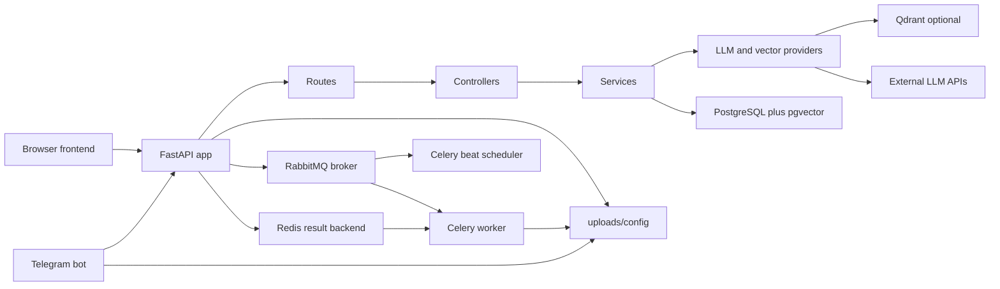
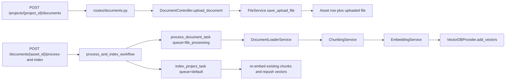
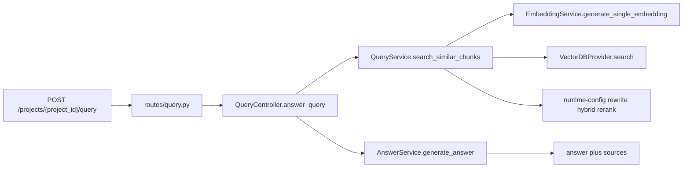
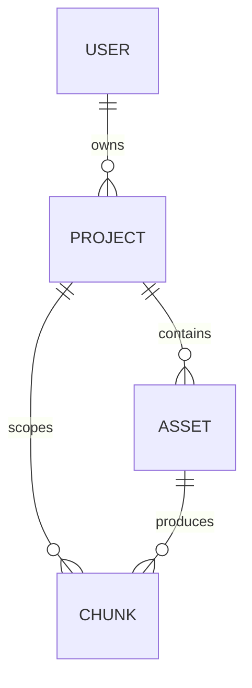
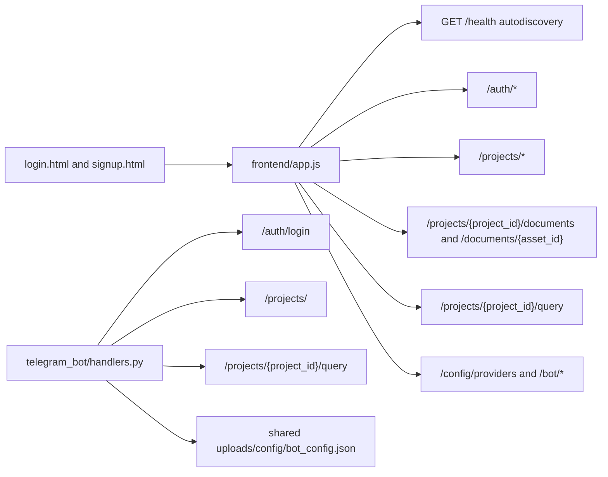

# Project Graph

Last verified against code on 2026-04-21.

## Stack Summary

- FastAPI in `backend/main.py` is the main HTTP entrypoint and mounts health, auth, project, document, query, stats, security, bot-config, and app-config routers.
- Celery in `backend/celery_app.py` runs background work on `default` and `file_processing` queues, with a separate beat scheduler in `docker/docker-compose.yml`.
- PostgreSQL is the primary relational store, `chunks.embedding` uses native `pgvector`, and Qdrant remains an optional vector backend.
- Runtime app and bot config resolve through shared files under `uploads/config/` via `backend/shared_config_paths.py`.
- The user-facing clients are a static HTML/CSS/JS frontend in `frontend/` and an optional Telegram bot in `telegram_bot/`.

## Runtime Architecture

Code anchors:

- `backend/main.py`
- `backend/celery_app.py`
- `backend/shared_config_paths.py`
- `docker/docker-compose.yml`

## API Surface

| Area | Paths | Main downstream layer |
| --- | --- | --- |
| Auth | `/auth/signup`, `/auth/login`, `/auth/me`, `/auth/change-password`, `/auth/update-password` | `backend/routes/auth.py` -> `backend/services/auth_service.py` -> `backend/security/*` + `backend/database/models.py` |
| Projects | `/projects/`, `/projects/{project_id}`, `/projects/{project_id}/index`, `/projects/{project_id}/stats` | `backend/routes/projects.py` -> `backend/controllers/project_controller.py` -> DB + `backend/tasks/data_indexing.py` |
| Documents | `/projects/{project_id}/documents`, `/documents/{asset_id}`, `/documents/{asset_id}/process`, `/documents/{asset_id}/process-and-index`, `/tasks/{task_id}` | `backend/routes/documents.py` -> `backend/controllers/document_controller.py` -> file service + Celery workflows |
| Query | `/projects/{project_id}/query` | `backend/routes/query.py` -> `backend/controllers/query_controller.py` -> `backend/services/query_service.py` + `backend/services/answer_service.py` |
| Config | `/config/providers`, `/bot/config`, `/bot/profile` | `backend/routes/app_config.py` + `backend/routes/bot_config.py` -> `backend/runtime_config.py` + shared config files |
| Ops | `/health`, `/`, `/stats/`, `/security/stats`, `/security/events`, `/security/simulate`, `/security/events/stream` | health routes + security dashboard service + in-memory event service |

## Main Request Flows

### Upload, Process, and Reindex

Important notes:

- `backend/routes/documents.py` records durable task ownership before returning task ids.
- `backend/tasks/process_workflow.py` chains file processing to project reindexing and persists child task ids in `celery_task_executions`.
- `backend/utils/idempotency_manager.py` and `backend/utils/task_tracking.py` are part of the task graph, not side helpers.

### Query and Answer Generation

Important notes:

- Retrieval behavior is partially runtime-configurable through `backend/runtime_config.py`.
- Query flow keeps `owner_id` and `project_id` scoping through the vector search layer.

## Data and Config Graph

Storage notes:

- `backend/database/models.py` defines `users`, `projects`, `assets`, `chunks`, and `celery_task_executions`.
- `chunks.embedding` is a native `pgvector` column and backs pgvector-based retrieval when that provider is active.
- `celery_task_executions` does not have direct foreign keys to users, projects, or assets; ownership and workflow linkage are carried in `task_args` JSON such as `owner_id`, `project_id`, `asset_id`, and `workflow_task_id`.
- Runtime config lives in `uploads/config/app_config.json` and `uploads/config/bot_config.json`; root `app_config.json` and `bot_config.json` are legacy/bootstrap copies.
- See `docs/database.md` for the storage-only view.

## Provider and Runtime-Config Wiring

- `backend/routes/app_config.py` exposes provider selection and retrieval toggles.
- `backend/runtime_config.py` persists overrides without app restart.
- `backend/providers/llm/factory.py` resolves the active chat and embedding providers from runtime config.
- `backend/providers/vectordb/factory.py` resolves the active vector backend from runtime config.
- `backend/services/query_service.py` also reads runtime flags for query rewrite, hybrid scoring, rerank, and candidate sizes.

## Frontend and Bot Graph

Frontend notes:

- `frontend/app.js` is the main dashboard client and owns API-base autodiscovery, auth state, project listing, document actions, query UX, config screens, and bot settings UI.
- `frontend/index.html` is the main shell; `frontend/login.html` and `frontend/signup.html` are separate auth entry pages.

## Open Edges and Constraints

- Auth, project, document, and query paths are strongly layered; config and some security paths are thinner route-to-service or route-to-helper flows.
- Runtime behavior depends on shared config plus environment variables, so deployment diagrams should always include both static env config and `uploads/config`.
- `AGENTS.md` is the repo's living quick graph; this file is the denser architecture snapshot.
